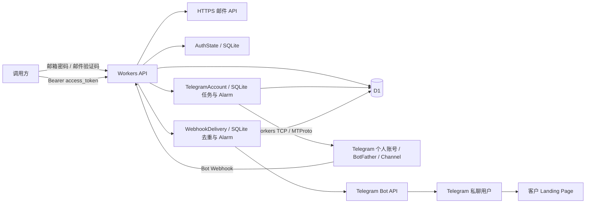

# Telegram Bot 自动化平台

`feature-cfworker` 分支提供基于 Cloudflare Workers 的 Bot 自动化 API。用户完成邮箱、密码和邮件验证码鉴权后，可以登录自己的 Telegram 个人账号，创建指定 Bot、获取 Token、配置客户 Landing Page 卡片、注册 Webhook，并创建私有 Channel 和发布引导帖子。

当前主服务是 `cfworker/`：Workers 处理 HTTP 请求，D1 保存用户和业务数据，Durable Objects 保存鉴权状态、创建任务及 Webhook 投递记录。只需安装、构建和部署该目录，构建时保留完整仓库供共享模块打包。Cloudflare 版本无需 MySQL、Redis 或 Docker。

从旧 Cloudflare 版本升级时，先阅读[升级与数据迁移](#upgrade)：最新版本要求凭据加密密钥；创建 Bot、Channel、帖子及核对远端结果的接口返回 **HTTP 202 和 job_id**，需要查询任务取得最终结果。

- [业务流程与架构](#architecture)
- [运行时配置与资源绑定](#configuration)
- [构建、部署与本地开发](#build-and-verify)
- [API 清单](#api-reference)
- [完整调用示例](#usage)
- [任务、投递与登录态管理](#operations)
- [升级、密钥轮换与数据迁移](#upgrade)
- [测试与生产运行](#verification)
- [Legacy Node.js Docker 与 Card Bot](#legacy-card-bot)

<a id="architecture"></a>
<a id="design"></a>

## 业务流程与架构

业务流程依次为：邮箱注册或登录 → 平台 access_token → Telegram 账号登录 → 创建 Bot 并查询 Token → 配置客户卡片 → 注册 Webhook → 按需创建 Channel、发布引导帖子。

客户进入 Bot 并点击 Start 后收到卡片，卡片按钮打开配置的 Landing Page。频道帖子也包含 Bot Start 和落地页链接。服务保存客户配置并发送消息；落地页由客户自行提供和托管，当前没有点击归因或成交统计。

### 身份与凭据

| 标识或凭据 | 来源 | 用途与有效期 |
| --- | --- | --- |
| `user_id` | 首次邮箱验证成功后自动生成 UUID | 平台用户身份，关联本人 Telegram 账号与业务资源 |
| `access_token` | 注册或登录的邮件验证码验证成功后返回 | 调用平台 API；默认 2 小时有效，访问不续期 |
| `api_id` / `api_hash` | Telegram App configuration | 使用 MTProto 登录个人账号；可以逐用户通过 API 传入 |
| `account_id` | 每次 `/v1/login/start` 成功后生成 UUID | 后续验证和操作的资源路径标识，不是鉴权凭据 |
| Telegram StringSession | 完成个人账号授权后保存 | 跨请求恢复 Telegram 登录，直至 Telegram 撤销或失效 |
| Bot Token | 已登录个人账号通过 BotFather 创建或核对 Bot 后取得 | 调用 Telegram Bot API，与平台 access_token 相互独立 |

App configuration、MTProto 服务器地址、公钥和 Telegram 网页端登录不能跳过个人账号认证。Telegram 登录码由用户从 Telegram 接收并提交；启用两步验证时还要提交密码。服务不会自动读取客户端验证码，也不注册新的 Telegram 个人账号。

不同用户通过自己的 access_token 管理资源。账号、Bot、Channel、任务和投递查询检查归属，其他用户的资源返回 404。`GET /v1/accounts` 可以找回本人 account_id；重复发起 Telegram 登录会生成新 ID，不自动替换旧记录。

### Cloudflare 组件



`AuthState` 保存一次性验证码、平台登录态、限流计数和操作锁。验证码消费与锁操作使用原子事务；读取时检查 TTL，Alarm 清理过期记录。认证使用 Durable Objects，不依赖 Workers KV 的最终一致性。

`TelegramAccount` 按手机号分配对象，协调同一手机号的 Telegram 操作。同步请求或任务需要时才建立 TCP 连接，结束后保存 StringSession 并关闭连接。它不维持永久在线客户端。创建任务先写入 SQLite，再由 Alarm 执行；客户端断线不会删除已持久化任务。

`WebhookDelivery` 按 Bot 分配对象。入口校验专属 Secret、持久化 `update_id` 并排队，Alarm 再调用 Bot API 发送卡片。发送与入口请求分离，支持投递查询、去重和明确失败后的重试。

### 数据与目录

D1 保存四张业务表和两张辅助表：

| 表 | 内容 |
| --- | --- |
| `user_info` | 用户 UUID、唯一邮箱、scrypt 密码哈希 |
| `tg_info` | 用户归属、account_id、App 凭据、手机号、StringSession、登录与恢复状态 |
| `bot_info` | 用户归属、Bot 信息、Token、客户卡片、Landing Page、Webhook 配置 |
| `channel_info` | 用户归属、创建 key、频道 ID/access_hash、邀请链接及旧帖子 JSON |
| `user_security` | 用户禁用标记、平台会话撤销版本 |
| `channel_posts` | 新帖子独立记录、random_id、发送状态 |

手机号、api_hash、session、phone_code_hash、恢复凭据、Bot Token、Webhook Secret 使用 AES-256-GCM 加密保存。DO 任务载荷、任务结果与投递载荷也加密。密码保存哈希。只有资源所有者的授权接口才会返回 Bot Token；日志不记录请求体或凭据。Telegram 64 位 ID、access_hash 和 random_id 使用字符串，调用方也应保留字符串类型。

```text
cfworker/                     当前 Cloudflare 主服务
  src/index.js                API 路由、鉴权、限流、健康检查
  src/auth-state.js           验证码、会话、计数和锁
  src/telegram-account.js     Telegram 操作与任务 Durable Object
  src/jobs.js                 持久化任务、检查点、恢复与重试
  src/webhook-delivery.js     回调去重、卡片投递与 Alarm
  src/security.js             凭据加密、管理员鉴权和审计
  src/store.js / schema.js    D1 存储、幂等初始化
  migrations/                 D1 SQL 迁移
  test/                       workerd 测试
  wrangler.jsonc              原生部署配置和 DO migrations
  .env.example                完整运行时变量模板
  .dev.vars.example           本地运行配置模板
  PRODUCTION.md               升级、恢复、监控与生产运行手册
auto-register/               Legacy Node.js Docker API 与共享业务模块
card-bot/                    Legacy 独立单 Bot 卡片 Worker
.github/workflows/           语法、回归与构建检查，不自动部署
```

<a id="configuration"></a>

## 运行时配置与资源绑定

所有业务环境变量都在 Worker 的 **Settings → Variables and Secrets** 设置，运行时从请求 `env` 读取。敏感值选择 **Secret**，其余选择 **Text**。这些变量不需要提供给构建过程；**Build Variables and Secrets 只供构建使用，不能替代运行时配置**。详见 [Cloudflare Builds 配置](https://developers.cloudflare.com/workers/ci-cd/builds/configuration/)。

Dashboard 部署无需上传 `.env`，也无需在业务变量中填写 Cloudflare Account ID、API Token 或资源 UUID。本地 CLI/外部 CI 的部署认证另由 Wrangler 登录或部署凭证提供。

### 资源绑定

资源绑定由 Cloudflare 注入对象，不是 Text 或 Secret 字符串：

| 绑定名 | 类型 | 对应资源 |
| --- | --- | --- |
| `DB` | D1 database | 用户、Telegram 账号、Bot、Channel 和辅助表 |
| `AUTH_STATE` | Durable Object | 当前 Worker 导出的 `AuthState` 类 |
| `TELEGRAM_ACCOUNTS` | Durable Object | 当前 Worker 导出的 `TelegramAccount` 类 |
| `WEBHOOK_DELIVERIES` | Durable Object | 当前 Worker 导出的 `WebhookDelivery` 类 |

已有 D1 在 **Bindings** 中以 `DB` 关联；首次部署也可由 Wrangler 按无资源 ID 的声明自动配置 D1。部署完成后核对实际关联。三个 DO 的 SQLite 命名空间由 `wrangler.jsonc` 的 v1/v2 migrations 创建，保留绑定名、类名和迁移历史。本版本没有 KV 绑定。自动配置行为见 [Wrangler 文档](https://developers.cloudflare.com/workers/wrangler/configuration/#automatic-provisioning)。

首次业务请求或 `/ready` 自动应用 `0001_init.sql`、`0002_security.sql` 的幂等 CREATE，初始化六张表并记录 `d1_migrations`；不会清空已有数据。`/health` 不建表。后续 ALTER 或凭据数据迁移需要单独执行。

### 必填与业务变量

完整模板：[cfworker/.env.example](cfworker/.env.example)。下列变量均为运行时配置。

| 名称 | 类型 | 默认值 / 要求 |
| --- | --- | --- |
| `AUTH_HMAC_SECRET` | Secret | 必填；至少 32 字符随机值，验证码 HMAC 密钥 |
| `CREDENTIAL_KEYS` | Secret | 必填；JSON 密钥环，每个值为 32 字节随机密钥的 base64 |
| `CREDENTIAL_KEY_ID` | Text | 必填；当前写入版本，例如 `v1`，须存在于密钥环 |
| `ADMIN_API_KEY` | Secret | 可选；管理员接口使用，至少 32 字符；未配置时管理员接口不可用 |
| `MAIL_API_KEY` | Secret | 真实邮箱注册和登录必填；邮件 API key |
| `MAIL_FROM` | Text | 真实邮箱注册和登录必填；邮件服务已验证的发件人 |
| `MAIL_API_URL` | Text | `https://api.resend.com/emails`；必须为 HTTPS |
| `AUTH_CHALLENGE_TTL_SECONDS` | Text | `600`；允许 60–3600 秒 |
| `AUTH_SESSION_TTL_SECONDS` | Text | `7200`；允许 60–86400 秒 |
| `AUTH_STATE_PREFIX` | Text | `telegram-bot:`；升级时保持一致 |
| `PUBLIC_BASE_URL` | Text | 注册 Webhook 时必填；本 API 的公网 HTTPS 源地址，不含路径、查询参数 |
| `TG_API_ID` | Text | 可选；Telegram 登录的默认 App ID |
| `TG_API_HASH` | Secret | 可选；默认 App hash，多用户建议通过请求传入 |
| `TG_PHONE` | Text | 可选；默认国际区号手机号，格式 `+` 加数字，不含空格 |
| `TG_BOT_NAME` | Text | 可选；Bot 创建请求的默认显示名称 |
| `TG_BOT_USERNAME` | Text | 可选；Bot 创建请求的默认用户名 |

请求提供的 App 凭据、手机号及 Bot 名称优先于 `TG_*` 默认值。多用户使用各自请求参数；Telegram code 和两步验证 password 通过 verify API 提交，不使用运行时默认值。

分别执行以下命令生成 Secret，然后把输出填入 Dashboard；不要提交输出：

```bash
# CREDENTIAL_KEYS；对应 CREDENTIAL_KEY_ID=v1
node -e "console.log(JSON.stringify({v1:require('node:crypto').randomBytes(32).toString('base64')}))"
# AUTH_HMAC_SECRET；ADMIN_API_KEY 另行生成一个独立值
node -e "console.log(require('node:crypto').randomBytes(32).toString('hex'))"
```

邮件 API 使用 Resend 兼容 JSON（`from`、`to` 数组、`subject`、`text`）和 Bearer 鉴权。其他服务需提供兼容网关或调整 `src/auth-runtime.js`。Workers 版不使用 SMTP。邮件暂不配置时可构建、运行模拟测试、访问 `/health`；真实发码返回 503，`/ready` 也会返回 503。

`PUBLIC_BASE_URL` 是 API 地址，例如 `https://bots.example.com`，注册时拼接 `/webhooks/:bot_id`；客户页面 URL 则通过 landing API 保存。仅登录或创建资源时可以留空，收取真实 Telegram Webhook 需要公网 HTTPS 地址。

### 限流、配额、超时与保留时间

以下均为可选 **Text** 运行时变量，省略时使用默认值：

| 名称 | 默认 | 允许范围 / 用途 |
| --- | --- | --- |
| `OTP_IP_QPS` | 1 | 1–100；三个获取验证码接口共享每 IP 每秒请求上限 |
| `API_IP_PER_MINUTE` | 120 | 1–10000；非 Webhook API 每 IP 分钟上限，健康检查除外 |
| `API_USER_PER_MINUTE` | 60 | 1–10000；已鉴权 `/v1/*` 业务每用户分钟上限 |
| `WEBHOOK_IP_PER_MINUTE` | 1200 | 1–10000；Webhook 每 IP 分钟上限 |
| `TG_LOGIN_PER_TEN_MINUTES` | 5 | 1–20；每用户 Telegram 发码十分钟上限 |
| `TG_CREATE_PER_TEN_MINUTES` | 10 | 1–100；每用户 Bot/Channel 创建请求十分钟上限，重复提交也计数 |
| `MAX_TG_ACCOUNTS_PER_USER` | 5 | 1–100；保存的 Telegram 账号记录上限，含已撤销记录；清理已过期的未完成登录 |
| `MAX_BOTS_PER_USER` | 20 | 1–1000；每用户 Bot 记录上限，仍受 Telegram 自身限制 |
| `MAX_CHANNELS_PER_USER` | 50 | 1–1000；每用户 Channel 记录上限 |
| `TELEGRAM_TIMEOUT_SECONDS` | 60 | 15–240；同步 Telegram 连接与操作总超时 |
| `JOB_TIMEOUT_SECONDS` | 240 | 30–240；任务内 Telegram 连接与操作总超时 |
| `JOB_QUEUE_LIMIT` | 20 | 1–100；同手机号 queued/running 任务总上限 |
| `JOB_RETENTION_SECONDS` | 604800 | 86400–2592000；完成、失败、取消任务保留秒数；uncertain 保留至核对 |
| `WEBHOOK_CHAT_PER_MINUTE` | 5 | 1–60；每 Bot 每私聊分钟卡片上限 |
| `WEBHOOK_BOT_PER_MINUTE` | 300 | 1–3000；每 Bot 分钟卡片上限 |
| `WEBHOOK_QUEUE_LIMIT` | 500 | 1–10000；每 Bot 待处理投递上限，队列满返回 503 |
| `WEBHOOK_BATCH_SIZE` | 10 | 1–30；每次 Alarm 顺序投递数量，批次间至少 1 秒 |
| `WEBHOOK_RETENTION_SECONDS` | 604800 | 172800–2592000；投递与去重记录保留秒数 |

**发码间隔固定为 60 秒**：同一邮箱的注册、登录共享冷却；同一 Telegram 手机号跨用户和 IP 共享冷却。发送失败或响应未知仍保留冷却，不支持通过提高 QPS 取消该间隔。

`OTP_IP_QPS` 同时覆盖 `POST /auth/register/start`、`POST /auth/login/start`、`POST /v1/login/start`。邮箱验证码最多错误 5 次；Telegram verify 每 account_id 十分钟最多 5 次。冷却与频率限制返回 429、`Retry-After` 和 JSON `retry_after`；其他资源配额拒绝可能没有等待秒数。

<a id="build-and-verify"></a>

## 构建、部署与本地开发

使用 Node.js **22.12+**。构建入口为 `cfworker/`，共享业务模块来自 `auto-register/api/`，因此 checkout 时保留完整仓库。无需分别部署 `auto-register/` 或 `card-bot/`。

### Cloudflare Dashboard 部署

1. 在 Workers & Pages 创建或选择 Worker；仓库默认名称为 `telegram-cfworker-api`，自定义名称时同步修改 `cfworker/wrangler.jsonc` 的 `name`。
2. 连接 GitHub 仓库，部署分支选择 `feature-cfworker`；已有 D1 以 `DB` 绑定到目标 Worker。
3. 配置下表的构建参数，完成代码部署并核对四个资源绑定。
4. 在 **Settings → Variables and Secrets** 添加运行时变量和密钥，保存并部署配置。
5. 请求 `/health` 和 `/ready`，就绪后执行真实业务流程。已有明文数据先完成[升级迁移](#upgrade)。

| 设置 | 值 |
| --- | --- |
| Root directory | `cfworker` |
| 依赖安装 | `npm ci`，使用该目录的 package-lock.json |
| Build command | `npm run build` |
| Deploy command | `npm run deploy` |
| 业务 Build Variables | 无 |
| Worker entry | `src/index.js`，由 wrangler.jsonc 指定 |
| 静态网站输出目录 | 无，部署的是 Worker API |

`npm run build` 执行语法检查、workerd 测试和 `wrangler deploy --dry-run --outdir dist`，通过后才进入默认 Builds 部署步骤。`npm run deploy` 执行原生 `wrangler deploy`；当前无需 `dist/server/wrangler.json` 或生成配置脚本。直接 deploy 不运行测试，本地发布先 build。

`wrangler.jsonc` 启用 `keep_vars: true`，并不写业务 `vars`，保留 Dashboard 普通变量；Wrangler 也不会在正常部署中删除 Secrets。参见[变量保留规则](https://developers.cloudflare.com/workers/wrangler/configuration/#source-of-truth)。Worker 名称、资源绑定、DO migration、兼容日期和 CPU 预算属于部署配置，不是业务环境变量。当前 CPU 预算为 30000 ms，需与账户计划匹配。

Workers Builds 提供部署认证；本地 CLI 或其他 CI 仍需 Wrangler 登录或独立部署凭证。修改运行时参数无需构建源码，但需发布配置使其生效。已关联 Git 自动部署时，对部署分支的推送会触发 Builds。

### 本地开发

```bash
cd cfworker
npm ci
# 首次创建本地配置；已有 .dev.vars 时保留原文件
if [ ! -f .dev.vars ]; then cp .dev.vars.example .dev.vars; fi
chmod 600 .dev.vars
# 编辑 .dev.vars，填写真实随机 HMAC 和凭据密钥；邮件可暂时留空
npm run dev
```

默认地址为 `http://127.0.0.1:8787`。本地 D1/DO 数据存入 `cfworker/.wrangler/state/`，对象回收或开发进程重启后仍可读取。`.dev.vars` 不自动上传云端；本地模拟资源与云端资源独立。

```bash
# 另一个终端
curl http://127.0.0.1:8787/health
curl http://127.0.0.1:8787/ready
# 邮件配置不完整时 ready 为 503
```

### 构建检查与 CLI 部署

```bash
cd cfworker
npm ci
npm run build
# 以下两步用于实际云端发布；build 本身不会部署资源
npx wrangler login
npm run deploy
```

也可在仓库根目录使用 `npm run cf:dev`、`npm run cf:build`、`npm run cf:test`、`npm run cf:deploy`。根目录不带 `cf:` 的 `dev/deploy` 指向 Legacy Card Bot。

可选 `npm run secrets` 从本地 `.env` 或进程环境读取 `AUTH_HMAC_SECRET`、`CREDENTIAL_KEYS`、`ADMIN_API_KEY`、`MAIL_API_KEY`、`TG_API_HASH`，经 stdin 批量上传 Secret。它不属于构建步骤，也不上传 Text；Text 仍在 Dashboard 配置。指定目标可用 `npm run secrets -- --name YOUR_WORKER_NAME`。

### SQL 初始化与后续迁移

首次业务请求自动初始化当前两份 SQL。也可以手动应用：

```bash
cd cfworker
npm run db:local
npm run db:remote -- YOUR_D1_DATABASE_NAME --remote
```

`YOUR_D1_DATABASE_NAME` 是管理员命令参数，不是运行时环境变量。后续结构调整新增迁移文件，不修改已发布迁移；当前自动初始化仅处理两个幂等 CREATE，不会自动执行未来 ALTER 或明文凭据迁移。

<a id="api-reference"></a>

## API 清单

请求、响应均为 JSON，POST/PUT 设置 `Content-Type: application/json`，请求体最多 **16 KiB**。同步成功一般返回 200；任务提交与重试返回 202。平台 Token 使用 `Authorization: Bearer <access_token>`；Webhook 与管理员接口分别使用专属凭据。响应包含 `X-Request-ID`，并设置 `Cache-Control: no-store`。

下表 `:id` 为 account_id、`:username` 为 Bot 用户名、`:key` 为 Channel 创建 request_key。所有 `/v1/*` 都要求平台 Token 并检查资源归属。

### 平台鉴权与服务状态

| 方法 | 路径 | 鉴权 | 参数 / 结果 |
| --- | --- | --- | --- |
| GET | `/health` | 无 | 可响应检查，返回 ok |
| GET | `/ready` | 无 | 检查必要配置、D1 和 AuthState；不可用时 503 |
| POST | `/auth/register/start` | 无 | email、password → challenge_id、expires_in |
| POST | `/auth/register/verify` | 无 | challenge_id、code → user、access_token |
| POST | `/auth/login/start` | 无 | email、password → challenge_id、expires_in |
| POST | `/auth/login/verify` | 无 | challenge_id、code → user、access_token |
| GET | `/auth/me` | 平台 Token | 本人 id、email |
| POST | `/auth/logout` | 平台 Token | `{}`；撤销当前 Token |
| POST | `/auth/logout-all` | 平台 Token | `{}`；撤销所有平台会话与旧登录验证 |
| POST | `/auth/password` | 平台 Token | current_password、new_password；改密并撤销所有平台会话 |

### Telegram、Bot、卡片与 Channel

| 方法 | 路径 | 参数 / 结果 |
| --- | --- | --- |
| GET | `/v1/accounts` | 本人账号列表，每页最多 100 条，next_cursor 配合 `?after=` |
| POST | `/v1/login/start` | api_id、api_hash、phone → account_id、status、delivery |
| POST | `/v1/accounts/:id/verify` | code；必要时 password → code_required/password_required/authorized |
| GET | `/v1/accounts/:id` | 已保存的登录状态，不实时探测 Telegram |
| POST | `/v1/accounts/:id/logout` | `{}`；Telegram 注销成功后清空本地 session，返回 revoked |
| POST | `/v1/accounts/:id/bots` | name、username；可选 request_key → 202 任务 |
| GET | `/v1/accounts/:id/bots/:username` | 已保存的 Bot 信息与 Token |
| PUT | `/v1/accounts/:id/bots/:username/token` | token；验证属于同一个 Bot 后更新，不回显 Token |
| POST | `/v1/accounts/:id/bots/:username/reconcile` | request_key → 202；核对并取回已创建 Bot 的 Token |
| PUT | `/v1/accounts/:id/bots/:username/landing` | customer_id、landing_url；可选 card_text/card_image/button_text |
| GET | `/v1/accounts/:id/bots/:username/landing` | 客户卡片配置，不返回 Webhook Secret |
| POST | `/v1/accounts/:id/bots/:username/webhook` | `{}`；注册 Webhook，需 PUBLIC_BASE_URL |
| POST | `/v1/accounts/:id/channels` | request_key、bot_username、title；可选 about → 202 任务 |
| GET | `/v1/accounts/:id/channels/:key` | 已保存的频道状态、邀请链接，不返回 access_hash |
| POST | `/v1/accounts/:id/channels/:key/posts` | request_key、text → 202 任务 |
| POST | `/v1/accounts/:id/channels/:key/reconcile` | request_key、channel_id、access_hash → 202 核对任务 |
| GET | `/v1/accounts/:id/jobs/:job_id` | 任务状态、成功 result 或失败 error |
| POST | `/v1/accounts/:id/jobs/:job_id/retry` | `{}`；202，安全重试或要求先核对 |
| GET | `/v1/accounts/:id/bots/:username/deliveries/:update_id` | Webhook 投递状态 |
| POST | `/v1/accounts/:id/bots/:username/deliveries/:update_id/retry` | uncertain 时必须传 allow_duplicate=true |

### Webhook 与管理员

| 方法 | 路径 | 鉴权 / 参数 |
| --- | --- | --- |
| POST | `/webhooks/:bot_id` | Telegram Secret Header；Telegram Update，去重排队后返回 200 |
| POST | `/admin/credentials/rewrap` | Bearer ADMIN_API_KEY；table、cursor、limit，分页加密或重加密 D1 |
| PUT | `/admin/users/:user_id/disabled` | Bearer ADMIN_API_KEY；disabled 布尔值，禁用/启用并撤销旧会话 |

Webhook Header 为 `X-Telegram-Bot-Api-Secret-Token`，由注册接口设置。管理员 Token 与平台 Token 相互独立，未配置 ADMIN_API_KEY 时管理员接口不可用。

<a id="usage"></a>

## 完整调用示例

以下示例用于本地或云端 API；把返回的 challenge_id、account_id、job_id 填入后续请求。为方便展示使用 Bash 变量，它们是调用方本地变量，不是 Worker 运行时配置。

```bash
BASE_URL='http://127.0.0.1:8787'
# 线上使用实际 HTTPS API 地址
```

### 1. 首次注册与后续登录

密码长度 12–128 字符；邮箱转为小写，密码中的空格保留。邮件验证码为六位数字，不在 API 响应中返回。

```bash
curl -X POST "$BASE_URL/auth/register/start" \
  -H 'Content-Type: application/json' \
  -d '{"email":"you@example.com","password":"YOUR_LONG_PASSWORD"}'
```

```json
{"challenge_id":"本次生成的UUID","status":"email_code_required","expires_in":600}
```

```bash
curl -X POST "$BASE_URL/auth/register/verify" \
  -H 'Content-Type: application/json' \
  -d '{"challenge_id":"CHALLENGE_ID","code":"123456"}'
```

```json
{
  "access_token":"YOUR_ACCESS_TOKEN",
  "token_type":"Bearer",
  "expires_in":7200,
  "user":{"id":"自动生成的用户UUID","email":"you@example.com"}
}
```

后续登录使用 `/auth/login/start` 提交同样的 email/password，再向 `/auth/login/verify` 提交新的 challenge_id/code；响应结构与注册相同。注册与登录 challenge 不能混用，每个验证码只能成功消费一次。

```bash
ACCESS_TOKEN='YOUR_ACCESS_TOKEN'
curl "$BASE_URL/auth/me" -H "Authorization: Bearer $ACCESS_TOKEN"
curl "$BASE_URL/v1/accounts" -H "Authorization: Bearer $ACCESS_TOKEN"
```

账号列表响应包含 `accounts` 和 `next_cursor`；没有账号时 accounts 为空。它不返回 api_hash、手机号或 StringSession。有下一页时向 `/v1/accounts?after=NEXT_CURSOR` 请求。

### 2. 登录 Telegram 个人账号

```bash
curl -X POST "$BASE_URL/v1/login/start" \
  -H "Authorization: Bearer $ACCESS_TOKEN" -H 'Content-Type: application/json' \
  -d '{"api_id":123456,"api_hash":"YOUR_32_HEX_APP_HASH","phone":"+8613800000000"}'
```

```json
{"account_id":"本次生成的UUID","status":"code_required","delivery":"telegram_app"}
```

`telegram_app` 表示从 Telegram 客户端接收，`other` 表示其他渠道；本服务不保证短信投递。保存返回的 account_id，在同一登录流程中复用。App 凭据和手机号已有运行时默认值时可提交 `{}`。

```bash
ACCOUNT_ID='YOUR_ACCOUNT_ID'
curl -X POST "$BASE_URL/v1/accounts/$ACCOUNT_ID/verify" \
  -H "Authorization: Bearer $ACCESS_TOKEN" -H 'Content-Type: application/json' \
  -d '{"code":"12345"}'
# 成功：{"account_id":"...","status":"authorized"}
```

返回 `password_required` 时向同一接口提交 `{"password":"YOUR_TELEGRAM_2FA_PASSWORD"}`；也可首次同时提交 code/password。验证码和两步验证密码不保存到数据库，恢复流程所需 session/phone_code_hash 加密保存。Telegram 登录流程固定 10 分钟有效，Telegram 验证码可能提前过期；过期后重新 start，取得新的 account_id。

### 3. 创建 Bot，查询任务并获取 Token

```bash
BOT_USERNAME='customer_a_unique_bot'
curl -X POST "$BASE_URL/v1/accounts/$ACCOUNT_ID/bots" \
  -H "Authorization: Bearer $ACCESS_TOKEN" -H 'Content-Type: application/json' \
  -d '{"request_key":"bot-create-001","name":"客户 A 助手","username":"customer_a_unique_bot"}'
```

HTTP **202** 表示已受理，不能据此判断 Bot 创建成功：

```json
{"job_id":"64位任务标识","account_id":"...","status":"queued","created_at":0,"updated_at":0}
```

其中时间戳为示意值，实际为毫秒 Unix 时间。以适当间隔查询；每次查询仍计入 API 用户限流：

```bash
JOB_ID='YOUR_JOB_ID'
curl "$BASE_URL/v1/accounts/$ACCOUNT_ID/jobs/$JOB_ID" \
  -H "Authorization: Bearer $ACCESS_TOKEN"
```

成功响应的主要字段：

```json
{
  "job_id":"...",
  "account_id":"...",
  "status":"succeeded",
  "result":{
    "username":"customer_a_unique_bot",
    "name":"客户 A 助手",
    "token":"BOT_ID:BOT_TOKEN_SECRET",
    "url":"https://t.me/customer_a_unique_bot"
  }
}
```

`name` 为 1–64 字符；username 为 5–32 位，字母开头、以 bot 结尾，仅含字母、数字、下划线，并须全局可用。Bot 的 request_key 可省略，默认使用 username。其他任务显式传稳定 request_key，格式为 1–64 位字母、数字、下划线或短横线。任务接口只接受对应接口支持的字符串字段。

Bot 创建通过个人账号与 BotFather 英文提示交互，仍受账号限制和提示变化影响。不要同时手动操作同一账号的 BotFather。创建结果核对 getMe 后加密保存，后续可通过 GET `/v1/accounts/:id/bots/:username` 取回。

### 4. 配置客户 Landing Page 与卡片

```bash
curl -X PUT "$BASE_URL/v1/accounts/$ACCOUNT_ID/bots/$BOT_USERNAME/landing" \
  -H "Authorization: Bearer $ACCESS_TOKEN" -H 'Content-Type: application/json' \
  -d '{
    "customer_id":"customer_a",
    "landing_url":"https://customer-a.example.com/offer?source=telegram",
    "card_text":"欢迎查看客户 A 的活动",
    "card_image":"",
    "button_text":"查看活动"
  }'
```

| 字段 | 要求 / 默认值 |
| --- | --- |
| `customer_id` | 必填，1–64 字符 |
| `landing_url` | 必填，完整 HTTP(S) URL；可以带查询参数，不允许内嵌用户名密码 |
| `card_text` | 默认“欢迎访问平台”；有图最多 1024、无图最多 4096 字符 |
| `card_image` | 默认空；公网图片 URL 或 Telegram file_id，最多 2048 字符 |
| `button_text` | 默认“立即了解”，1–64 字符 |

PUT 保存完整配置，省略可选字段会使用默认值。GET 同一路径读取配置，不返回 Webhook Secret。更新后后续投递读取新配置，无需重新部署。一个 Bot 当前对应一份客户卡片配置，不同客户可以使用不同 Bot。

### 5. 注册 Webhook 并测试私聊卡片

先设置运行时 `PUBLIC_BASE_URL` 为本 API 的公网 HTTPS 源地址：

```bash
curl -X POST "$BASE_URL/v1/accounts/$ACCOUNT_ID/bots/$BOT_USERNAME/webhook" \
  -H "Authorization: Bearer $ACCESS_TOKEN" -H 'Content-Type: application/json' -d '{}'
```

```json
{"username":"customer_a_unique_bot","webhook_url":"https://bots.example.com/webhooks/123456","status":"registered"}
```

打开 `https://t.me/customer_a_unique_bot` 并点击 Start，检查卡片与按钮。只有私聊 `/start`（可带参数）会投递卡片，其他消息忽略。一个 Bot 只使用一个 Webhook 接收入口；注册这里会替换该 Bot 原有入口，无需再部署 card-bot。

### 6. 创建 Channel 并发布引导帖子

Bot 已完成 landing 配置后创建私有广播频道：

```bash
curl -X POST "$BASE_URL/v1/accounts/$ACCOUNT_ID/channels" \
  -H "Authorization: Bearer $ACCESS_TOKEN" -H 'Content-Type: application/json' \
  -d '{"request_key":"customer_a_channel_001","bot_username":"customer_a_unique_bot","title":"客户 A 活动频道","about":"客户 A 的活动信息"}'
```

同样返回 202，查询返回的 job_id，成功 result 包含 channel_id、invite_url、status=ready、客户与 Bot 信息。title 为 1–128 字符，about 最多 255 字符。GET `/v1/accounts/:id/channels/customer_a_channel_001` 可读取保存结果。

```bash
CHANNEL_KEY='customer_a_channel_001'
curl -X POST "$BASE_URL/v1/accounts/$ACCOUNT_ID/channels/$CHANNEL_KEY/posts" \
  -H "Authorization: Bearer $ACCESS_TOKEN" -H 'Content-Type: application/json' \
  -d '{"request_key":"offer_post_001","text":"本周活动已上线，点击链接了解详情。"}'
```

text 为 1–3000 字符，追加 Bot Start/落地页链接后合计不得超过 4096。查询该帖子的 job_id，成功 result 包含发送状态、正文、链接及 message_id（如远端返回）。更换正文或落地页后使用新帖子 key。

频道由登录个人账号创建和发布；当前不设置公开频道用户名，不自动邀请用户，也不将 Bot 提升为管理员。用户需主动进入 Bot 才能收到私聊卡片。

<a id="operations"></a>

## 任务、投递与登录态管理

### 持久化任务与重试

| 状态 | 含义 / 处理 |
| --- | --- |
| `queued` | 已持久化，等待 Alarm |
| `running` | 执行中，继续查询 |
| `succeeded` | 完成，读取 result |
| `failed` | 明确失败，处理原因后重试原任务 |
| `uncertain` | 远端动作可能已经完成，先核对结果 |
| `cancelled` | 未开始时身份已撤销或禁用；重新鉴权后可重试 |

同一账号、路径、request_key 和参数复用原任务；同 key 不同参数返回 409。任务保留期结束后不能仅依赖旧 job_id 去重；使用已保存的业务资源核对结果。执行前再次检查用户禁用和会话撤销版本，未开始的旧版本任务会取消，已完成的远端动作无法撤回。

```bash
curl -X POST "$BASE_URL/v1/accounts/$ACCOUNT_ID/jobs/$JOB_ID/retry" \
  -H "Authorization: Bearer $ACCESS_TOKEN" -H 'Content-Type: application/json' -d '{}'
```

结果已落入 D1 时重试可直接恢复 succeeded。Bot/Channel 创建结果未知时不自动再次创建，先使用以下核对任务，再重试原任务：

```bash
curl -X POST "$BASE_URL/v1/accounts/$ACCOUNT_ID/bots/$BOT_USERNAME/reconcile" \
  -H "Authorization: Bearer $ACCESS_TOKEN" -H 'Content-Type: application/json' \
  -d '{"request_key":"bot-reconcile-001"}'

curl -X POST "$BASE_URL/v1/accounts/$ACCOUNT_ID/channels/$CHANNEL_KEY/reconcile" \
  -H "Authorization: Bearer $ACCESS_TOKEN" -H 'Content-Type: application/json' \
  -d '{"request_key":"channel-reconcile-001","channel_id":"123456789","access_hash":"987654321"}'
```

Bot 核对请求已有 Token，不再次执行 /newbot。Channel 核对要求已有本地记录和远端 ID/access_hash，并检查当前账号是相同标题的广播频道创建者。两者返回 202。帖子重试复用已保存 random_id，以降低重复发送风险；Telegram 去重不能视为无限期保证。恢复细节见[持久化任务运行手册](cfworker/PRODUCTION.md#持久化任务-api)。

### Webhook 投递与未知结果

有效更新持久化排队后即返回 200，表示接收成功，不表示卡片已发送。保留期内按 bot_id/update_id 去重。同一 Bot 顺序发送；超过私聊/Bot 分钟上限时确认接收但不再发卡片，队列满返回 503 供 Telegram 重投。

明确 Telegram 429 按 retry_after 重试，最多 5 次；明确 4xx 标为 failed。网络错误、5xx 或发送中断标为 uncertain，不自动重发，因为 sendMessage 没有远端幂等键。

```bash
UPDATE_ID='123456'
curl "$BASE_URL/v1/accounts/$ACCOUNT_ID/bots/$BOT_USERNAME/deliveries/$UPDATE_ID" \
  -H "Authorization: Bearer $ACCESS_TOKEN"
curl -X POST "$BASE_URL/v1/accounts/$ACCOUNT_ID/bots/$BOT_USERNAME/deliveries/$UPDATE_ID/retry" \
  -H "Authorization: Bearer $ACCESS_TOKEN" -H 'Content-Type: application/json' \
  -d '{"allow_duplicate":true}'
```

投递状态为 queued、sending、sent、failed、uncertain。uncertain 重试必须明确传 allow_duplicate=true，可能产生重复消息；failed 重试无需该字段。只有对应 Bot 所有者可查询和重试。

### 注销、改密与 Token 更新

Cloudflare Telegram 登录态保存在 D1，不需要 `*.json`、`tgsession.blob` 或容器挂载目录。平台会话则保存在 AuthState，到期与 Telegram 长期登录态相互独立。

```bash
# 撤销当前平台令牌
curl -X POST "$BASE_URL/auth/logout" \
  -H "Authorization: Bearer $ACCESS_TOKEN" -H 'Content-Type: application/json' -d '{}'
# 以下请求应使用仍有效的令牌；全部注销后需重新邮箱登录
curl -X POST "$BASE_URL/auth/logout-all" \
  -H "Authorization: Bearer $ACCESS_TOKEN" -H 'Content-Type: application/json' -d '{}'
# 修改密码并撤销所有平台令牌
curl -X POST "$BASE_URL/auth/password" \
  -H "Authorization: Bearer $ACCESS_TOKEN" -H 'Content-Type: application/json' \
  -d '{"current_password":"CURRENT_LONG_PASSWORD","new_password":"NEW_LONG_PASSWORD"}'
# 注销 Telegram 会话，不删除已有 Bot 或 Channel
curl -X POST "$BASE_URL/v1/accounts/$ACCOUNT_ID/logout" \
  -H "Authorization: Bearer $ACCESS_TOKEN" -H 'Content-Type: application/json' -d '{}'
```

上述撤销操作按实际需求单独执行。Telegram 注销确认后清空 session 并标为 revoked，网络结果未知时保留凭据供再次核对；也可在 Telegram 客户端「设置 → 设备」终止会话。重新登录走 start/verify，取得新 account_id。GET 账号状态只读本地记录，不证明此刻远端授权有效。

用户在 BotFather 轮换 Token 后更新已保存值：

```bash
curl -X PUT "$BASE_URL/v1/accounts/$ACCOUNT_ID/bots/$BOT_USERNAME/token" \
  -H "Authorization: Bearer $ACCESS_TOKEN" -H 'Content-Type: application/json' \
  -d '{"token":"NEW_TOKEN_FOR_THE_SAME_BOT"}'
```

服务通过 getMe 核对相同 Bot 后加密保存，不回显 Token；之后重新注册 Webhook。管理员可通过 PUT `/admin/users/:user_id/disabled` 和 `{"disabled":true}` 禁用用户，false 重新启用；两者都撤销旧平台会话，不删除用户数据或远端资源。

### HTTP 错误处理

| 状态 | 处理 |
| --- | --- |
| 400 / 413 | 修正参数或 JSON，请求体不超过 16 KiB |
| 401 | 平台认证失效、验证码错误或 Telegram 授权失效，按具体流程重新认证 |
| 403 / 405 | 核对权限、Webhook Secret 或请求方法 |
| 404 | 路径/记录不存在或不属于本人 |
| 409 | 参数 key 冲突、并发操作或远端结果需核对 |
| 410 | Telegram 登录流程过期，重新 start |
| 422 | Telegram 拒绝请求，或需当前未支持的额外认证 |
| 429 | QPS、冷却、配额或 Telegram 限流；有 Retry-After 时按其等待 |
| 500 | 内部错误，结合 X-Request-ID 查看日志 |
| 502 / 504 | 远端失败或超时，查询任务并核对结果 |
| 503 | 必要依赖/配置不可用、旧凭据待迁移或投递队列满 |

冷却响应示例：`{"error":"错误说明","retry_after":60}`，并带 `Retry-After: 60`；实际秒数随剩余等待时间变化。异步业务错误在任务 error 中返回，不会把最初的 202 改成失败状态码。

<a id="upgrade"></a>

## 升级、密钥轮换与数据迁移

### 从旧 Cloudflare 版本升级

1. 在维护窗口停止旧版本写入，备份 D1 和现有密钥，记录恢复书签。
2. 配置 CREDENTIAL_KEYS、CREDENTIAL_KEY_ID，迁移还需 ADMIN_API_KEY；保留原 Worker、DB、DO、AUTH_STATE_PREFIX 和 HMAC。
3. 部署新代码，检查新增 WEBHOOK_DELIVERIES 与 v2 DO migration；首次业务请求初始化两张辅助表。
4. 旧 tg_info/bot_info 有明文凭据时，用管理员接口分页加密；普通 API 默认拒绝读取明文。
5. 调用方适配 202 → 查询 job_id → 读取 result，再恢复业务。

```bash
ADMIN_TOKEN='YOUR_ADMIN_API_KEY'
curl -X POST "$BASE_URL/admin/credentials/rewrap" \
  -H "Authorization: Bearer $ADMIN_TOKEN" -H 'Content-Type: application/json' \
  -d '{"table":"tg_info","cursor":"","limit":50}'
# 把返回 next_cursor 放入下一次请求，直到 done=true
# 然后对 table=bot_info 同样分页执行
```

只支持 tg_info、bot_info，每批最多 100 行，响应只含计数和游标。普通新建数据无需执行明文迁移。重加密用旧值比较，避免覆盖并发变化。

### 密钥轮换与恢复约束

先往 CREDENTIAL_KEYS 加入新版本并保留旧版本，再切换 CREDENTIAL_KEY_ID，然后分页 rewrap D1。**不能仅完成 D1 重加密就删除旧密钥**：DO 的历史任务、投递及备份也可能仍使用旧版本；当前 rewrap 不处理 DO 历史记录。保留读取未决任务与备份所需的旧密钥。

不要回滚到不支持密文或任务 API 的旧代码。恢复 D1 不会撤销 Telegram 已完成动作，也不同时回滚 DO 记录，恢复后需要核对远端状态。完整步骤见[生产升级与运行手册](cfworker/PRODUCTION.md)。

### 从 Node.js MySQL 迁移到 D1

D1 不自动读取原 MySQL；Redis 邮件验证码、平台 Token 和锁不迁移。可以导出业务四表，保留 user_id、密码哈希、account_id、StringSession、Bot 和 Channel：

```bash
# 在旧服务停止写入后，从仓库根目录执行
cd auto-register
npm ci
node --env-file=.env scripts/export-d1.js
cd ../cfworker
npm run db:remote -- YOUR_D1_DATABASE_NAME --remote
npx wrangler d1 execute YOUR_D1_DATABASE_NAME --remote --file ../data/d1-export.sql
```

导入目标应为空表，唯一键冲突不会覆盖旧记录。导出含敏感凭据，存入已忽略的 data/ 并限制文件权限。导入后分页 rewrap tg_info/bot_info，用户重新完成邮箱登录即可继续使用原 account_id。避免新旧服务同时写入或操作同一手机号。

<a id="verification"></a>

## 测试与生产运行

`npm run build` 包含语法、workerd 回归与 dry-run 打包。Cloudflare 测试覆盖 D1 初始化、认证 TTL/单次消费、用户隔离、对象回收、加密和迁移、会话撤销、限流与 60 秒冷却、任务检查点与恢复、Webhook 去重/重试、日志脱敏和就绪失败。邮件、Telegram 登录、BotFather、Channel 和帖子远端调用默认使用模拟。

```bash
# cfworker/ 下
npm run check
npm test
npm run build
# 可选真实连接探测：不发验证码、不登录、不创建资源
npm run probe:telegram
```

连接探测只验证 Workers TCP、MTProto 握手及服务器配置查询，不等于真实用户登录或创建成功。GitHub Actions 执行共享 Node.js 回归与 Cloudflare 构建检查，不发布云端资源。

`/health` 只检查 HTTP 可响应；`/ready` 检查凭据密钥、HMAC、TTL、必要邮件配置、D1 与 AuthState，可触发初始化，但不在线验证邮件投递或 Telegram 授权。日志含请求 ID、状态、耗时与任务/投递事件，不记录邮箱、手机号、Authorization 或含 Token 的外部 URL。

本地测试不能代替生产验收。当前加固版本尚需在真实 Cloudflare 环境验证邮件投递、用户登录、Bot/Channel 创建、帖子和公网 Webhook。生产还需配置容量与配额监控、失败/uncertain 告警、密钥和数据库备份、恢复演练及边缘限流。自定义域名防护启用后关闭 workers.dev/preview 旁路入口，管理员路径可用 Access 限制。仓库默认保留 workers.dev 供首次部署；运行细节见[生产手册](cfworker/PRODUCTION.md#监控灾备与容量验收)。

<a id="legacy-card-bot"></a>
<a id="docker-部署"></a>

## Legacy Node.js Docker 与 Card Bot

### auto-register：原 Node.js Docker API

保留邮箱鉴权、Telegram 登录、Bot 创建、客户卡片、Webhook、Channel 和帖子流程，运行时连接已有 MySQL/Redis，启动自动建库建业务四表。该版本接口同步返回结果，与 Cloudflare 的持久化任务、凭据加密和新增管理接口能力不同；不能直接共用 Cloudflare 的配置或任务客户端。

```bash
cd auto-register
if [ ! -f .env ]; then cp .env.example .env; fi
chmod 600 .env
# 编辑 MYSQL_*、Redis、AUTH_HMAC_SECRET 和 SMTP_* 等运行配置
docker compose up -d --build
curl http://127.0.0.1:3100/health
```

只构建本目录即可运行原 Docker 服务，镜像不包含真实 .env。完整环境变量、构建、API、旧文件会话迁移见 [auto-register/README.md](auto-register/README.md)、[部署文档](auto-register/DEPLOYMENT.md) 和[鉴权文档](auto-register/AUTH.md)。独立命令行 Bot 创建脚本仍保留，配置与用法见部署文档。

### card-bot：原独立卡片 Worker

仅使用已有 Bot Token，在私聊 `/start` 时发送固定文字/图片和落地页按钮，不含平台注册、个人账号登录、Bot 自动创建或 Channel 管理。

```bash
cd card-bot
npm ci
# 在 Dashboard 配置 BOT_TOKEN、WEBHOOK_SECRET、LANDING_URL 和卡片变量
npm run check
npm run deploy
# 配置 scripts/env 后注册回调
bash scripts/register-webhook.sh
```

完整配置、本地 .dev.vars 与注册脚本说明见 [card-bot/README.md](card-bot/README.md)。使用新 Cloudflare 平台的 landing/webhook API 时无需再部署此服务；同一 Bot 应选择一个 Webhook 接收入口。
