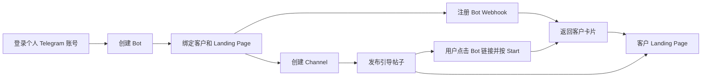

# Bot 自动化创建与 Telegram Card Bot

本项目提供两种卡片接入方式。`auto-register` 是 Node.js Docker API，负责个人 Telegram 账号登录、Bot 自动创建、客户落地页配置、Webhook、Channel 创建和引导帖子发布，数据存入 MySQL 和会话卷。`card-bot` 是独立 Cloudflare Worker，使用已有 Bot Token 返回固定卡片，可单独部署。

- [Bot 自动化创建和客户转化流程](#1-bot-自动化创建和客户转化流程)
- [Telegram Card Bot](#2-telegram-card-bot)

## 项目目录

```text
auto-register/             Bot、客户落地页和 Channel API
  api/                     登录、资源创建、客户卡片、MySQL 存储
  CONVERSION.md            客户转化接口与恢复说明
  test/                    模拟 Telegram 流程测试
  scripts/                 命令行创建脚本和配置模板
  sql/init.sql             可选手工建库建表 SQL
  Dockerfile               Node.js API 镜像
  compose.yaml             API 部署与会话卷
  .env.example             API、MySQL、Telegram 默认配置
card-bot/                  Telegram 卡片服务
  src/index.js             Cloudflare Worker
  scripts/                 Webhook 注册脚本和配置模板
  wrangler.jsonc           Worker 部署配置
  .dev.vars.example        Worker 本地变量模板
```

两个目录各自包含 `package.json`，可独立安装和运行。仓库根目录的 npm 命令仅转发到对应服务；`npm run check` 同时检查两个服务。已有本地 `.env` 已迁入 `auto-register/.env`，不提交到 Git。

## 1. Bot 自动化创建和客户转化流程

适合由一个操作者管理自己的 Telegram 账号，以及不同客户的 Bot、频道和落地页配置。接口共用管理员 `API_KEY`；可以保存多个 Telegram 账号会话，每次登录生成独立 `account_id`，但没有客户登录和权限隔离。`customer_id` 仅用于客户业务关联。

服务采用独立 API 分步执行，没有一次请求完成全部创建的接口。各步的调用顺序和输出如下：

| 步骤 | 操作 | 前置条件 | 返回或保存 |
| --- | --- | --- | --- |
| 部署 | Docker 启动，自动建库建表 | 可连接 MySQL，配置 API_KEY | API 服务、MySQL 四张表、会话卷 |
| 1 | 发起 Telegram 登录 | App 凭据和个人手机号 | account_id、验证码接收方式 |
| 2 | 提交验证码及可能的两步验证密码 | 本次登录的 account_id | authorized、持久化会话 |
| 3 | 创建指定 Bot | 有效用户会话、唯一 Bot 用户名 | Bot Token、Bot URL |
| 4 | 配置客户落地页和卡片 | 本服务保存的 Bot | customer_id、卡片配置 |
| 5 | 注册 Webhook | 已保存卡片配置、公网 HTTPS API 地址 | 每个 Bot 的 Webhook URL |
| 6 | 创建私有 Channel，可选 | 有效用户会话、已配置落地页的 Bot | Channel ID、邀请链接 |
| 7 | 发布引导帖子，可选 | ready 状态的 Channel | Bot 链接、落地页链接、帖子结果 |

已有有效会话时从步骤 3 继续；已有 Bot 时从步骤 4 继续；只做 Bot 卡片时完成步骤 5 即可。Channel 创建不依赖 Webhook 注册，但 Bot 的卡片回复必须在 Webhook 配置完成后才能工作。



Channel 帖子同时提供落地页直接链接；加入频道不会自动启动 Bot 或私信成员。本项目使用客户已有的落地页，不生成页面，也不统计点击、注册或成交归因。两个卡片服务都支持私聊 `/start`，同一个 Bot 只能选择一个 Webhook 接收服务。

### 准备

- 已注册的个人 Telegram 账号，能够接收登录验证码。
- 在 [my.telegram.org](https://my.telegram.org) → API development tools 获取 App `api_id` 和 `api_hash`；它们与 Bot Token 不同。
- Docker、Docker Compose 和可访问的现有 MySQL。
- 首次需完成验证码及可能的两步验证密码校验，网页端登录不会自动授权本服务。

### Docker 部署

以下 API 命令均在 `auto-register/` 目录执行：

```bash
cd auto-register
```

```bash
cp .env.example .env
chmod 600 .env
# 编辑 .env：设置随机 API_KEY（至少 32 字符）、MYSQL_HOST、MYSQL_PORT、MYSQL_DATABASE、MYSQL_USER、MYSQL_PASSWORD，可选填 App 凭据等默认值
# 生成随机密钥：openssl rand -hex 32
docker compose up -d --build
```

默认仅监听宿主机 `127.0.0.1:3100`。所有管理请求必须携带 `Authorization: Bearer <API_KEY>`。远程访问可通过 HTTPS 反向代理。健康检查为 `GET /health`。以下命令中的值均为占位符，使用自己的实际配置。

| 环境变量 | 必填 | 默认值 | 用途和格式 |
| --- | --- | --- | --- |
| API_KEY | 是 | 无 | 至少 32 字符；所有管理接口使用 Bearer 鉴权 |
| API_PORT | 否 | `3100` | Compose 的宿主机监听端口 |
| PUBLIC_BASE_URL | 注册 Webhook 时必填 | 无 | 指向 API 的公网 HTTPS 源地址，不含路径；用于 `/webhooks/:bot_id` |
| MYSQL_HOST | 是 | 无 | 数据库 IP/域名；宿主机已映射 MySQL 可用 `host.docker.internal` |
| MYSQL_PORT | 否 | `3306` | 1–65535 的整数 |
| MYSQL_DATABASE | 是 | 无 | 自动创建的库名，1–64 位字母、数字或下划线 |
| MYSQL_USER | 是 | 无 | 对目标库具有 CREATE、SELECT、INSERT 权限的用户 |
| MYSQL_PASSWORD | 是 | 无 | 数据库密码 |
| TG_API_ID | 条件必填 | 无 | 正整数；登录请求未传 `api_id` 时使用 |
| TG_API_HASH | 条件必填 | 无 | 32 位十六进制密钥；请求未传 `api_hash` 时使用 |
| TG_PHONE | 条件必填 | 无 | `+` 加 7–15 位数字，不含空格；请求未传 `phone` 时使用 |
| TG_BOT_NAME | 条件必填 | 无 | 显示名称，最多 64 个 JavaScript 字符；请求未传 `name` 时使用 |
| TG_BOT_USERNAME | 条件必填 | 无 | 5–32 位，字母开头、bot 结尾，仅含字母/数字/下划线；请求未传 `username` 时使用 |
| PORT | 否 | `3000` | Node.js 服务端口；Dockerfile 设置为 3000，Compose 不透传自定义值 |
| DATA_DIR | 否 | 本地 `./data`；容器 `/data` | 会话目录；Compose 固定为 `/data` 并挂载命名卷 |

Dockerfile 使用 Node.js 22、非 root 用户运行，并内置 HTTP 健康检查。仅 API 代码和依赖进入镜像，真实 `.env` 和登录数据不进入镜像。使用现有 MySQL 时不需要部署新数据库容器。

可单独构建镜像并运行（同样使用环境变量和持久化卷）：

```bash
docker build -t telegram-card-bot-api:local .
docker run -d --name telegram-card-bot-api --restart unless-stopped \
  --env-file .env --add-host host.docker.internal:host-gateway \
  -p 127.0.0.1:3100:3000 -v telegram-bot-data:/data \
  telegram-card-bot-api:local
```

单独使用 `docker run` 时端口由 `-p` 参数指定；`API_PORT` 只供 Compose 插值。两种部署方式使用不同的卷名，选择一种并在后续部署中保留同一个卷。Compose 固定项目名为 `telegram-card-bot-github`，目录重组后继续使用原容器和 `telegram-card-bot-github_telegram-data` 卷；若改项目名，也需显式复用原卷才能读取旧会话。

### API 使用约定和接口明细

API 用 JSON 接收参数并返回 JSON；POST / PUT 请求设置 `Content-Type: application/json`，管理接口设置 `Authorization: Bearer <API_KEY>`。请求体最大 16 KiB。每次首次登录会生成一个新的 `account_id`；完成登录后保存这个标识，后续创建和查询都使用同一个标识。

| 方法 | 路径 | 请求字段 | 返回内容 |
| --- | --- | --- | --- |
| GET | `/health` | 无；无需鉴权 | `{"ok":true}`；表示 HTTP 服务已启动，不实时探测 MySQL/Telegram |
| POST | `/v1/login/start` | `api_id`、`api_hash`、`phone`，可由环境变量提供 | `account_id`、`status`、`delivery` |
| POST | `/v1/accounts/:account_id/verify` | `code`；需要两步验证时提交 `password` | `account_id`、`status` |
| GET | `/v1/accounts/:account_id` | 无 | 已保存的账号标识和登录状态 |
| POST | `/v1/accounts/:account_id/bots` | `name`、`username`，可由环境变量提供 | `username`、`name`、`token`、`url` |
| GET | `/v1/accounts/:account_id/bots/:username` | 无 | MySQL 中已保存的 Bot 信息和 Token |
| PUT / GET | `/v1/accounts/:account_id/bots/:username/landing` | PUT 传客户及卡片字段 | 保存/读取客户卡片配置 |
| POST | `/v1/accounts/:account_id/bots/:username/webhook` | `{}` | 已注册的 Webhook URL |
| POST | `/v1/accounts/:account_id/channels` | request_key、bot_username、title、about | Channel 信息和邀请链接 |
| GET | `/v1/accounts/:account_id/channels/:request_key` | 无 | Channel 的已保存状态 |
| POST | `/v1/accounts/:account_id/channels/:request_key/posts` | request_key、text | 帖子发送结果 |
| POST | `/webhooks/:bot_id` | Telegram Update | 接收 `/start`，通过专属 Webhook Secret 校验 |

下面示例的 `YOUR_API_KEY`、`ACCOUNT_ID`、App 凭据和用户名需要替换。也可在自己的 Bash 终端加载 `.env` 后使用 `-H "Authorization: Bearer $API_KEY"`；`source` 会执行文件内容，只加载自己维护的可信文件。

```bash
set -a
source .env
set +a
```

登录状态依次为 `code_required` → `password_required`（如启用两步验证）→ `authorized`。验证码和密码通过 verify 请求提交，API 不读取脚本专用的 `TG_PHONE_CODE`、`TG_PASSWORD` 环境变量。

`/health` 和 `/webhooks/:bot_id` 不使用管理员 API_KEY；Webhook 必须携带 Telegram 的 `X-Telegram-Bot-Api-Secret-Token`，其余业务接口都需鉴权。

### 步骤 1：发起登录，发送验证码

```bash
curl http://127.0.0.1:3100/v1/login/start \
  -H 'Authorization: Bearer YOUR_API_KEY' \
  -H 'Content-Type: application/json' \
  -d '{"api_id":123456,"api_hash":"YOUR_APP_API_HASH","phone":"+8613800000000"}'
```

响应示例（account_id 每次不同）：

```json
{"account_id":"本次生成的UUID","status":"code_required","delivery":"telegram_app"}
```

服务在发送验证码后立即保存 `/data/<account_id>.json`，再返回 `account_id`。调用方也应保存这个值；验证码确认和后续创建使用同一个 account_id。向同一手机号重新发起登录会生成新标识，不会自动复用旧记录。

返回 `account_id`、`status: "code_required"`、`delivery`。`telegram_app` 表示通过 Telegram 客户端接收，`other` 表示其他渠道；本服务不保证短信发送。App 凭据和手机号已设置环境变量时可发送 `{}`。保存 `account_id`，后续调用均使用它，不需要重复发送验证码。

### 步骤 2：提交验证码，完成登录

```bash
curl http://127.0.0.1:3100/v1/accounts/ACCOUNT_ID/verify \
  -H 'Authorization: Bearer YOUR_API_KEY' \
  -H 'Content-Type: application/json' \
  -d '{"code":"12345"}'
```

成功响应示例：

```json
{"account_id":"返回的账号标识","status":"authorized"}
```

成功返回 `status: "authorized"`。如返回 `password_required`，向同一接口再次提交 `{"password":"你的两步验证密码"}`；也可首次提交 `code` 和 `password` 两个字段。验证码和密码不写入持久化文件。登录流程在本服务中 10 分钟后过期，Telegram 验证码也可能提前失效；重新调用登录接口获取新的 `account_id`。当前不支持注册个人账号、额外邮箱验证或验证码自动读取。

### 步骤 3：创建指定 Bot，回传 Token

```bash
curl http://127.0.0.1:3100/v1/accounts/ACCOUNT_ID/bots \
  -H 'Authorization: Bearer YOUR_API_KEY' \
  -H 'Content-Type: application/json' \
  -d '{"name":"Gatherstar Card Bot","username":"gatherstar_unique_card_bot"}'
```

响应示例：

```json
{"username":"gatherstar_unique_card_bot","name":"Gatherstar Card Bot","token":"123456:EXAMPLE_TOKEN","url":"https://t.me/gatherstar_unique_card_bot"}
```

`name`、`username` 可分别由 `TG_BOT_NAME`、`TG_BOT_USERNAME` 提供默认值。BotFather 对话依赖英文提示，用户名占用、账号限制或回复变化会返回错误；超时后先检查 BotFather 对话，避免重复创建。不要同时手动操作该账号的 BotFather。服务只对已成功保存的结果去重，无法保证远程创建与本地写入之间的事务一致性。

| 字段 | 必填 | 说明 |
| --- | --- | --- |
| name | 请求或环境变量提供 | Bot 显示名称，1–64 字符；默认读取 TG_BOT_NAME |
| username | 请求或环境变量提供 | 全局唯一，5–32 位，字母开头、bot 结尾，仅含字母、数字、下划线；默认读取 TG_BOT_USERNAME |

### 步骤 4：配置客户 Landing Page 和卡片

```bash
curl -X PUT http://127.0.0.1:3100/v1/accounts/ACCOUNT_ID/bots/customer_a_unique_bot/landing \
  -H 'Authorization: Bearer YOUR_API_KEY' -H 'Content-Type: application/json' \
  -d '{
    "customer_id":"customer_a",
    "landing_url":"https://customer-a.example.com/offer?source=telegram",
    "card_text":"欢迎查看客户 A 的活动",
    "card_image":"",
    "button_text":"查看活动"
  }'
```

| 字段 | 必填 | 限制或默认值 |
| --- | --- | --- |
| customer_id | 是 | 1–64 字符，绑定客户业务标识 |
| landing_url | 是 | 完整 HTTP(S) 地址，可带查询参数，不允许 URL 内嵌用户名密码 |
| card_text | 否 | 默认“欢迎访问平台”；有图片最多 1024，无图片最多 4096 字符 |
| card_image | 否 | 默认空；公网图片 URL 或 Telegram file_id，最多 2048 字符 |
| button_text | 否 | 默认“立即了解”，1–64 字符 |

PUT 保存完整配置，省略可选字段将恢复默认值。返回配置不含 Webhook 密钥。GET 同一路径可查询配置。不同 Bot 对应不同客户落地页，配置更新后后续 `/start` 使用新配置；不需要重新部署。Webhook 密钥在第一次配置时生成，后续更新保留。

### 步骤 5：注册 Bot Webhook

```bash
curl -X POST http://127.0.0.1:3100/v1/accounts/ACCOUNT_ID/bots/customer_a_unique_bot/webhook \
  -H 'Authorization: Bearer YOUR_API_KEY' -H 'Content-Type: application/json' -d '{}'
```

返回：

```json
{"username":"customer_a_unique_bot","webhook_url":"https://bots.example.com/webhooks/123456","status":"registered"}
```

用户私聊发送 `/start` 时，API 根据 Bot ID 从 MySQL 读取客户配置并发送图片或文字、网址按钮。这里由 Docker API 直接处理卡片，无需为每个客户部署 Cloudflare Worker。一个 Bot 只能设置一个 Webhook；注册到 Docker API 会替换该 Bot 之前的 Worker Webhook。独立 `card-bot` 仍可用于其他 Bot。

### 步骤 6：创建客户 Channel（可选）

```bash
curl http://127.0.0.1:3100/v1/accounts/ACCOUNT_ID/channels \
  -H 'Authorization: Bearer YOUR_API_KEY' -H 'Content-Type: application/json' \
  -d '{
    "request_key":"customer_a_channel_001",
    "bot_username":"customer_a_unique_bot",
    "title":"客户 A 活动频道",
    "about":"客户 A 的活动信息"
  }'
```

| 字段 | 必填 | 限制 |
| --- | --- | --- |
| request_key | 是 | 1–64 位字母、数字、下划线、短横线；同一账号下稳定且唯一 |
| bot_username | 是 | 当前账号已创建且已配置 landing 的 Bot 用户名 |
| title | 是 | 1–128 字符 |
| about | 否 | 最多 255 字符，默认空 |

创建的是私有广播频道，账号为创建者。响应包含 `request_key`、`channel_id`、`customer_id`、`bot_username`、`title`、`about`、`status: "ready"`、`invite_url`、`bot_url`，不返回 access_hash。当前不设置公开频道用户名，也不邀请用户或将 Bot 提升为管理员。发布通过登录用户账号完成。

GET `/v1/accounts/ACCOUNT_ID/channels/customer_a_channel_001` 查询已保存信息；GET 不会调用 Telegram。相同 request_key 和参数会返回已有频道，改变参数会返回 409。Channel 已创建但邀请链接生成失败时，使用同一 key 重试可继续生成链接。

Channel 创建请求本身没有服务端幂等键。如果发生网络错误，结果可能不确定，记录保留 `creating` 状态，服务返回 409 并禁止自动再次创建；先到 Telegram 检查，不应直接换 key 盲目重试。创建成功后数据库短暂故障时，会话 JSON 保存恢复信息，后续账号请求先补写数据库。

### 步骤 7：发布转化引导帖子（可选）

```bash
curl http://127.0.0.1:3100/v1/accounts/ACCOUNT_ID/channels/customer_a_channel_001/posts \
  -H 'Authorization: Bearer YOUR_API_KEY' -H 'Content-Type: application/json' \
  -d '{"request_key":"offer_post_001","text":"本周活动已上线，点击下方链接了解详情。"}'
```

| 字段 | 必填 | 限制 |
| --- | --- | --- |
| request_key | 是 | 1–64 位字母、数字、下划线、短横线；同一频道内唯一 |
| text | 是 | 1–3000 字符，加入链接后总长度不超过 4096 |

频道发布普通文字，并追加两个可点击链接：Bot Start 链接、配置的 Landing Page。响应含 `status: "sent"`、`message_id`（如 Telegram 返回）、`bot_url`、`landing_url` 和文本。已成功发送的同 key 请求直接返回保存结果；改变正文或落地页需使用新 key。待发送记录保存 Telegram random_id，重试使用同一 random_id 来降低重复发送风险。不要无限重复提交。

### 查询登录状态或取回已保存 Token

```bash
curl http://127.0.0.1:3100/v1/accounts/ACCOUNT_ID \
  -H 'Authorization: Bearer YOUR_API_KEY'
curl http://127.0.0.1:3100/v1/accounts/ACCOUNT_ID/bots/gatherstar_unique_card_bot \
  -H 'Authorization: Bearer YOUR_API_KEY'
```

状态查询返回本地记录；创建时会检查 Telegram 会话是否仍有效。Token 查询仅支持本服务保存的 Bot，不会从 BotFather 导入已有 Bot，也不会轮换 Token。获得的 Token 可用于独立 Cloudflare 卡片服务；Docker 卡片模式会自动从数据库读取 Token，无需再配置给 Worker。

账号 GET 只返回本地状态，`authorized` 不代表本次请求实时验证了 Telegram。创建新 Bot、创建 Channel、发布帖子会检查实际授权；缓存结果或配置查询不验证用户会话。当前没有单独的实时会话校验 API。

### 常见错误和处理

失败返回 `{"error":"错误说明"}`，不会返回 App 密钥或用户会话。

| HTTP 状态 | 原因 | 处理 |
| --- | --- | --- |
| 400 | 参数缺失、格式错误或 JSON 错误 | 检查请求字段和配置表 |
| 401 | API_KEY 错误、未登录或实际 Telegram 会话失效 | 检查鉴权；会话失效时重新发起登录 |
| 404 | 接口、账号记录或已保存 Bot 不存在 | 检查路径、account_id 和用户名 |
| 409 | 并发操作、request_key 冲突或 Channel 创建结果不确定 | 等待、检查参数，或到 Telegram 核对远程资源 |
| 410 | 本服务登录流程超过 10 分钟 | 重新发起登录并使用新的 account_id |
| 413 | 请求体超过 16 KiB | 缩小请求体 |
| 422 | Telegram 拒绝认证、需要额外验证或 BotFather 创建失败 | 根据错误和 BotFather 对话处理；当前不支持邮箱验证或注册个人账号 |
| 429 | Telegram FLOOD_WAIT 限流 | 等待 Telegram 指定时间，避免立即重复请求 |
| 403 | Webhook Secret 不匹配 | 检查注册的 Telegram Webhook 密钥 |
| 405 | Webhook 使用非 POST 方法 | Telegram 消息入口只接受 POST |
| 500 | 数据库、网络或其他内部错误 | 检查容器日志、MySQL 和网络连接 |
| 502 | Telegram Bot API 请求或发送失败 | 检查 Token、图片、网络和 Webhook 配置 |
| 504 | BotFather 回复超时 | 先检查 Telegram 中是否已创建成功，再决定是否重试 |

同一 account_id 和用户名已有数据库记录时，创建接口直接返回已保存 Token；更改 name 不会更新已有 Bot。它不提供 Token 轮换、删除 Bot 或导入已有 Bot 功能。

### 持久化和维护

用户会话文件位于容器内 `/data/<account_id>.json`，挂载到 Compose 命名卷 `<项目名>_telegram-data`。当前本地卷为 `telegram-card-bot-github_telegram-data`。宿主机路径可通过以下命令查询：

```bash
docker volume inspect telegram-card-bot-github_telegram-data \
  --format '{{.Mountpoint}}'
```

- `.env`、`data/` 已被 Git 忽略，真实凭据不放入镜像。
- Docker 命名卷 `telegram-data` 保存 App 凭据和用户会话，现有 MySQL 保存 Bot 信息和 Token；数据库写入失败时，会话文件临时保存待补写的 Bot 结果，文件权限为 `600`，应保护宿主机和备份。`API_KEY` 可访问本服务管理的所有账号。
- `docker compose down` 保留数据；`docker compose down -v` 会删除数据卷。
- 账号会话撤销或失效时重新发起登录；旧 Bot Token 仍可从旧 `account_id` 的记录取回。
- 非 Docker 本地运行：设置 `API_KEY` 后执行 `npm run start:api`；需设置 `MYSQL_HOST`、`MYSQL_USER`、`MYSQL_PASSWORD`、`MYSQL_DATABASE`，可用 `MYSQL_PORT`（默认 3306）、`PORT`、`DATA_DIR` 设置连接和目录。

### 重启、退出登录和验证

```bash
docker compose ps
docker compose logs --tail 50 telegram-api
curl http://127.0.0.1:3100/health
docker compose restart telegram-api
```

重启后用原 `account_id` 查询状态和 Token；创建新 Bot 时会实际检查 Telegram 会话。无需再次发送验证码。若要退出 Telegram 登录，在客户端「设置 → 设备/活跃会话」中终止该脚本会话；本服务尚无退出接口。终止会话不会删除 Bot 或使其 Token 失效，本地记录仍保留。

| 验证内容 | 当前结果 |
| --- | --- |
| Docker 构建和容器健康检查 | 已通过 |
| MySQL 自动建库建表、配置写入/读取、API 鉴权 | 已实测通过，临时记录已清理 |
| 真实 Telegram 验证码登录及保存会话实际授权 | 已验证有效 |
| 客户卡片分发、Channel 分步恢复、帖子重试 | 模拟 Telegram 测试已通过 |
| 真实 BotFather 创建、Channel 创建和发布 | 尚未实测 |
| 公网 Webhook 注册和收发 | 尚未实测，需配置 PUBLIC_BASE_URL |

历史登录凭据和会话可在本地继续使用；文档不保存手机号、api_hash、验证码、账号标识或真实 Token。

### MySQL 数据和自动初始化

Compose 仅启动 API 服务，使用已有 MySQL，不会创建新的数据库容器。所有数据库连接参数均来自 `.env`：`MYSQL_HOST`、`MYSQL_PORT`、`MYSQL_DATABASE`、`MYSQL_USER`、`MYSQL_PASSWORD`。服务启动时先连接 MySQL 自动创建 `MYSQL_DATABASE` 指定的数据库，再创建 `telegram_bots`、`bot_landings`、`telegram_channels`、`channel_posts` 四张表，完成后才开始监听 API。Bot 表保存所属 `account_id`、Telegram Bot 数字 ID、用户名、显示名称、Token、创建和更新时间。用户名不区分大小写并有唯一约束。Token 以明文保存在数据库中以便 API 返回，数据库访问凭据与备份应保密。

本地 MySQL 已映射宿主机 3306 时，使用模板中的 `MYSQL_HOST=host.docker.internal`；Compose 已配置 Linux 的 host-gateway 映射。不要在 API 容器中使用 `localhost` 连接另一个容器。也可将两个容器加入同一个 Docker 网络，然后用 MySQL 容器名作为主机。无需预先创建数据库；API 用户需对目标数据库有 `CREATE`、`SELECT`、`INSERT` 权限。`MYSQL_DATABASE` 仅允许 1–64 位字母、数字、下划线，支持通过环境变量动态指定。初始化失败时服务启动失败，不会接受业务请求。若远程创建成功后数据库暂时不可用，结果先记入会话恢复记录；同一 `account_id` 的后续请求会先补写数据库，避免重复创建。

默认 API 宿主机端口为 `3100`，可通过 `API_PORT` 调整，避免与已有 3000 端口服务冲突。将 `MYSQL_DATABASE` 配置为目标库名即可；库表已存在时不会清空数据或自动修改已有结构。

### 可选：手动初始化数据库和表

通常无需手动导入，服务启动已自动完成建库建表。如需管理员预先初始化，建库建表脚本为 [`sql/init.sql`](auto-register/sql/init.sql)，默认数据库名为 `telegram_bot`，与 `.env.example` 一致。若使用其他 `MYSQL_DATABASE`，先修改 SQL 中的 `CREATE DATABASE` 和 `USE` 数据库名。脚本使用 `IF NOT EXISTS`，可重复导入，不会清空现有数据；不会自动修改已存在表的结构。

使用宿主机 MySQL 客户端导入（密码在提示中输入）：

```bash
mysql -h 127.0.0.1 -P 3306 -u root -p < sql/init.sql
```

也可通过本地 `mysql` 容器导入：

```bash
docker cp sql/init.sql mysql:/tmp/telegram-bot-init.sql
docker exec -it mysql mysql -u root -p -e 'source /tmp/telegram-bot-init.sql'
```

导入后，将 `.env` 的 `MYSQL_DATABASE` 设置为对应库名，并填写有权限访问此库的 `MYSQL_USER`、`MYSQL_PASSWORD`，再启动 API 服务。SQL 不包含数据库账号或密码。

| 数据位置 | 内容 | 恢复要求 |
| --- | --- | --- |
| `/data/<account_id>.json` | App 凭据、手机号、用户会话、登录状态、待补写远程创建结果 | 保留原数据卷和 account_id |
| MySQL `telegram_bots` | account_id、Bot ID、用户名、名称、Token | 保留数据库和连接配置 |
| MySQL `bot_landings` | 客户标识、卡片、落地页、Webhook Secret 和 URL | 注册 Webhook 前先保存配置 |
| MySQL `telegram_channels` | 客户/Bot 关联、频道 ID、access_hash、邀请链接、阶段状态 | 通过 request_key 查询和恢复 |
| MySQL `channel_posts` | 正文、链接、Telegram random_id、发送状态 | 重试使用同一 request_key |

服务不会自动删除已创建的 Bot/Channel 或回滚已发布内容。备份时同时保留会话卷和 MySQL，数据库中 Token 与会话文件均按敏感数据处理。

### 可选：通过 Node.js 脚本自动创建 Bot

除 Docker API 外，也可在本地终端运行独立创建脚本。需要 Node.js 20 或更新版本；脚本将会话和 Token 保存为本地文件，不使用 API 的数据卷或 MySQL。

`scripts/create-bot.js` 使用个人 Telegram 账号通过 MTProto 与官方 BotFather 对话，依次发送 `/newbot`、名称和用户名，提取返回的 Bot Token。首次无需已有 Bot Token，但需要在 [my.telegram.org](https://my.telegram.org) → API development tools 申请的 App `api_id`、`api_hash`。网页端登录会话不能直接作为本脚本的会话。

在 `auto-register/` 目录执行：

```bash
npm install
cp scripts/create-bot.env.example scripts/create-bot.env
chmod 600 scripts/create-bot.env
```

编辑 `scripts/create-bot.env`，填写以下环境变量。模板不包含真实凭据：

| 环境变量 | 必填 | 说明 |
| --- | --- | --- |
| TG_API_ID | 是 | App api_id，正整数 |
| TG_API_HASH | 是 | App api_hash，32 位十六进制密钥 |
| TG_PHONE | 是 | 个人账号手机号，包含国家区号，如 `+86...` |
| TG_BOT_NAME | 是 | 新机器人的显示名称 |
| TG_BOT_USERNAME | 是 | 唯一用户名，5–32 位，以字母开头、以 bot 结尾，仅含字母、数字、下划线 |
| TG_PHONE_CODE | 否 | 首次登录验证码，不提供时终端输入 |
| TG_PASSWORD | 否 | 两步验证密码，不提供时终端输入 |
| TG_SESSION_PATH | 否 | 用户会话路径，默认 `scripts/.telegram-user.session`，直接保存 StringSession 文本 |
| TG_TOKEN_FILE | 否 | Token 输出文件，默认 `scripts/.bot-token.env`，必须不存在 |

加载环境变量并运行：

```bash
set -a
source scripts/create-bot.env
set +a
npm run create:bot
```

脚本只从环境变量读取创建配置；也可由终端或密钥管理工具直接注入，无需配置文件。`source` 会执行 Bash 语法，只加载自己填写的可信文件。可通过 `TG_PHONE_CODE`、`TG_PASSWORD` 环境变量传入登录验证码和两步验证密码；未提供时在终端输入；验证码会过期，建议临时注入。用户会话有效时，后续运行可复用登录。

成功后 Token 写入 `TG_TOKEN_FILE`，格式为 `BOT_TOKEN=...`，文件仅当前用户可读写，不在终端显示 Token。脚本会拒绝覆盖已有输出文件。将该值填入下文 Cloudflare 的 `BOT_TOKEN` Secret 和 `scripts/env` 的 `BOT_TOKEN`；不会自动部署 Worker 或注册 Webhook。

不要同时手动操作 BotFather 或运行多个创建脚本。脚本依赖 BotFather 的英文提示，用户名占用、创建限制、回复变化或超时会停止流程；重新运行前检查 BotFather 对话，确认是否已创建成功，避免重复创建。脚本属于对话自动化，没有官方独立的 `createBot` HTTP 接口，尚未完成真实账号创建实测。

`scripts/create-bot.env`、默认 Token 输出和会话文件已被 Git 忽略。若自定义输出路径，请自行确认不会提交到 Git。会话文件可用于访问个人账号，应与 `api_hash`、Bot Token 一并保密。详见 [BotFather 流程](https://core.telegram.org/bots/features#creating-a-new-bot)、[用户授权](https://core.telegram.org/api/auth) 和 [Teleproto](https://docs.teleproto.dev/)。

## 2. Telegram Card Bot

Cloudflare Workers 使用已有 Bot Token，在私聊收到 `/start` 后发送固定图片、文案和网址按钮。无图片时发送文字和按钮。每个部署使用一组 Worker 环境变量，卡片服务无需 MySQL 或个人账号会话。适合已创建 Bot 的独立卡片接入。

如果已使用上方 Docker 的客户配置和 Webhook，可以由 Docker 直接发送卡片；Cloudflare Worker 是另一种部署选项。同一个 Bot 注册到 Worker 后会替换 Docker Webhook，反之亦然。

### 准备

以下卡片服务命令均在 `card-bot/` 目录执行：

```bash
cd card-bot
```

- 使用上方 API 创建 Bot 获取 Token，或在官方 @BotFather 通过 `/newbot` 手动创建。
- 注册 Cloudflare 账号，准备卡片图片直链和文案。
- Token 通常是 `数字ID:密钥`，Bot 用户名和普通账号 ID 不是 Token。
- 不要提交真实 Token 或 Webhook 密钥；`.dev.vars.example` 只是配置模板，不会自动配置线上变量。

### 使用流程

1. 准备 Bot Token、落地页网址，以及可选的图片和文案。
2. 将 `src/index.js` 部署到 Cloudflare Workers。
3. 设置 Worker 运行时变量和 Secrets，保存并部署。
4. 在本地配置 `scripts/env`，运行注册 Webhook 脚本。
5. 打开 `https://t.me/你的机器人用户名`，点击 Start 或发送 `/start`。

只响应私聊中的 `/start`（可带参数），忽略其他消息和群聊。配置了 `CARD_IMAGE` 时发送图片、文案和网址按钮；没有图片时发送文字和按钮。网址按钮只打开配置的网址，不在 API 服务中记录点击。

### 部署到 Cloudflare Workers

Cloudflare 控制台 → Workers & Pages → 创建应用 → 从 Git 仓库导入，选择本仓库。

- 部署命令：`npx wrangler deploy`
- 项目根目录：`card-bot`。
- 本项目无需构建；如果要求构建命令，可填写 `npm run check`。

也可以创建 Hello World Worker，在代码编辑器粘贴 `card-bot/src/index.js` 并部署。使用提供的 `workers.dev` 地址，无需自有域名。

### 配置运行时变量

Worker → Settings → Variables and Secrets，添加并保存部署：

| 名称 | 类型 | 必填 | 默认值/格式 | 用途 |
| --- | --- | --- | --- | --- |
| BOT_TOKEN | Secret | 是 | `数字ID:密钥` | 调用 Telegram Bot API；不是 App api_hash |
| WEBHOOK_SECRET | Secret | 是 | 1–256 位字母、数字、下划线或短横线，建议随机 32 位以上 | 验证 Telegram 请求，需与本地注册配置一致 |
| WEBHOOK_PATH | Text | 否 | `/webhook` | 接收 Webhook 的路径；修改后重新注册 |
| LANDING_URL | Text | 是 | 完整 `http://` 或 `https://` URL，可带查询参数 | 网址按钮目标 |
| CARD_IMAGE | Text | 否 | 空 | 公网图片直链或 Telegram file_id |
| CARD_TEXT | Text | 否 | `欢迎访问平台` | 有图最多 1024、无图最多 4096 个 JavaScript 字符，普通文本 |
| BUTTON_TEXT | Text | 否 | `立即进入平台` | 网址按钮文字 |

配置的是 Worker 运行时变量，不是 Git 构建环境变量。业务值不写入 wrangler 配置，方便在控制台修改。

### 本地开发

本地开发使用 `.dev.vars`，与 API 的 `.env` 独立：

```bash
npm ci
cp .dev.vars.example .dev.vars
# 编辑 .dev.vars，填写上表的 Bot Token、Webhook 密钥、落地页等
npm run dev
```

Wrangler 显示本地地址；Telegram 注册 Webhook 需要可从公网访问的 HTTPS 地址，不能直接使用 localhost。通过 Cloudflare 控制台配置的线上变量不会自动写入本地 `.dev.vars`，本地配置也不会自动同步线上。

### 注册 Webhook

注册脚本将公网 Worker URL 和校验密钥提交给 Telegram，并查询 Webhook 信息。它只配置消息接收入口，不会部署 Worker 或创建 Bot。复制模板：

```bash
cp scripts/env.example scripts/env
chmod 600 scripts/env
```

编辑 `scripts/env`，填写：

```ini
BOT_TOKEN=你的BotFather令牌
WEBHOOK_SECRET=与Cloudflare中完全一致的密钥
WORKER_URL=https://你的worker.你的子域.workers.dev
WEBHOOK_PATH=/webhook
```

| 配置 | 必填 | 说明 |
| --- | --- | --- |
| BOT_TOKEN | 是 | 与 Worker 的 BOT_TOKEN 完全一致 |
| WEBHOOK_SECRET | 是 | 与 Worker 的 WEBHOOK_SECRET 完全一致 |
| WORKER_URL | 是 | 公网 HTTPS 源地址，例如 `https://example.workers.dev`，不包含路径或查询参数 |
| WEBHOOK_PATH | 否 | 默认 `/webhook`；必须与 Worker 使用的路径一致 |

支持空行、整行 `#` 注释和包裹值的单引号/双引号；值按原文读取，不执行命令或展开变量。不要使用 `export` 或行尾注释。`scripts/env` 已被 Git 忽略，不提交密钥。建议执行 `chmod 600 scripts/env`。

在 Bash 终端执行：

```bash
bash scripts/register-webhook.sh
```

脚本自动读取其所在目录的 `env`，不再交互输入。从 `scripts` 目录也可执行 `bash register-webhook.sh`。确认 setWebhook 返回 `ok: true`，getWebhookInfo 的 URL 正确。本地 env 只用于注册 Webhook，不会同步 Cloudflare 变量。

### 测试和维护

| Worker HTTP 状态 | 含义 |
| --- | --- |
| 200 | 已处理，或消息不属于私聊 `/start` 而被忽略 |
| 400 | Webhook 请求不是有效 JSON |
| 403 | Telegram Secret Header 与配置不一致 |
| 404 | 请求路径不匹配 |
| 405 | Webhook 路径收到非 POST 请求 |
| 500 | 缺少密钥、落地页无效或文案超长 |
| 502 | Telegram 发送接口失败或网络请求异常 |

进入 Bot，点击 Start 或发送 `/start`，确认收到卡片，点击按钮检查完整落地页地址。

- 根路径返回 404、浏览器 GET 访问 Webhook 返回 405 是正常行为。
- 无回复：检查 getWebhookInfo 和 Worker 日志。
- 图片失败：检查直链是否能直接下载图片；先移除 CARD_IMAGE 验证文字发送。
- 修改图片、文案、按钮、落地页：保存并部署变量即可。
- 修改密钥、Token、路径或 Worker 地址：重新注册 Webhook。

普通网址按钮无法强制使用 TG 内置浏览器，取决于客户端和用户设置。基础版没有持久化去重，Telegram 重试时可能重复发送。不提供点击统计。

## 参考文档

- [Telegram Bot API](https://core.telegram.org/bots/api)
- [BotFather 创建流程](https://core.telegram.org/bots/features#creating-a-new-bot)
- [Telegram 用户授权](https://core.telegram.org/api/auth)
- [Cloudflare Workers](https://developers.cloudflare.com/workers/)
