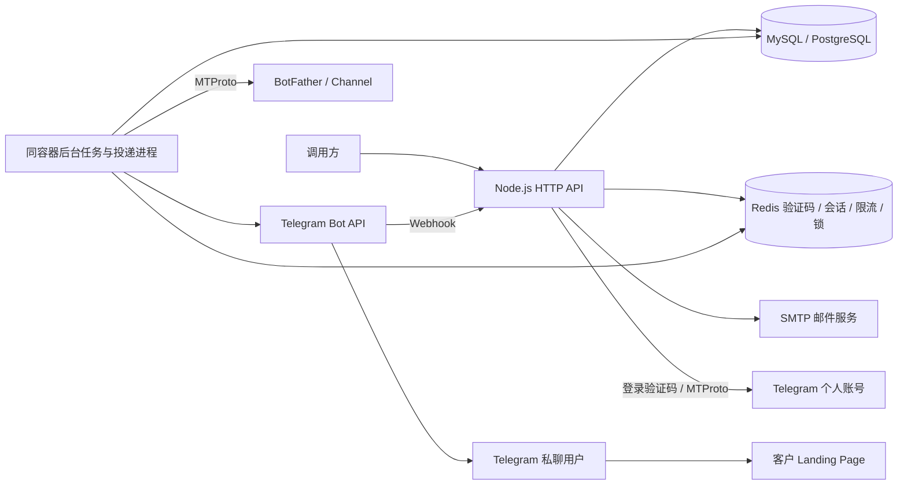

# Telegram Bot 自动化平台 · Docker

**main 分支用于 Node.js Docker 部署；feature-cfworker 分支用于 Cloudflare Workers。** 两个分支分别维护运行适配层，Docker 版支持 MySQL 8.0+ 或 PostgreSQL 16+，并使用 Redis 和 SMTP，不依赖 D1、KV 或 Durable Objects。

本服务支持邮箱密码及邮件一次性验证码鉴权，登录个人 Telegram 账号，自动创建 Bot 并获取 Token，配置不同客户的 Landing Page 卡片，注册 Webhook，创建私有 Channel 和发布引导帖子。只需构建 `auto-register/` 一个目录，平台鉴权、业务 API 和后台队列都包含在同一镜像内。`card-bot/` 保留为 Legacy 独立卡片 Worker。

最新安全升级要求配置 `CREDENTIAL_KEYS` 和 `CREDENTIAL_KEY_ID`。创建 Bot/Channel/帖子与核对任务返回 **HTTP 202 + job_id**，需要查询任务结果。旧明文库先备份，再执行分页加密迁移，详见[升级说明](#upgrade)。

- [架构与数据](#architecture)
- [运行时环境变量](#configuration)
- [Docker 构建、部署与检查](#build-and-verify)
- [API 清单](#api-reference)
- [完整请求示例](#usage)
- [任务、投递与登录态管理](#operations)
- [升级与生产运行](#upgrade)
- [测试与验证范围](#verification)
- [Legacy Card Bot](#legacy-card-bot)

<a id="architecture"></a>

## 架构与数据

平台邮箱身份和 Telegram 身份分别认证。首次邮箱验证成功时生成 UUID `user_id`；注册/登录返回的 `access_token` 用于本 API，默认 2 小时有效且访问不续期。用户随后提交 App api_id/api_hash、手机号与 Telegram 验证码，必要时提交两步验证密码。App configuration 和网页端已登录状态不能替代个人账号认证。

每次 Telegram login/start 成功生成独立 `account_id`，调用方保存或通过 `GET /v1/accounts` 查回。所有账号、Bot、Channel、任务和投递检查用户归属，其他用户的资源返回 404。account_id 只是路径标识，不是鉴权凭据。Bot Token、App api_hash 和平台 access_token 用途不同。



API 接收操作并持久化任务，后台轮询数据库队列，使用事务与租约领取任务。多个副本共享同一个数据库和 Redis，通过 Redis 按手机号、用户或 Bot 协调操作。Telegram 连接仅在需要时建立，结束后保存 StringSession 并关闭，不要求永久在线 TCP 客户端。

| 表 | 内容 |
| --- | --- |
| `user_info` | UUID、唯一邮箱和 scrypt 密码哈希 |
| `tg_info` | 用户归属、account_id、App 凭据、手机号、StringSession 和恢复状态 |
| `bot_info` | Bot 信息与 Token、客户卡片、落地页和 Webhook 配置 |
| `channel_info` | Channel 创建 key、频道 ID/access_hash、邀请链接及旧帖子 JSON |
| `user_security` | 用户禁用标记与会话撤销版本 |
| `channel_posts` | 新帖子独立记录、random_id 和发送状态 |
| `api_jobs` | 持久化创建/核对任务、检查点、租约与结果 |
| `webhook_deliveries` | update_id 去重、卡片投递状态和重试时间 |

手机号、api_hash、session、phone_code_hash、恢复凭据、Bot Token 和 Webhook Secret 使用 AES-256-GCM 加密。任务载荷/结果和投递载荷也加密，密文绑定记录与字段。密码只存哈希。Redis 保存邮件 OTP、平台会话、限流和锁；Telegram 登录态在关系数据库，不需要 tgsession.blob 或 JSON 文件即可跨容器重启恢复。

客户提供已有落地页，服务发送卡片和频道引导链接；不生成页面、不做点击/成交归因。用户主动私聊 Bot 并点击 Start 后才能收到卡片，不自动私信频道成员。Channel 创建和帖子发布使用登录个人账号。

```text
auto-register/
  api/server.js             HTTP 服务、Telegram 连接与退出处理
  api/app.js                API 路由、鉴权、限流与健康检查
  api/store.js              加密存储与数据库读写
  api/database.js           DB_* 配置、连接池与 SQL 方言适配
  api/schema.js             MySQL 建表与旧列升级
  api/postgres-schema.js     PostgreSQL 建表与索引
  api/auth*.js / cache.js   Redis 鉴权、SMTP、原子计数和锁
  api/jobs.js               创建任务、检查点与核对恢复
  api/deliveries.js         Webhook 去重和后台投递
  api/queue-store.js        SQL 事务领取、租约与后台轮询
  api/security.js           密钥、管理员凭据、限流和脱敏审计
  sql/init.sql              MySQL 新库八张表 SQL
  sql/postgresql/init.sql    PostgreSQL 八张表与索引 SQL
  sql/002-security.sql      MySQL 旧表字段扩容及辅助表 SQL
  Dockerfile / compose.yaml 单镜像部署
  .env.example              完整运行时变量模板
  PRODUCTION.md             安全升级与生产运行说明
  scripts/                  旧会话归属迁移、独立 Bot 创建脚本
  test/                     单元与可选真实 MySQL/PostgreSQL 与 Redis 集成验证
card-bot/                   Legacy 独立单 Bot 卡片 Worker
```

<a id="configuration"></a>

## 运行时环境变量

全部配置在 **容器运行时** 通过 Compose `.env`、`docker run --env-file` 或环境变量注入；镜像构建不需要数据库、Redis、SMTP 或 Telegram 凭据，不包含真实 .env。请求中的 App 凭据、手机号和 Bot 名称优先于 TG 默认值；多用户应通过请求提交个人配置。

完整模板见 [auto-register/.env.example](auto-register/.env.example)。首次复制后编辑，后续升级保留原密钥与数据库配置。

| 名称 | 默认值 / 要求 |
| --- | --- |
| `AUTH_HMAC_SECRET` | 必填，至少 32 字符随机值，OTP HMAC 密钥 |
| `CREDENTIAL_KEYS` | 必填，JSON 密钥环，每个值为 32 字节随机密钥的 base64 |
| `CREDENTIAL_KEY_ID` | 必填，例如 v1，须存在于密钥环 |
| `ADMIN_API_KEY` | 可选，管理员接口独立随机凭据，至少 32 字符 |
| `AUTH_CHALLENGE_TTL_SECONDS` | 600，允许 60–3600 秒 |
| `AUTH_SESSION_TTL_SECONDS` | 7200，允许 60–86400 秒，访问不续期 |
| `DB_TYPE` | mysql；可选 mysql 或 postgresql |
| `DB_HOST` | 必填，现有 MySQL 或 PostgreSQL 地址，容器内 localhost 指向 API 自己 |
| `DB_PORT` | 留空按 DB_TYPE 选择：mysql=3306，postgresql=5432 |
| `DB_DATABASE` | 必填，字母、数字、下划线；MySQL 最长 64，PostgreSQL 最长 63 位 |
| `DB_USER` / `DB_PASSWORD` | 必填，需业务读写及表/索引初始化权限；自动建库还需建库权限 |
| `DB_POOL_SIZE` | 10，允许 1–100，每个 API 副本的连接池大小 |
| `DB_CONNECT_TIMEOUT_MS` | 5000，允许 1000–30000 |
| `DB_AUTO_CREATE_DATABASE` | true；已有库且无建库权限时设置 false，仍会初始化表/索引 |
| `DB_MAINTENANCE_DATABASE` | postgres；PostgreSQL 自动建库时连接的维护库，MySQL 忽略 |
| `DB_SSL_MODE` | disable 或 verify-full；后者验证服务端证书及主机名 |
| `DB_SSL_CA` | 可选自定义 CA PEM；在 .env 单行中用字面量 \n 表示换行 |
| `REDIS_URL` | 可选，优先于独立 Redis 地址/用户/密码/DB 配置 |
| `REDIS_HOST` / `REDIS_PORT` | 未设置 URL 时需要 host，Compose 默认 host.docker.internal / 6379 |
| `REDIS_DB` | 0 |
| `REDIS_USER` / `REDIS_PASSWORD` | 可选，依实际 Redis ACL 配置 |
| `REDIS_KEY_PREFIX` | telegram-bot:，多副本保持一致，测试/生产分开 |
| `SMTP_HOST` / `SMTP_FROM` | 真实邮箱注册/登录需要；可暂时省略 |
| `SMTP_PORT` / `SMTP_SECURE` | 587 / false；465 通常使用 secure=true |
| `SMTP_REQUIRE_TLS` | true；仅受控本地测试可用 false |
| `SMTP_USER` / `SMTP_PASSWORD` | 依邮件服务配置；设置 user 时必须提供 password |
| `API_PORT` | 3100，Compose 宿主机映射端口，默认仅监听 127.0.0.1 |
| `PORT` | 3100，Node.js 默认监听端口；Compose 固定容器内部为 3100 |
| `PUBLIC_BASE_URL` | 注册 Webhook 时需要；本 API 的公网 HTTPS 源地址，不含路径 |
| `TG_API_ID` / `TG_API_HASH` / `TG_PHONE` | 可选默认 App ID/hash/国际区号手机号，请求优先 |
| `TG_BOT_NAME` / `TG_BOT_USERNAME` | 可选 Bot 名称/用户名默认值 |
| `DATA_DIR` | Compose 为 /data，仅旧 JSON 会话迁移使用，新会话存在所选关系数据库 |

生成并分别保存密钥：

```bash
# CREDENTIAL_KEYS；CREDENTIAL_KEY_ID=v1
node -e "console.log(JSON.stringify({v1:require('node:crypto').randomBytes(32).toString('base64')}))"
# AUTH_HMAC_SECRET；需要管理员密钥时另生成独立值
node -e "console.log(require('node:crypto').randomBytes(32).toString('hex'))"
```

把 JSON 密钥环按一行放入 .env，例如 `CREDENTIAL_KEYS={"v1":"YOUR_BASE64_KEY"}`。妥善保管密钥与数据库备份，丢失旧密钥无法读取对应凭据。

SMTP 暂不配置仍可启动并访问 `/health`，真实发码及 `/ready` 返回 503。PUBLIC_BASE_URL 在登录和创建资源阶段可以留空；真实 Telegram 回调需要 HTTPS 公网地址。它是 API 地址，客户页面地址另通过 landing API 设置。

### 数据库选择与配置升级

所有数据库业务变量统一使用 `DB_*`，旧前缀不再读取。已有部署升级前，需要把原数据库变量改为上表对应的 DB_* 名称，保持地址、库名、账号、密码和密钥值不变；只修改变量名称不会迁移或重建已有数据。

MySQL 配置示例：

```dotenv
DB_TYPE=mysql
DB_HOST=host.docker.internal
DB_PORT=3306
DB_DATABASE=telegram_bot
DB_USER=telegram_app
DB_PASSWORD=YOUR_DATABASE_PASSWORD
DB_AUTO_CREATE_DATABASE=true
DB_SSL_MODE=disable
```

PostgreSQL 配置示例（使用同一个 Docker 镜像）：

```dotenv
DB_TYPE=postgresql
DB_HOST=host.docker.internal
DB_PORT=5432
DB_DATABASE=telegram_bot
DB_USER=telegram_app
DB_PASSWORD=YOUR_DATABASE_PASSWORD
DB_AUTO_CREATE_DATABASE=false
DB_MAINTENANCE_DATABASE=postgres
DB_SSL_MODE=verify-full
DB_SSL_CA=
```

PostgreSQL 自动建库要求账号具备 CREATEDB 且能够连接维护库；已有数据库可以设置 false，账号仍需目标 schema 的建表/建索引权限与表读写权限。MySQL 自动建库及旧列升级需对应 CREATE/ALTER 权限。TLS 连接设置 verify-full，使用系统信任 CA 或 DB_SSL_CA 指定 CA；受控本地数据库未启用 TLS 时使用 disable。

**切换 DB_TYPE 不会迁移 MySQL/PostgreSQL 之间的数据**，新数据库需要另行导入匹配结构的数据及原密钥。两个后端保留邮箱和 Bot 用户名大小写不敏感、请求 key 大小写敏感的行为，64 位 ID 按字符串处理。

可选手动初始化：先由管理员创建 DB_DATABASE，选择该库后执行 [MySQL init.sql](auto-register/sql/init.sql) 或 [PostgreSQL init.sql](auto-register/sql/postgresql/init.sql)。MySQL 旧列升级见 [002-security.sql](auto-register/sql/002-security.sql)。SQL 不写死数据库名；mysql 使用 -D，psql 使用 -d 指定目标库。服务启动仍会进行幂等建表检查。

### 限流、配额与队列配置

以下均为可选运行时变量：

| 名称 | 默认 | 允许范围 / 用途 |
| --- | --- | --- |
| `OTP_IP_QPS` | 1 | 1–100；三个获取验证码接口共享每 IP 每秒请求上限 |
| `API_IP_PER_MINUTE` | 120 | 1–10000；非 Webhook API 每 IP 分钟上限，健康检查除外 |
| `API_USER_PER_MINUTE` | 60 | 1–10000；已鉴权 `/v1/*` 业务每用户分钟上限 |
| `WEBHOOK_IP_PER_MINUTE` | 1200 | 1–10000；Webhook 每 IP 分钟上限 |
| `TG_LOGIN_PER_TEN_MINUTES` | 5 | 1–20；每用户 Telegram 发码十分钟上限 |
| `TG_CREATE_PER_TEN_MINUTES` | 10 | 1–100；每用户 Bot/Channel 创建请求十分钟上限，重复提交也计数 |
| `MAX_TG_ACCOUNTS_PER_USER` | 5 | 1–100；保存的 Telegram 账号记录上限，含已撤销记录；清理已过期的未完成登录 |
| `MAX_BOTS_PER_USER` | 20 | 1–1000；每用户 Bot 记录上限，仍受 Telegram 自身限制 |
| `MAX_CHANNELS_PER_USER` | 50 | 1–1000；每用户 Channel 记录上限 |
| `TELEGRAM_TIMEOUT_SECONDS` | 60 | 15–240；同步 Telegram 连接与操作总超时 |
| `JOB_TIMEOUT_SECONDS` | 240 | 30–240；任务内 Telegram 连接与操作总超时 |
| `JOB_QUEUE_LIMIT` | 20 | 1–100；同手机号 queued/running 任务总上限 |
| `JOB_RETENTION_SECONDS` | 604800 | 86400–2592000；完成、失败、取消任务保留秒数；uncertain 保留至核对 |
| `WEBHOOK_CHAT_PER_MINUTE` | 5 | 1–60；每 Bot 每私聊分钟卡片上限 |
| `WEBHOOK_BOT_PER_MINUTE` | 300 | 1–3000；每 Bot 分钟卡片上限 |
| `WEBHOOK_QUEUE_LIMIT` | 500 | 1–10000；每 Bot 待处理投递上限，队列满返回 503 |
| `WEBHOOK_RETENTION_SECONDS` | 604800 | 172800–2592000；投递与去重记录保留秒数 |
| `QUEUE_POLL_INTERVAL_MS` | 1000 | 100–10000；每个副本任务/投递各自的轮询间隔 |
| `TRUST_PROXY_HOPS` | 0 | 0–10；默认按 TCP 对端限流，不信任 X-Forwarded-For |

**发码冷却固定 60 秒**：同一邮箱注册与登录共享；同一 Telegram 手机号跨用户/IP 共享。失败也保留冷却。获取验证码的三个 start 接口共享每 IP 默认 1 QPS，可调 OTP_IP_QPS，但不取消 60 秒间隔。冷却/频率超限返回 429、Retry-After 与 retry_after；资源配额拒绝可能没有等待秒数。

在可信反向代理后才能设置 TRUST_PROXY_HOPS，按实际代理层数取 X-Forwarded-For，代理必须正确追加/覆盖头，且禁止绕过代理直连。不要直接信任客户端的 Cloudflare 或 X-Forwarded-For 头。多副本共享 Redis 计数；应用限流不能替代入口 WAF/反向代理限流。

<a id="build-and-verify"></a>
<a id="docker-部署"></a>

## Docker 构建、部署与检查

使用现有 MySQL 8.0+ 或 PostgreSQL 16+、Redis 6.0+。Compose 仅创建 API 容器，不启动新的数据库或 Redis。数据库、Redis 在宿主机发布端口时可用 host.docker.internal，远端服务使用实际地址。

```bash
cd auto-register
if [ ! -f .env ]; then cp .env.example .env; fi
chmod 600 .env
# 编辑 DB_*、Redis、HMAC、凭据密钥等运行时变量
# SMTP 可暂时省略
docker compose config --quiet
docker compose build telegram-api
docker compose up -d --no-build telegram-api
docker compose ps
curl http://127.0.0.1:3100/health
curl http://127.0.0.1:3100/ready
```

默认宿主机与容器内部均使用 3100，Compose 映射为 `127.0.0.1:3100:3100`。API_PORT 和 PORT 都无需手动配置；API_PORT 仅修改 Compose 的宿主机端口。直接运行镜像时使用 `docker run -p 127.0.0.1:3100:3100 --env-file .env YOUR_IMAGE`。若显式覆盖 PORT，docker run 的映射目标端口也需同步调整。

启动按 DB_TYPE 选择驱动、按 DB_DATABASE 自动建库并初始化八张表和索引，然后连接 Redis、启动 HTTP 和后台队列。设置 DB_AUTO_CREATE_DATABASE=false 时只连接已有库并初始化表/索引。MySQL 还会扩容已知旧凭据列为 TEXT/MEDIUMTEXT，此步骤不加密旧数据，管理员需完成分页迁移。PostgreSQL 使用独立建表 SQL 和 JSONB 字段，队列在两种数据库中都使用事务与 FOR UPDATE SKIP LOCKED。初始化应串行发布。

容器使用 Node.js 22、非 root 用户、只读根文件系统、临时目录 tmpfs、移除 capabilities、init 和 6 分钟退出宽限。DATA_DIR 卷保留旧迁移兼容用途。Docker HEALTHCHECK 使用 `/health`，SMTP 未配也可运行基础服务；正式流量切换应检查 `/ready`。

更新代码先 build 再 up；修改 .env 后用 `docker compose up -d telegram-api` 重建容器，restart 不重新加载环境变量。退出时停止接入新请求，等待活动请求/任务结束再关闭 Redis/数据库；异常退出后租约到期可恢复，未知远端副作用不会盲目再次创建。

```bash
# 在 auto-register/ 下
docker compose build telegram-api
docker compose up -d --no-build telegram-api
docker compose logs --tail 50 telegram-api
# 宿主机开发（Node.js 22）
npm ci
npm run check
npm test
node --env-file=.env api/server.js
```

数据库/Redis、密钥、REDIS_KEY_PREFIX 和旧迁移卷在更新时保持。水平扩容可运行多个 API 副本并共享依赖；当前 Compose 绑定固定宿主机端口，不能直接 --scale 多副本占用同一端口，需要部署平台/负载均衡和独立端口设计。数据库、Redis、SMTP 及 Telegram 仍是外部可用性依赖，并未由本 Compose 提供集群。

<a id="api-reference"></a>

## API 清单

请求、响应均为 JSON，POST/PUT 设置 `Content-Type: application/json`，请求体最多 **16 KiB**。同步成功一般返回 200；任务提交与重试返回 202。平台 Token 使用 `Authorization: Bearer <access_token>`；Webhook 与管理员接口分别使用专属凭据。响应包含 `X-Request-ID`，并设置 `Cache-Control: no-store`。

下表 `:id` 为 account_id、`:username` 为 Bot 用户名、`:key` 为 Channel 创建 request_key。所有 `/v1/*` 都要求平台 Token 并检查资源归属。

### 平台鉴权与服务状态

| 方法 | 路径 | 鉴权 | 参数 / 结果 |
| --- | --- | --- | --- |
| GET | `/health` | 无 | 可响应检查，返回 ok |
| GET | `/ready` | 无 | 检查必要配置、数据库和 Redis；不可用时 503 |
| POST | `/auth/register/start` | 无 | email、password → challenge_id、expires_in |
| POST | `/auth/register/verify` | 无 | challenge_id、code → user、access_token |
| POST | `/auth/login/start` | 无 | email、password → challenge_id、expires_in |
| POST | `/auth/login/verify` | 无 | challenge_id、code → user、access_token |
| GET | `/auth/me` | 平台 Token | 本人 id、email |
| POST | `/auth/logout` | 平台 Token | `{}`；撤销当前 Token |
| POST | `/auth/logout-all` | 平台 Token | `{}`；撤销所有平台会话与旧登录验证 |
| POST | `/auth/password` | 平台 Token | current_password、new_password；改密并撤销所有平台会话 |

### Telegram、Bot、卡片与 Channel

| 方法 | 路径 | 参数 / 结果 |
| --- | --- | --- |
| GET | `/v1/accounts` | 本人账号列表，每页最多 100 条，next_cursor 配合 `?after=` |
| POST | `/v1/login/start` | api_id、api_hash、phone → account_id、status、delivery |
| POST | `/v1/accounts/:id/verify` | code；必要时 password → code_required/password_required/authorized |
| GET | `/v1/accounts/:id` | 已保存的登录状态，不实时探测 Telegram |
| POST | `/v1/accounts/:id/logout` | `{}`；Telegram 注销成功后清空本地 session，返回 revoked |
| POST | `/v1/accounts/:id/bots` | name、username；可选 request_key → 202 任务 |
| GET | `/v1/accounts/:id/bots/:username` | 已保存的 Bot 信息与 Token |
| PUT | `/v1/accounts/:id/bots/:username/token` | token；验证属于同一个 Bot 后更新，不回显 Token |
| POST | `/v1/accounts/:id/bots/:username/reconcile` | request_key → 202；核对并取回已创建 Bot 的 Token |
| PUT | `/v1/accounts/:id/bots/:username/landing` | customer_id、landing_url；可选 card_text/card_image/button_text |
| GET | `/v1/accounts/:id/bots/:username/landing` | 客户卡片配置，不返回 Webhook Secret |
| POST | `/v1/accounts/:id/bots/:username/webhook` | `{}`；注册 Webhook，需 PUBLIC_BASE_URL |
| POST | `/v1/accounts/:id/channels` | request_key、bot_username、title；可选 about → 202 任务 |
| GET | `/v1/accounts/:id/channels/:key` | 已保存的频道状态、邀请链接，不返回 access_hash |
| POST | `/v1/accounts/:id/channels/:key/posts` | request_key、text → 202 任务 |
| POST | `/v1/accounts/:id/channels/:key/reconcile` | request_key、channel_id、access_hash → 202 核对任务 |
| GET | `/v1/accounts/:id/jobs/:job_id` | 任务状态、成功 result 或失败 error |
| POST | `/v1/accounts/:id/jobs/:job_id/retry` | `{}`；202，安全重试或要求先核对 |
| GET | `/v1/accounts/:id/bots/:username/deliveries/:update_id` | Webhook 投递状态 |
| POST | `/v1/accounts/:id/bots/:username/deliveries/:update_id/retry` | uncertain 时必须传 allow_duplicate=true |

### Webhook 与管理员

| 方法 | 路径 | 鉴权 / 参数 |
| --- | --- | --- |
| POST | `/webhooks/:bot_id` | Telegram Secret Header；Telegram Update，去重排队后返回 200 |
| POST | `/admin/credentials/rewrap` | Bearer ADMIN_API_KEY；table、cursor、limit，分页加密或重加密数据库凭据 |
| PUT | `/admin/users/:user_id/disabled` | Bearer ADMIN_API_KEY；disabled 布尔值，禁用/启用并撤销旧会话 |

Webhook Header 为 `X-Telegram-Bot-Api-Secret-Token`，由注册接口设置。管理员 Token 与平台 Token 相互独立，未配置 ADMIN_API_KEY 时管理员接口不可用。

<a id="usage"></a>

## 完整调用示例

以下示例用于本地或云端 API；把返回的 challenge_id、account_id、job_id 填入后续请求。为方便展示使用 Bash 变量，它们是调用方本地变量，不是 Worker 运行时配置。

```bash
BASE_URL='http://127.0.0.1:3100'
# 线上使用实际 HTTPS API 地址
```

### 1. 首次注册与后续登录

密码长度 12–128 字符；邮箱转为小写，密码中的空格保留。邮件验证码为六位数字，不在 API 响应中返回。

```bash
curl -X POST "$BASE_URL/auth/register/start" \
  -H 'Content-Type: application/json' \
  -d '{"email":"you@example.com","password":"YOUR_LONG_PASSWORD"}'
```

```json
{"challenge_id":"本次生成的UUID","status":"email_code_required","expires_in":600}
```

```bash
curl -X POST "$BASE_URL/auth/register/verify" \
  -H 'Content-Type: application/json' \
  -d '{"challenge_id":"CHALLENGE_ID","code":"123456"}'
```

```json
{
  "access_token":"YOUR_ACCESS_TOKEN",
  "token_type":"Bearer",
  "expires_in":7200,
  "user":{"id":"自动生成的用户UUID","email":"you@example.com"}
}
```

后续登录使用 `/auth/login/start` 提交同样的 email/password，再向 `/auth/login/verify` 提交新的 challenge_id/code；响应结构与注册相同。注册与登录 challenge 不能混用，每个验证码只能成功消费一次。

```bash
ACCESS_TOKEN='YOUR_ACCESS_TOKEN'
curl "$BASE_URL/auth/me" -H "Authorization: Bearer $ACCESS_TOKEN"
curl "$BASE_URL/v1/accounts" -H "Authorization: Bearer $ACCESS_TOKEN"
```

账号列表响应包含 `accounts` 和 `next_cursor`；没有账号时 accounts 为空。它不返回 api_hash、手机号或 StringSession。有下一页时向 `/v1/accounts?after=NEXT_CURSOR` 请求。

### 2. 登录 Telegram 个人账号

```bash
curl -X POST "$BASE_URL/v1/login/start" \
  -H "Authorization: Bearer $ACCESS_TOKEN" -H 'Content-Type: application/json' \
  -d '{"api_id":123456,"api_hash":"YOUR_32_HEX_APP_HASH","phone":"+8613800000000"}'
```

```json
{"account_id":"本次生成的UUID","status":"code_required","delivery":"telegram_app"}
```

`telegram_app` 表示从 Telegram 客户端接收，`other` 表示其他渠道；本服务不保证短信投递。保存返回的 account_id，在同一登录流程中复用。App 凭据和手机号已有运行时默认值时可提交 `{}`。

```bash
ACCOUNT_ID='YOUR_ACCOUNT_ID'
curl -X POST "$BASE_URL/v1/accounts/$ACCOUNT_ID/verify" \
  -H "Authorization: Bearer $ACCESS_TOKEN" -H 'Content-Type: application/json' \
  -d '{"code":"12345"}'
# 成功：{"account_id":"...","status":"authorized"}
```

返回 `password_required` 时向同一接口提交 `{"password":"YOUR_TELEGRAM_2FA_PASSWORD"}`；也可首次同时提交 code/password。验证码和两步验证密码不保存到数据库，恢复流程所需 session/phone_code_hash 加密保存。Telegram 登录流程固定 10 分钟有效，Telegram 验证码可能提前过期；过期后重新 start，取得新的 account_id。

### 3. 创建 Bot，查询任务并获取 Token

```bash
BOT_USERNAME='customer_a_unique_bot'
curl -X POST "$BASE_URL/v1/accounts/$ACCOUNT_ID/bots" \
  -H "Authorization: Bearer $ACCESS_TOKEN" -H 'Content-Type: application/json' \
  -d '{"request_key":"bot-create-001","name":"客户 A 助手","username":"customer_a_unique_bot"}'
```

HTTP **202** 表示已受理，不能据此判断 Bot 创建成功：

```json
{"job_id":"64位任务标识","account_id":"...","status":"queued","created_at":0,"updated_at":0}
```

其中时间戳为示意值，实际为毫秒 Unix 时间。以适当间隔查询；每次查询仍计入 API 用户限流：

```bash
JOB_ID='YOUR_JOB_ID'
curl "$BASE_URL/v1/accounts/$ACCOUNT_ID/jobs/$JOB_ID" \
  -H "Authorization: Bearer $ACCESS_TOKEN"
```

成功响应的主要字段：

```json
{
  "job_id":"...",
  "account_id":"...",
  "status":"succeeded",
  "result":{
    "username":"customer_a_unique_bot",
    "name":"客户 A 助手",
    "token":"BOT_ID:BOT_TOKEN_SECRET",
    "url":"https://t.me/customer_a_unique_bot"
  }
}
```

`name` 为 1–64 字符；username 为 5–32 位，字母开头、以 bot 结尾，仅含字母、数字、下划线，并须全局可用。Bot 的 request_key 可省略，默认使用 username。其他任务显式传稳定 request_key，格式为 1–64 位字母、数字、下划线或短横线。任务接口只接受对应接口支持的字符串字段。

Bot 创建通过个人账号与 BotFather 英文提示交互，仍受账号限制和提示变化影响。不要同时手动操作同一账号的 BotFather。创建结果核对 getMe 后加密保存，后续可通过 GET `/v1/accounts/:id/bots/:username` 取回。

### 4. 配置客户 Landing Page 与卡片

```bash
curl -X PUT "$BASE_URL/v1/accounts/$ACCOUNT_ID/bots/$BOT_USERNAME/landing" \
  -H "Authorization: Bearer $ACCESS_TOKEN" -H 'Content-Type: application/json' \
  -d '{
    "customer_id":"customer_a",
    "landing_url":"https://customer-a.example.com/offer?source=telegram",
    "card_text":"欢迎查看客户 A 的活动",
    "card_image":"",
    "button_text":"查看活动"
  }'
```

| 字段 | 要求 / 默认值 |
| --- | --- |
| `customer_id` | 必填，1–64 字符 |
| `landing_url` | 必填，完整 HTTP(S) URL；可以带查询参数，不允许内嵌用户名密码 |
| `card_text` | 默认“欢迎访问平台”；有图最多 1024、无图最多 4096 字符 |
| `card_image` | 默认空；公网图片 URL 或 Telegram file_id，最多 2048 字符 |
| `button_text` | 默认“立即了解”，1–64 字符 |

PUT 保存完整配置，省略可选字段会使用默认值。GET 同一路径读取配置，不返回 Webhook Secret。更新后后续投递读取新配置，无需重新部署。一个 Bot 当前对应一份客户卡片配置，不同客户可以使用不同 Bot。

### 5. 注册 Webhook 并测试私聊卡片

先设置运行时 `PUBLIC_BASE_URL` 为本 API 的公网 HTTPS 源地址：

```bash
curl -X POST "$BASE_URL/v1/accounts/$ACCOUNT_ID/bots/$BOT_USERNAME/webhook" \
  -H "Authorization: Bearer $ACCESS_TOKEN" -H 'Content-Type: application/json' -d '{}'
```

```json
{"username":"customer_a_unique_bot","webhook_url":"https://bots.example.com/webhooks/123456","status":"registered"}
```

打开 `https://t.me/customer_a_unique_bot` 并点击 Start，检查卡片与按钮。只有私聊 `/start`（可带参数）会投递卡片，其他消息忽略。一个 Bot 只使用一个 Webhook 接收入口；注册这里会替换该 Bot 原有入口，无需再部署 card-bot。

### 6. 创建 Channel 并发布引导帖子

Bot 已完成 landing 配置后创建私有广播频道：

```bash
curl -X POST "$BASE_URL/v1/accounts/$ACCOUNT_ID/channels" \
  -H "Authorization: Bearer $ACCESS_TOKEN" -H 'Content-Type: application/json' \
  -d '{"request_key":"customer_a_channel_001","bot_username":"customer_a_unique_bot","title":"客户 A 活动频道","about":"客户 A 的活动信息"}'
```

同样返回 202，查询返回的 job_id，成功 result 包含 channel_id、invite_url、status=ready、客户与 Bot 信息。title 为 1–128 字符，about 最多 255 字符。GET `/v1/accounts/:id/channels/customer_a_channel_001` 可读取保存结果。

```bash
CHANNEL_KEY='customer_a_channel_001'
curl -X POST "$BASE_URL/v1/accounts/$ACCOUNT_ID/channels/$CHANNEL_KEY/posts" \
  -H "Authorization: Bearer $ACCESS_TOKEN" -H 'Content-Type: application/json' \
  -d '{"request_key":"offer_post_001","text":"本周活动已上线，点击链接了解详情。"}'
```

text 为 1–3000 字符，追加 Bot Start/落地页链接后合计不得超过 4096。查询该帖子的 job_id，成功 result 包含发送状态、正文、链接及 message_id（如远端返回）。更换正文或落地页后使用新帖子 key。

频道由登录个人账号创建和发布；当前不设置公开频道用户名，不自动邀请用户，也不将 Bot 提升为管理员。用户需主动进入 Bot 才能收到私聊卡片。

<a id="operations"></a>

## 任务、投递与登录态管理

### 持久化任务与重试

| 状态 | 含义 / 处理 |
| --- | --- |
| `queued` | 已持久化，等待 后台队列进程 |
| `running` | 执行中，继续查询 |
| `succeeded` | 完成，读取 result |
| `failed` | 明确失败，处理原因后重试原任务 |
| `uncertain` | 远端动作可能已经完成，先核对结果 |
| `cancelled` | 未开始时身份已撤销或禁用；重新鉴权后可重试 |

同一账号、路径、request_key 和参数复用原任务；同 key 不同参数返回 409。任务保留期结束后不能仅依赖旧 job_id 去重；使用已保存的业务资源核对结果。执行前再次检查用户禁用和会话撤销版本，未开始的旧版本任务会取消，已完成的远端动作无法撤回。

```bash
curl -X POST "$BASE_URL/v1/accounts/$ACCOUNT_ID/jobs/$JOB_ID/retry" \
  -H "Authorization: Bearer $ACCESS_TOKEN" -H 'Content-Type: application/json' -d '{}'
```

结果已落入数据库 时重试可直接恢复 succeeded。Bot/Channel 创建结果未知时不自动再次创建，先使用以下核对任务，再重试原任务：

```bash
curl -X POST "$BASE_URL/v1/accounts/$ACCOUNT_ID/bots/$BOT_USERNAME/reconcile" \
  -H "Authorization: Bearer $ACCESS_TOKEN" -H 'Content-Type: application/json' \
  -d '{"request_key":"bot-reconcile-001"}'

curl -X POST "$BASE_URL/v1/accounts/$ACCOUNT_ID/channels/$CHANNEL_KEY/reconcile" \
  -H "Authorization: Bearer $ACCESS_TOKEN" -H 'Content-Type: application/json' \
  -d '{"request_key":"channel-reconcile-001","channel_id":"123456789","access_hash":"987654321"}'
```

Bot 核对请求已有 Token，不再次执行 /newbot。Channel 核对要求已有本地记录和远端 ID/access_hash，并检查当前账号是相同标题的广播频道创建者。两者返回 202。帖子重试复用已保存 random_id，以降低重复发送风险；Telegram 去重不能视为无限期保证。恢复细节见[持久化任务运行手册](auto-register/PRODUCTION.md#持久化任务-api)。

### Webhook 投递与未知结果

有效更新持久化排队后即返回 200，表示接收成功，不表示卡片已发送。保留期内按 bot_id/update_id 去重。同一 Bot 顺序发送；超过私聊/Bot 分钟上限时确认接收但不再发卡片，队列满返回 503 供 Telegram 重投。

明确 Telegram 429 按 retry_after 重试，最多 5 次；明确 4xx 标为 failed。网络错误、5xx 或发送中断标为 uncertain，不自动重发，因为 sendMessage 没有远端幂等键。

```bash
UPDATE_ID='123456'
curl "$BASE_URL/v1/accounts/$ACCOUNT_ID/bots/$BOT_USERNAME/deliveries/$UPDATE_ID" \
  -H "Authorization: Bearer $ACCESS_TOKEN"
curl -X POST "$BASE_URL/v1/accounts/$ACCOUNT_ID/bots/$BOT_USERNAME/deliveries/$UPDATE_ID/retry" \
  -H "Authorization: Bearer $ACCESS_TOKEN" -H 'Content-Type: application/json' \
  -d '{"allow_duplicate":true}'
```

投递状态为 queued、sending、sent、failed、uncertain。uncertain 重试必须明确传 allow_duplicate=true，可能产生重复消息；failed 重试无需该字段。只有对应 Bot 所有者可查询和重试。

### 注销、改密与 Token 更新

Docker Telegram 登录态保存在所选关系数据库，不需要 `*.json`、`tgsession.blob` 或容器挂载目录。平台会话则保存在 Redis，到期与 Telegram 长期登录态相互独立。

```bash
# 撤销当前平台令牌
curl -X POST "$BASE_URL/auth/logout" \
  -H "Authorization: Bearer $ACCESS_TOKEN" -H 'Content-Type: application/json' -d '{}'
# 以下请求应使用仍有效的令牌；全部注销后需重新邮箱登录
curl -X POST "$BASE_URL/auth/logout-all" \
  -H "Authorization: Bearer $ACCESS_TOKEN" -H 'Content-Type: application/json' -d '{}'
# 修改密码并撤销所有平台令牌
curl -X POST "$BASE_URL/auth/password" \
  -H "Authorization: Bearer $ACCESS_TOKEN" -H 'Content-Type: application/json' \
  -d '{"current_password":"CURRENT_LONG_PASSWORD","new_password":"NEW_LONG_PASSWORD"}'
# 注销 Telegram 会话，不删除已有 Bot 或 Channel
curl -X POST "$BASE_URL/v1/accounts/$ACCOUNT_ID/logout" \
  -H "Authorization: Bearer $ACCESS_TOKEN" -H 'Content-Type: application/json' -d '{}'
```

上述撤销操作按实际需求单独执行。Telegram 注销确认后清空 session 并标为 revoked，网络结果未知时保留凭据供再次核对；也可在 Telegram 客户端「设置 → 设备」终止会话。重新登录走 start/verify，取得新 account_id。GET 账号状态只读本地记录，不证明此刻远端授权有效。

用户在 BotFather 轮换 Token 后更新已保存值：

```bash
curl -X PUT "$BASE_URL/v1/accounts/$ACCOUNT_ID/bots/$BOT_USERNAME/token" \
  -H "Authorization: Bearer $ACCESS_TOKEN" -H 'Content-Type: application/json' \
  -d '{"token":"NEW_TOKEN_FOR_THE_SAME_BOT"}'
```

服务通过 getMe 核对相同 Bot 后加密保存，不回显 Token；之后重新注册 Webhook。管理员可通过 PUT `/admin/users/:user_id/disabled` 和 `{"disabled":true}` 禁用用户，false 重新启用；两者都撤销旧平台会话，不删除用户数据或远端资源。

### HTTP 错误处理

| 状态 | 处理 |
| --- | --- |
| 400 / 413 | 修正参数或 JSON，请求体不超过 16 KiB |
| 401 | 平台认证失效、验证码错误或 Telegram 授权失效，按具体流程重新认证 |
| 403 / 405 | 核对权限、Webhook Secret 或请求方法 |
| 404 | 路径/记录不存在或不属于本人 |
| 409 | 参数 key 冲突、并发操作或远端结果需核对 |
| 410 | Telegram 登录流程过期，重新 start |
| 422 | Telegram 拒绝请求，或需当前未支持的额外认证 |
| 429 | QPS、冷却、配额或 Telegram 限流；有 Retry-After 时按其等待 |
| 500 | 内部错误，结合 X-Request-ID 查看日志 |
| 502 / 504 | 远端失败或超时，查询任务并核对结果 |
| 503 | 必要依赖/配置不可用、旧凭据待迁移或投递队列满 |

冷却响应示例：`{"error":"错误说明","retry_after":60}`，并带 `Retry-After: 60`；实际秒数随剩余等待时间变化。异步业务错误在任务 error 中返回，不会把最初的 202 改成失败状态码。

<a id="upgrade"></a>

## 升级与生产运行

先备份旧库与密钥，在维护窗口停止旧版本写入。新增 CREDENTIAL_KEYS/CREDENTIAL_KEY_ID/ADMIN_API_KEY，启动新版自动建表和扩容后，用管理员接口分页加密旧凭据：

```bash
ADMIN_TOKEN='YOUR_ADMIN_API_KEY'
curl -X POST "$BASE_URL/admin/credentials/rewrap" \
  -H "Authorization: Bearer $ADMIN_TOKEN" -H 'Content-Type: application/json' \
  -d '{"table":"tg_info","cursor":"","limit":50}'
# 传 next_cursor 继续，直到 done=true；然后对 table=bot_info 同样处理
```

每批最多 100 行，普通 API 默认拒绝明文。接口调用方适配 202 后轮询任务，不直接从创建响应读取 Token 或邀请链接。新建数据自动加密，不需要额外迁移。初始 SQL 见 [MySQL init.sql](auto-register/sql/init.sql) 和 [PostgreSQL init.sql](auto-register/sql/postgresql/init.sql)，MySQL 旧库扩容 SQL 见 [002-security.sql](auto-register/sql/002-security.sql)。

密钥轮换先增加新版本并保留旧版本，切换 CREDENTIAL_KEY_ID 后分页 rewrap 两张凭据表。任务结果/载荷、投递载荷和历史备份可能仍使用旧版本；当前 rewrap 不处理队列表，不能迁移两张表后就删除旧密钥。不回滚到不能读取密文或任务接口的旧版本。

旧 JSON 迁移仍可用 MIGRATE_ACCOUNT_ID、MIGRATE_EMAIL、DATA_DIR 和 `npm run assign:account`，先让归属邮箱完成注册。独立脚本通过 `scripts/create-bot.env` 和 `npm run create:bot` 创建 Bot，仍由该脚本管理本地会话与 Token，与平台用户 API 分开。

`/ready` 验证配置和数据库/Redis 可用性，不实际发送邮件或登录 Telegram。监控 HTTP 5xx、队列积压、failed/uncertain、Redis/数据库可用性和容量，并配置通知与恢复演练。数据库与 Redis 需自行提供持久化/备份和故障切换；Redis 丢失会话后用户重新邮箱登录，Telegram 会话仍在数据库。数据库恢复不能撤销远端 Telegram 动作，恢复后核对任务/投递状态，避免重复。

完整升级、密钥轮换、备份和容量边界见 [Docker 生产运行手册](auto-register/PRODUCTION.md)。

<a id="verification"></a>

## 测试与验证范围

```bash
# 仓库根目录，检查 Docker 和 Legacy 源码
npm run check
npm test
# auto-register/ 下，显式启用真实依赖集成测试
INTEGRATION_TEST=1 TEST_API_URL=http://127.0.0.1:3100 \
  node --env-file=.env --test test/integration.test.js
SECURITY_INTEGRATION=1 node --env-file=.env --test --test-concurrency=1 \
  test/database.test.js test/security.test.js test/upgrade.test.js
```

本地依赖地址与 Docker 地址可能不同，按测试所在网络调整 DB_HOST/REDIS_HOST，REDIS_URL 若已填写仍优先。集成测试应使用独立测试库与 Redis prefix；原鉴权集成需要已运行的同配置 API，安全集成自己启动临时 HTTP 服务。SMTP 测试使用本地接收器，不需要实际外部邮箱。

真实 MySQL/PostgreSQL、Redis 与 HTTP 验证覆盖加密读写、旧凭据迁移、会话撤销、QPS/60 秒冷却、任务持久化/领取/中断恢复/核对、Webhook 去重/429/未知结果重试。Telegram 副作用使用模拟执行器，真实用户登录、BotFather 创建、Channel/帖子、公网 Webhook 和外部 SMTP 投递仍需单独验收。GitHub Actions 仅通过 workflow_dispatch 手动运行，不再由 push 或 pull_request 自动触发；在 Actions → Docker API checks → Run workflow 中选择 main。工作流分别验证 mysql/postgresql 两个后端，MySQL 旧列升级测试仅在 MySQL 执行。构建与单元测试通过不等于已达到线上可用性 SLA。

<a id="legacy-card-bot"></a>

## Legacy Card Bot

`card-bot/` 仅为已有 Bot 提供固定图片/文字和落地页按钮，不含平台注册、Telegram 登录、Bot 创建或 Channel。新 Docker API 自带卡片和 Webhook，使用它时无需部署 Legacy Worker。一个 Bot 只使用一个 Webhook 入口。

完整配置、本地开发、部署和注册回调见 [card-bot/README.md](card-bot/README.md)。Cloudflare 平台版本在 [feature-cfworker 分支](https://github.com/gatherstar101/telegram-card-bot/tree/feature-cfworker)，以该分支的 README 为准。
