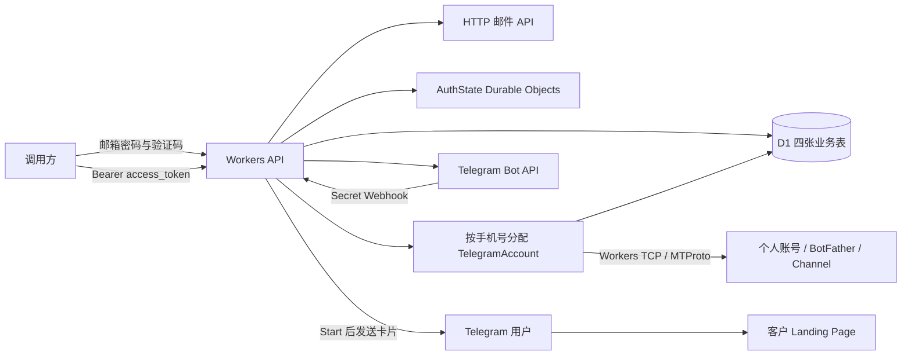

# Telegram Bot 自动化平台 · Cloudflare Workers

`feature-cfworker` 分支提供完整 Cloudflare API 服务：用户完成邮箱鉴权后，登录个人 Telegram 账号，自动创建 Bot、配置客户 Landing Page 卡片、注册 Webhook，并创建 Channel 和发布引导帖子。Workers 接收 API 和 Telegram 回调，D1 保存四张业务表，Durable Objects 保存验证码、平台登录态和操作锁，并协调同一手机号的 Telegram 操作。

**Cloudflare 版本只需安装和构建 `cfworker/`，部署整个仓库中的共享业务代码。** 无需部署 MySQL、Redis 或 Docker。`auto-register/` 保留原 Node.js Docker 部署方式，`card-bot/` 保留 Legacy 单 Bot 卡片 Worker。

- [设计与架构](#architecture)
- [环境变量](#configuration)
- [本地运行、构建和云端部署](#build-and-verify)
- [API 清单与完整调用示例](#api-reference)
- [持久化、退出和重试](#operations)
- [测试和验证范围](#verification)
- [Docker 与 Legacy 服务](#legacy-card-bot)

<a id="design"></a>
<a id="architecture"></a>

## 设计与架构

平台身份和 Telegram 身份分别认证。用户首先用邮箱、密码和邮件验证码获得本服务的 `access_token`，然后提交 Telegram App `api_id/api_hash`、手机号和 Telegram 验证码。启用 Telegram 两步验证的账号还需要提交密码。App configuration、网页端登录和服务器公钥不能跳过个人账号认证。

运行配置使用环境变量，用户自己的凭据和客户业务配置通过 API 传入。请求中的 App 凭据、手机号、Bot 名称和用户名优先于 `TG_*` 默认值。多用户部署应在请求中提供各自的配置，不设置共享手机号和 App 凭据。



`AuthState` 按认证键分配 Durable Object，使用 SQLite 同步事务消费一次性验证码、计数限流和释放操作锁。验证码默认 10 分钟有效，最多错误 5 次；平台登录态默认保留 2 小时，访问不续期。读取时检查过期时间，Alarm 负责清理，因此不会依赖 Alarm 准时执行来保证认证过期。

同一手机号的登录、确认验证码、Bot 和 Channel 操作进入同一 `TelegramAccount` 对象，并使用操作锁防止并发 BotFather 对话。Telegram TCP 连接只在当前请求内创建，操作结束后销毁；后续请求从 D1 的 StringSession 恢复登录。Durable Objects 不承担永久在线 Telegram 客户端。

认证采用 Durable Objects 而没有使用 KV：验证码只能消费一次，退出后的登录态应立即失效，需要原子操作和一致的读取。此版本不依赖 KV。D1 保留与 Docker 版本相同的四张业务表，SQLite 建表脚本位于 [0001_init.sql](cfworker/migrations/0001_init.sql)。

| 表 | 保存内容 |
| --- | --- |
| `user_info` | UUID 用户 ID、唯一邮箱、scrypt 密码哈希 |
| `tg_info` | account_id、用户归属、App 凭据、手机号、Telegram StringSession、登录与恢复状态 |
| `bot_info` | 用户归属、Bot 名称与 Token、客户 Landing Page、卡片、Webhook 配置 |
| `channel_info` | 用户归属、请求 key、频道 ID/access_hash、邀请链接、帖子及发送状态 |

`user_id` 在首次邮箱验证成功时自动生成，不由调用方自定义。每次发起新的 Telegram 登录生成一个 `account_id`，调用方保存它，或登录后通过 `GET /v1/accounts` 获取自己的列表。资源路径检查用户归属，访问他人的账号返回 404。Telegram 的 64 位频道 ID、access_hash 和 random_id 以字符串保存，避免 JavaScript 数字丢失精度。

客户 Landing Page 是客户已有的完整 URL；服务负责卡片按钮和频道引导链接，不生成或托管页面，也没有转化归因统计。频道成员需主动打开 Bot 并点击 Start 才能收到私聊卡片。Bot 创建通过个人账号与 BotFather 英文对话完成，仍受 Telegram 账号限制和用户名可用性影响。

```text
cfworker/                  Cloudflare 主服务，安装依赖和构建的入口
  src/index.js             HTTP API、鉴权、Webhook、账号操作路由
  src/auth-state.js        验证码、登录态、限流和锁的 Durable Object
  src/telegram-account.js  个人账号操作 Durable Object
  src/telegram-socket.js   Workers 原生 TCP 传输适配
  src/store.js             D1 存储适配
  migrations/              D1 四表 SQL 迁移
  scripts/                 环境变量配置、D1 创建、部署和连接探测
  test/                    workerd 运行时测试与可选 Telegram 探测
  wrangler.jsonc           本地开发配置；数据库 UUID 为占位符
  .env.example             云端资源和非敏感运行配置模板
  .dev.vars.example        本地 Worker 环境变量与密钥模板
  README.md                Cloudflare 部署说明
  .wrangler/state/         本地模拟 D1 / Durable Objects 数据，不提交
  wrangler.generated.json  从环境变量生成的云端配置，不提交
auto-register/            Node.js Docker 服务及双方共享的业务逻辑
card-bot/                 Legacy 单 Bot 卡片 Worker
```

<a id="configuration"></a>

## 环境变量

本地 `cfworker/.dev.vars` 配置 Worker 运行环境；云端普通变量从 `cfworker/.env` 生成 Wrangler 配置，敏感变量通过 Worker Secrets 配置。Cloudflare 资源绑定 `DB`、`AUTH_STATE`、`TELEGRAM_ACCOUNTS` 由 Wrangler 创建/绑定，不能由 HTTP 请求指定。所有真实配置文件和本地持久化数据都已加入忽略规则。

| Worker 变量 | 要求 | 默认值 / 用途 |
| --- | --- | --- |
| `AUTH_HMAC_SECRET` | 必填 Secret | 至少 32 字符随机密钥；用于验证码 HMAC |
| `AUTH_CHALLENGE_TTL_SECONDS` | 可选 | `600`；允许 60–3600 秒 |
| `AUTH_SESSION_TTL_SECONDS` | 可选 | `7200`；允许 60–86400 秒 |
| `AUTH_STATE_PREFIX` | 可选 | `telegram-bot:`；认证键与账号对象命名空间，部署更新时保持一致 |
| `MAIL_API_URL` | 可选 | `https://api.resend.com/emails`；HTTPS 邮件 API |
| `MAIL_API_KEY` | 发邮件时必填 Secret | 邮件服务 Bearer API key |
| `MAIL_FROM` | 发邮件时必填 | 已验证的发件人地址 |
| `PUBLIC_BASE_URL` | 注册 Webhook 时必填 | API 的公网 HTTPS 源地址，不含路径；其余流程可留空 |
| `TG_API_ID` | 可选 | 请求未传 `api_id` 时的默认值 |
| `TG_API_HASH` | 可选 Secret | 请求未传 `api_hash` 时的默认值 |
| `TG_PHONE` | 可选 | 默认国际区号手机号，如 `+447000000001`，不含空格 |
| `TG_BOT_NAME` / `TG_BOT_USERNAME` | 可选 | 创建请求未传名称/用户名时使用 |

邮件 API 使用 Resend 兼容请求：`Authorization: Bearer ...`，JSON 字段 `from`、`to` 数组、`subject`、`text`。其他邮件厂商需提供兼容网关，或修改 `cfworker/src/auth-runtime.js`。Workers 版不使用原来的 `SMTP_*` 配置。邮件配置留空可验证健康接口、构建和本地模拟流程，真实发送验证码会返回 503，不能完成真实用户注册。

| 部署变量（`cfworker/.env` 或进程环境） | 要求 | 用途 |
| --- | --- | --- |
| `CLOUDFLARE_ACCOUNT_ID` | 云端必填 | Cloudflare 账户 ID |
| `CLOUDFLARE_API_TOKEN` | CI 按需 | Wrangler 云端认证；本机也可使用 `wrangler login`，不写入 Worker |
| `CF_WORKER_NAME` | 可选 | 默认 `telegram-cfworker-api` |
| `CF_D1_DATABASE_NAME` | 可选 | 默认 `telegram_cfworker`；用于创建和绑定 D1 |
| `CF_D1_DATABASE_ID` | 云端必填 | 已创建 D1 数据库的 UUID；禁止使用占位 UUID 部署 |
| `CF_CPU_MS` | 可选 | 默认 `30000`，Worker CPU 时间预算，需匹配 Cloudflare 账户计划；不是网络等待时长 |

生产部署建议使用 Workers 付费计划，并核对 CPU 和 Durable Objects 额度。密码哈希和首次 MTProto 密钥协商会消耗 CPU；本地验证不能替代云端配额和网络验证。生成配置只复制普通 Worker 变量，绝不会把 HMAC、邮件密钥、App hash 或 Cloudflare API token 写入 JSON。

<a id="build-and-verify"></a>

## 本地运行、构建和云端部署

以下命令从仓库根目录开始。需要 Node.js 22.12+，推荐 Node.js 22 LTS。仅安装 `cfworker/` 的依赖即可，Wrangler 会打包仓库中的共享模块，不能只上传这个目录而丢弃 `auto-register/api/`。

### 本地开发

```bash
cd cfworker
npm ci
# 已有文件时保留原配置
cp .dev.vars.example .dev.vars
chmod 600 .dev.vars
# 编辑 .dev.vars，替换 AUTH_HMAC_SECRET；邮件配置可暂留空
npm run db:local
npm run dev
```

默认本地地址 `http://127.0.0.1:8787`。Wrangler 本地运行使用模拟 D1 和 Durable Objects，不需要 Cloudflare 账号或真实数据库 ID；数据持久化至 `cfworker/.wrangler/state/`。第一次启动前运行迁移初始化四表；以后新增迁移后再执行，无需每次重建数据库。

```bash
curl http://127.0.0.1:8787/health
npm run check
npm test
npm run build
```

`build` 是 `wrangler deploy --dry-run`，只验证打包，不上传服务。普通测试使用真实 workerd、本地 D1 和 Durable Objects，模拟外部邮件及 Telegram API，不发送真实邮件、验证码或创建 Telegram 资源。

可选的真实 Telegram TCP / MTProto 探测只查询服务器配置，不登录个人账号、不发送验证码，不保存会话或创建资源：

```bash
# 在 .dev.vars 内填写 TG_API_ID/TG_API_HASH，或在进程环境传入
npm run probe:telegram
```

### 云端部署

```bash
# 仍在 cfworker/，已有文件时保留
cp .env.example .env
chmod 600 .env
# 编辑 .env：CLOUDFLARE_ACCOUNT_ID、Worker 名称、D1 库名及普通运行变量
npx wrangler login
# 创建数据库；已有数据库跳过此步
npm run db:create
# 将创建命令返回的 database_id 填入 .env 的 CF_D1_DATABASE_ID
npm run configure
npm run deploy
```

`configure` 生成 `wrangler.generated.json`，校验账户 ID、D1 UUID、库名和 TTL。`deploy` 先执行远端 D1 迁移，迁移成功后部署 Worker，部署失败时不清空已有数据。D1 数据库由 Cloudflare 控制面创建，不能在 Worker HTTP 启动时创建；SQL 表在部署前通过迁移初始化。Durable Objects 的 SQLite 存储在各对象首次使用时初始化。

初次部署后配置敏感变量（也可在 Cloudflare Dashboard 的 Worker Secrets 添加）。若要全部通过环境变量提供，在 `.env` 填写 `AUTH_HMAC_SECRET`、`MAIL_API_KEY` 和可选 `TG_API_HASH`，执行 `npm run secrets`，脚本通过 stdin 上传，不写入生成的 JSON 或临时文件。只有变量名称进入命令行，密钥在 Wrangler 提示中输入：

```bash
npx wrangler secret put AUTH_HMAC_SECRET --config wrangler.generated.json
# 接入真实邮件时再配置
npx wrangler secret put MAIL_API_KEY --config wrangler.generated.json
# 只有使用全局 Telegram App 默认值时才需要
npx wrangler secret put TG_API_HASH --config wrangler.generated.json
```

更新 `.env` 的 `PUBLIC_BASE_URL` 为实际 Worker `https://名称.账户子域.workers.dev` 或自定义域名，配置 `MAIL_FROM`，重新执行 `npm run configure && npm run deploy`。`PUBLIC_BASE_URL` 是调用本 API 的地址，不是客户 Landing Page；注册 Webhook 时自动拼接 `/webhooks/:bot_id`。无需卡片 Webhook 时可一直留空。

CI 通过环境变量提供 Cloudflare token，也可以不创建 `.env`，直接运行 `node scripts/configure.js` 和 `node scripts/wrangler.js deploy`。token 需要针对目标账户的 Worker、Durable Objects 和 D1 管理权限；不要提交到代码库。运行端的 HMAC 和邮件 key 使用 Worker Secrets。

后续更新保持 Worker 名称、D1 ID、`AUTH_STATE_PREFIX` 和 `AUTH_HMAC_SECRET` 不变：

```bash
npm ci
npm test
npm run build
npm run configure
npm run deploy
```

手工执行远端 SQL 迁移可用 `npm run db:remote`。新增表结构用新的迁移文件，不修改已执行迁移。备份、数据导入和数据库迁移由管理员执行，不通过用户 API 访问 D1 控制面。

<a id="api-reference"></a>

## API 清单与完整调用示例

本地 Base URL 为 `http://127.0.0.1:8787`。API 用 JSON 接收参数并返回 JSON，POST / PUT 请求设置 `Content-Type: application/json`，请求体最大 16 KiB，所有成功请求当前均返回 HTTP 200。下面的步骤 0 给出完整平台鉴权示例，Docker 的 [AUTH.md](auto-register/AUTH.md) 补充旧服务鉴权细节，Cloudflare 的持久化与重试规则见本文后段。

平台注册/登录的 start、verify 接口无需已有令牌；`/auth/me`、`/auth/logout` 和所有 `/v1/*` 接口使用 `Authorization: Bearer <access_token>`。平台令牌默认 2 小时有效，访问不续期。每次新的 Telegram 登录生成一个独立 account_id，调用方保存它并用于验证码确认、创建和查询；account_id 本身不是鉴权凭据。资源路径会检查用户归属，访问他人的账号返回 404。

平台登录令牌、Telegram App api_hash 和 Bot Token 用途不同：access_token 用于调用本服务；api_id/api_hash 用于个人 Telegram 登录；Bot Token 用于 Telegram Bot API。App 配置不能跳过个人账号的验证码认证。

| 方法 | 路径 | 请求字段 | 返回内容 |
| --- | --- | --- | --- |
| POST | `/auth/register/start` | `email`、`password`；无需令牌 | 发注册邮件，返回 `challenge_id`、`status`、`expires_in` |
| POST | `/auth/register/verify` | `challenge_id`、`code`；无需令牌 | 创建用户，返回 `access_token`、`token_type`、`expires_in`、`user` |
| POST | `/auth/login/start` | `email`、`password`；无需令牌 | 校验密码后发登录邮件，返回 `challenge_id`、`status`、`expires_in` |
| POST | `/auth/login/verify` | `challenge_id`、`code`；无需令牌 | 返回新的平台登录令牌和用户信息 |
| GET | `/auth/me` | 无；本人 Bearer 凭据 | 当前用户 `id`、`email` |
| POST | `/auth/logout` | `{}`；本人 Bearer 凭据 | `{"ok":true}`，撤销当前平台令牌 |
| GET | `/v1/accounts` | 无；本人 Bearer 凭据 | 当前用户的 Telegram 账号列表 |
| GET | `/health` | 无；无需鉴权 | `{"ok":true}`；表示 HTTP 服务已启动，不实时探测 D1/Telegram |
| POST | `/v1/login/start` | `api_id`、`api_hash`、`phone`，可由环境变量提供 | `account_id`、`status`、`delivery` |
| POST | `/v1/accounts/:account_id/verify` | `code`；需要两步验证时提交 `password` | `account_id`、`status` |
| GET | `/v1/accounts/:account_id` | 无 | 已保存的账号标识和登录状态 |
| POST | `/v1/accounts/:account_id/bots` | `name`、`username`，可由环境变量提供 | `username`、`name`、`token`、`url` |
| GET | `/v1/accounts/:account_id/bots/:username` | 无 | D1 中已保存的 Bot 信息和 Token |
| PUT | `/v1/accounts/:account_id/bots/:username/landing` | `customer_id`、`landing_url`；可选卡片字段 | 保存并返回客户卡片配置 |
| GET | `/v1/accounts/:account_id/bots/:username/landing` | 无 | 读取客户卡片配置 |
| POST | `/v1/accounts/:account_id/bots/:username/webhook` | `{}` | 已注册的 Webhook URL |
| POST | `/v1/accounts/:account_id/channels` | `request_key`、`bot_username`、`title`；可选 `about` | Channel 信息和邀请链接 |
| GET | `/v1/accounts/:account_id/channels/:request_key` | 无 | Channel 的已保存状态 |
| POST | `/v1/accounts/:account_id/channels/:request_key/posts` | request_key、text | 帖子发送结果 |
| POST | `/webhooks/:bot_id` | Telegram Update；专属 Secret 请求头 | 接收 `/start` 并回复卡片，返回 `{"ok":true}` |

下面示例的 `YOUR_ACCESS_TOKEN` 是邮件验证码验证成功返回的令牌，`ACCOUNT_ID`、App 凭据和用户名也需要替换。

登录状态依次为 `code_required` → `password_required`（如启用两步验证）→ `authorized`。验证码和密码通过 verify 请求提交，API 不读取脚本专用的 `TG_PHONE_CODE`、`TG_PASSWORD` 环境变量。

`/health` 和 `/webhooks/:bot_id` 无需平台登录令牌；Webhook 必须携带 Telegram 的 `X-Telegram-Bot-Api-Secret-Token`，其余业务接口都需鉴权。

### 步骤 0：平台注册、登录和退出

首次注册提交邮箱及 12–128 字符的密码；邮箱会转为小写，密码中的空格会保留。邮件 API 留空时本步骤的发送邮件请求返回 503，需配置邮件服务后再执行真实注册。

```bash
curl -X POST http://127.0.0.1:8787/auth/register/start \
  -H 'Content-Type: application/json' \
  -d '{"email":"you@example.com","password":"YOUR_LONG_PASSWORD"}'
```

响应示例中的 UUID 为占位值。邮件验证码为六位数字，默认 10 分钟有效，不通过 API 返回：

```json
{"challenge_id":"00000000-0000-4000-8000-000000000001","status":"email_code_required","expires_in":600}
```

收到邮件后提交上一步返回的 challenge_id 和验证码：

```bash
curl -X POST http://127.0.0.1:8787/auth/register/verify \
  -H 'Content-Type: application/json' \
  -d '{"challenge_id":"CHALLENGE_ID","code":"123456"}'
```

验证成功后创建 user_info 记录，返回平台登录令牌；响应中的用户 ID 与后续 Telegram account_id 是两个不同标识：

```json
{
  "access_token":"YOUR_ACCESS_TOKEN",
  "token_type":"Bearer",
  "expires_in":7200,
  "user":{"id":"00000000-0000-4000-8000-000000000002","email":"you@example.com"}
}
```

后续平台登录需要密码和新邮件验证码，调用以下两个接口，响应结构与注册流程相同；不能将注册 challenge 用于登录：

```bash
curl -X POST http://127.0.0.1:8787/auth/login/start \
  -H 'Content-Type: application/json' \
  -d '{"email":"you@example.com","password":"YOUR_LONG_PASSWORD"}'

curl -X POST http://127.0.0.1:8787/auth/login/verify \
  -H 'Content-Type: application/json' \
  -d '{"challenge_id":"LOGIN_CHALLENGE_ID","code":"123456"}'

curl http://127.0.0.1:8787/auth/me \
  -H 'Authorization: Bearer YOUR_ACCESS_TOKEN'

curl http://127.0.0.1:8787/v1/accounts \
  -H 'Authorization: Bearer YOUR_ACCESS_TOKEN'
```

`/auth/me` 返回 `{"id":"用户UUID","email":"you@example.com"}`。`/v1/accounts` 返回 `{"accounts":[]}` 或当前用户的 account_id、status、created_at 列表；查询不返回 App hash 和 Telegram session。

```bash
curl -X POST http://127.0.0.1:8787/auth/logout \
  -H 'Authorization: Bearer YOUR_ACCESS_TOKEN' \
  -H 'Content-Type: application/json' -d '{}'
```

退出返回 `{"ok":true}`，当前平台令牌立即失效，其他登录令牌仍按各自 TTL 有效。平台退出不撤销 Telegram session，也不删除 Bot 或 Channel；Telegram 退出通过客户端设备列表操作。

### 步骤 1：发起登录，发送验证码

```bash
curl http://127.0.0.1:8787/v1/login/start \
  -H 'Authorization: Bearer YOUR_ACCESS_TOKEN' \
  -H 'Content-Type: application/json' \
  -d '{"api_id":123456,"api_hash":"YOUR_APP_API_HASH","phone":"+8613800000000"}'
```

响应示例（account_id 每次不同）：

```json
{"account_id":"本次生成的UUID","status":"code_required","delivery":"telegram_app"}
```

服务在发送 Telegram 验证码后立即保存会话至 `tg_info`，关联当前平台用户，再返回 `account_id`。调用方也应保存这个值；验证码确认和后续创建使用同一个 account_id。向同一手机号重新发起登录会生成新标识，不会自动复用旧记录。

返回 `account_id`、`status: "code_required"`、`delivery`。`telegram_app` 表示通过 Telegram 客户端接收，`other` 表示其他渠道；本服务不保证短信发送。App 凭据和手机号已设置环境变量时可发送 `{}`。保存 `account_id`，后续调用均使用它，不需要重复发送验证码。

### 步骤 2：提交验证码，完成登录

```bash
curl http://127.0.0.1:8787/v1/accounts/ACCOUNT_ID/verify \
  -H 'Authorization: Bearer YOUR_ACCESS_TOKEN' \
  -H 'Content-Type: application/json' \
  -d '{"code":"12345"}'
```

成功响应示例：

```json
{"account_id":"返回的账号标识","status":"authorized"}
```

成功返回 `status: "authorized"`。如返回 `password_required`，向同一接口再次提交 `{"password":"你的两步验证密码"}`；也可首次提交 `code` 和 `password` 两个字段。提交的验证码和两步验证密码不保存到数据库；MTProto session 和验证码流程所需的 phone_code_hash 保存于 tg_info。登录流程在本服务中 10 分钟后过期，Telegram 验证码也可能提前失效；重新调用登录接口获取新的 `account_id`。当前不支持注册个人 Telegram 账号、Telegram 额外邮箱认证或验证码自动读取。

### 步骤 3：创建指定 Bot，回传 Token

```bash
curl http://127.0.0.1:8787/v1/accounts/ACCOUNT_ID/bots \
  -H 'Authorization: Bearer YOUR_ACCESS_TOKEN' \
  -H 'Content-Type: application/json' \
  -d '{"name":"客户 A 助手","username":"customer_a_unique_bot"}'
```

响应示例：

```json
{"username":"customer_a_unique_bot","name":"客户 A 助手","token":"123456:EXAMPLE_TOKEN","url":"https://t.me/customer_a_unique_bot"}
```

`name`、`username` 可分别由 `TG_BOT_NAME`、`TG_BOT_USERNAME` 提供默认值。BotFather 对话依赖英文提示，用户名占用、账号限制或回复变化会返回错误；超时后先检查 BotFather 对话，避免重复创建。不要同时手动操作该账号的 BotFather。服务只对已成功保存的结果去重，无法保证远程创建与本地写入之间的事务一致性。

| 字段 | 必填 | 说明 |
| --- | --- | --- |
| name | 请求或环境变量提供 | Bot 显示名称，1–64 字符；默认读取 TG_BOT_NAME |
| username | 请求或环境变量提供 | 全局唯一，5–32 位，字母开头、bot 结尾，仅含字母、数字、下划线；默认读取 TG_BOT_USERNAME |

### 步骤 4：配置客户 Landing Page 和卡片

```bash
curl -X PUT http://127.0.0.1:8787/v1/accounts/ACCOUNT_ID/bots/customer_a_unique_bot/landing \
  -H 'Authorization: Bearer YOUR_ACCESS_TOKEN' -H 'Content-Type: application/json' \
  -d '{
    "customer_id":"customer_a",
    "landing_url":"https://customer-a.example.com/offer?source=telegram",
    "card_text":"欢迎查看客户 A 的活动",
    "card_image":"",
    "button_text":"查看活动"
  }'
```

| 字段 | 必填 | 限制或默认值 |
| --- | --- | --- |
| customer_id | 是 | 1–64 字符，绑定客户业务标识 |
| landing_url | 是 | 完整 HTTP(S) 地址，可带查询参数，不允许 URL 内嵌用户名密码 |
| card_text | 否 | 默认“欢迎访问平台”；有图片最多 1024，无图片最多 4096 字符 |
| card_image | 否 | 默认空；公网图片 URL 或 Telegram file_id，最多 2048 字符 |
| button_text | 否 | 默认“立即了解”，1–64 字符 |

PUT 保存完整配置，省略可选字段将恢复默认值。返回配置不含 Webhook 密钥。GET 同一路径可查询配置。不同 Bot 对应不同客户落地页，配置更新后后续 `/start` 使用新配置；不需要重新部署。Webhook 密钥在第一次配置时生成，后续更新保留。

### 步骤 5：注册 Bot Webhook

```bash
curl -X POST http://127.0.0.1:8787/v1/accounts/ACCOUNT_ID/bots/customer_a_unique_bot/webhook \
  -H 'Authorization: Bearer YOUR_ACCESS_TOKEN' -H 'Content-Type: application/json' -d '{}'
```

返回：

```json
{"username":"customer_a_unique_bot","webhook_url":"https://bots.example.com/webhooks/123456","status":"registered"}
```

用户私聊发送 `/start` 时，API 根据 Bot ID 从 D1 读取客户配置并发送图片或文字、网址按钮。这里由 Docker API 直接处理卡片，无需为每个客户部署 Cloudflare Worker。一个 Bot 只能设置一个 Webhook；注册到 Docker API 会替换该 Bot 之前的 Worker Webhook。独立 `card-bot` 仍可用于其他 Bot。

### 步骤 6：创建客户 Channel（可选）

```bash
curl http://127.0.0.1:8787/v1/accounts/ACCOUNT_ID/channels \
  -H 'Authorization: Bearer YOUR_ACCESS_TOKEN' -H 'Content-Type: application/json' \
  -d '{
    "request_key":"customer_a_channel_001",
    "bot_username":"customer_a_unique_bot",
    "title":"客户 A 活动频道",
    "about":"客户 A 的活动信息"
  }'
```

| 字段 | 必填 | 限制 |
| --- | --- | --- |
| request_key | 是 | 1–64 位字母、数字、下划线、短横线；同一账号下稳定且唯一 |
| bot_username | 是 | 当前账号已创建且已配置 landing 的 Bot 用户名 |
| title | 是 | 1–128 字符 |
| about | 否 | 最多 255 字符，默认空 |

创建的是私有广播频道，账号为创建者。响应包含 `request_key`、`channel_id`、`customer_id`、`bot_username`、`title`、`about`、`status: "ready"`、`invite_url`、`bot_url`，不返回 access_hash。当前不设置公开频道用户名，也不邀请用户或将 Bot 提升为管理员。发布通过登录用户账号完成。

GET `/v1/accounts/ACCOUNT_ID/channels/customer_a_channel_001` 查询已保存信息；GET 不会调用 Telegram。相同 request_key 和参数会返回已有频道，改变参数会返回 409。Channel 已创建但邀请链接生成失败时，使用同一 key 重试可继续生成链接。

Telegram 的 Channel 创建调用本身没有远程幂等键。如果发生网络错误，结果可能不确定，记录保留 `creating` 状态，服务返回 409 并禁止自动再次创建；先到 Telegram 检查，不应直接换 key 盲目重试。服务会先把已返回的创建结果保存到 tg_info.pending_channel，后续账号请求可据此补写 channel_info；如果 pending 写入也失败，需先核对 Telegram 中的实际结果。

### 步骤 7：发布转化引导帖子（可选）

```bash
curl http://127.0.0.1:8787/v1/accounts/ACCOUNT_ID/channels/customer_a_channel_001/posts \
  -H 'Authorization: Bearer YOUR_ACCESS_TOKEN' -H 'Content-Type: application/json' \
  -d '{"request_key":"offer_post_001","text":"本周活动已上线，点击下方链接了解详情。"}'
```

| 字段 | 必填 | 限制 |
| --- | --- | --- |
| request_key | 是 | 1–64 位字母、数字、下划线、短横线；同一频道内唯一 |
| text | 是 | 1–3000 字符，加入链接后总长度不超过 4096 |

频道发布普通文字，并追加两个可点击链接：Bot Start 链接、配置的 Landing Page。响应含 `status: "sent"`、`message_id`（如 Telegram 返回）、`bot_url`、`landing_url` 和文本。已成功发送的同 key 请求直接返回保存结果；改变正文或落地页需使用新 key。待发送记录保存 Telegram random_id，重试使用同一 random_id 来降低重复发送风险。不要无限重复提交。

### 查询登录状态或取回已保存 Token

```bash
curl http://127.0.0.1:8787/v1/accounts/ACCOUNT_ID \
  -H 'Authorization: Bearer YOUR_ACCESS_TOKEN'
curl http://127.0.0.1:8787/v1/accounts/ACCOUNT_ID/bots/customer_a_unique_bot \
  -H 'Authorization: Bearer YOUR_ACCESS_TOKEN'
```

状态查询返回本地记录；创建时会检查 Telegram 会话是否仍有效。Token 查询仅支持本服务保存的 Bot，不会从 BotFather 导入已有 Bot，也不会轮换 Token。获得的 Token 可用于独立 Cloudflare 卡片服务；Docker 卡片模式会自动从数据库读取 Token，无需再配置给 Worker。

账号 GET 只返回本地状态，`authorized` 不代表本次请求实时验证了 Telegram。创建新 Bot、创建 Channel、发布帖子会检查实际授权；缓存结果或配置查询不验证用户会话。当前没有单独的实时会话校验 API。

<a id="operations"></a>

## 持久化、退出和重试

Cloudflare 版的 Telegram session、Bot Token 和客户数据保存在 D1；不需要 `*.json`、`tgsession.blob` 或 Docker 挂载目录。验证码和平台登录态保存在各 AuthState 的 SQLite 存储，对象回收后仍可读取未过期的状态。删除本地 `.wrangler/state/` 只会丢失本地测试数据，不会删除云端 D1 或 Durable Objects。

`POST /auth/logout` 立即撤销当前平台 Bearer token，不撤销 Telegram 登录。平台 token 过期后，重新完成邮箱登录，再用原 account_id 操作。要撤销 Telegram 登录，在 Telegram 客户端「设置 → 设备」终止对应会话；D1 中原 session 随后无法通过真实 Telegram 认证。要更新 Telegram 登录，重新调用 `/v1/login/start` 和 verify 获取新的 account_id。目前不提供 Bot Token 轮换、删除账号、导入已有 Bot 或自动迁移旧 account_id 的 HTTP 接口。

邮箱发送间隔 60 秒；默认验证码 TTL 窗口内单邮箱最多 5 次发信、单 IP 最多 20 次 start / 60 次 verify，单邮箱最多 10 次密码校验。Workers 使用 Cloudflare 提供的 `CF-Connecting-IP` 限流。本地直接调用时应使用固定测试 IP。邮件验证码正确消费后即删除，最多错误 5 次；Durable Objects 认证读写失败时不会放行请求。

同一账号已有对应用户名的 Bot 记录时，创建接口直接返回保存的 Token。频道的 `request_key` 在账号内唯一，帖子的 key 在频道内唯一。参数相同的重试可复用已有结果，参数冲突返回 409。帖子重试复用持久化 random_id。频道处于 `creating` 或 BotFather 请求超时、客户端中断时，应先到 Telegram 核对远端结果，直接更换 key/用户名可能重复创建资源。

BotFather 对话最长可能等待多个 60 秒回复。客户端和上游代理应允许较长请求，例如 curl 使用 `--max-time 300`。本服务将结果在请求内返回，没有实现 Queues/Workflows 异步任务或断线后无限后台执行；Telegram 平台限制和 Cloudflare 网络、CPU 配额仍可能中断操作。

| HTTP 状态 | 含义和处理 |
| --- | --- |
| 400 / 413 | 参数、JSON 格式或请求体大小错误；最多 16 KiB |
| 401 | 平台令牌、验证码或 Telegram 登录失效，重新认证 |
| 403 / 405 | Webhook Secret 错误或使用非 POST 方法 |
| 404 | 接口/记录不存在，或账号不属于当前用户 |
| 409 | 操作冲突、资源 key 冲突、频道创建结果不确定 |
| 410 | Telegram 登录步骤超过 10 分钟，重新发送验证码 |
| 422 | Telegram 拒绝请求，或 BotFather 未接受创建；当前不支持额外邮箱认证和注册个人账号 |
| 429 | 邮箱/密码请求限流，或 Telegram FLOOD_WAIT |
| 500 | 内部存储、运行配置等错误，检查 Worker 日志和绑定 |
| 502 / 504 | Telegram API 失败或 BotFather 回复超时 |
| 503 | 邮件 API 未配置或发信失败 |

### 从 Docker 数据迁移

D1 是新的 SQLite 数据库，不会自动连接原 MySQL 或复用 Redis 登录态。现有 MySQL 和 Docker 服务保持可用。可使用 `auto-register/scripts/export-d1.js` 导出四张表并导入空 D1，保留用户 ID、密码哈希、account_id、Telegram StringSession、Bot Token 和频道记录：

```bash
# 仓库根目录；停用旧 API 的写入后导出，保留原 .env
cd auto-register
npm ci
node --env-file=.env scripts/export-d1.js
cd ../cfworker
# 先 configure、初始化远端四表；这里只导入业务数据
npm run db:remote
node --env-file=.env scripts/wrangler.js d1 execute DB --remote --file ../data/d1-export.sql
```

仅导入空表，唯一键冲突会报错，不覆盖已有用户。导出包含可用的账号凭据和 Bot Token，文件存入已忽略的 `data/` 并限制权限，导入后妥善处理。原 Redis 验证码、平台 token 和锁不迁移；用户重新完成邮箱登录，之后可使用原 account_id。导入应在维护窗口进行，避免新旧服务同时写入或同时操作同一 Telegram 手机号。Cloudflare 部署不自动读取或发送历史凭据。

<a id="verification"></a>

## 测试和验证范围

根目录 `npm run check` 检查 Cloudflare、Docker 和 Legacy 源码；`npm test` 验证 Docker 现有测试，`npm run cf:test` 验证 workerd 中的 Cloudflare API。`npm run cf:build` 验证 Cloudflare 打包。

当前已通过：D1 四表迁移及读写、密码哈希、邮箱注册和登录、验证码仅消费一次与错误次数限制、验证码/平台登录态过期、Durable Object 回收后的登录态持久化、退出撤销、多用户账号归属、客户卡片和 Webhook Secret、频道 64 位 ID 和帖子幂等。Telegram 登录、BotFather 创建、Channel/帖子流程使用模拟远端客户端验证；默认测试不会创建真实 Telegram 资源。

可选 `npm run probe:telegram` 已在本地 workerd 验证真实 Workers TCP 接口、MTProto 握手、Telegram 服务器配置查询及连接关闭。它使用临时未登录会话，未提交手机号验证码，不能证明真实用户登录或 Bot 创建成功。

尚未部署到真实 Cloudflare 账户，未验证云端 D1 / Durable Objects 配额或真实邮箱投递；用户登录、真实 Bot/Channel 创建及生产 Webhook 需要配置邮件服务和 Cloudflare 资源后再做端到端验证。

<a id="legacy-card-bot"></a>
<a id="docker-部署"></a>

## Docker 与 Legacy 服务

`auto-register/` 保留 Node.js Docker API、MySQL 四表和 Redis 鉴权，启动时仍自动建库建表。仅构建该目录即可运行 Docker 服务，已有环境变量和数据继续使用。完整 Docker 架构、配置、构建命令及 API 示例见 [Docker 部署文档](auto-register/DEPLOYMENT.md)，概要见 [auto-register/README.md](auto-register/README.md)。

`card-bot/` 是 Legacy 单 Bot 卡片 Worker，仅处理已有 Bot 的 `/start` 回复，不含平台注册、Telegram 个人账号登录、Bot 自动创建或 Channel 管理。完整配置和使用方法见 [card-bot/README.md](card-bot/README.md)。使用新 Cloudflare API 自带的卡片回复时，无需再部署 Legacy Worker。

根目录 `npm run dev` / `npm run deploy` 仍指向 Legacy；新服务使用 `npm run cf:dev` / `npm run cf:deploy`，或直接在 `cfworker/` 执行命令。
