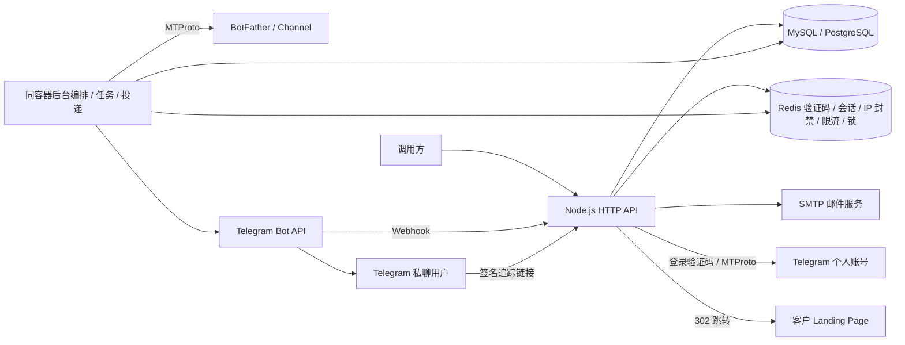

# Telegram Bot 自动化平台 · Node.js Docker

`main` 提供当前维护的 Docker API，支持 MySQL 8.0+ 或 PostgreSQL 16+、Redis 6.0+ 和 SMTP。只需构建 `auto-register/` 一个目录，HTTP API、用户鉴权、管理员管理、项目编排、创建任务和 Webhook 投递包含在同一镜像中，默认端口为 **3100**。

用户从同一个 API 完成邮箱注册、登录、自有 Telegram App 配置和个人账号认证，随后提交业务项目。系统开通独立测试 Bot、卡片和可选私有 Channel，经测试验收后发布独立生产资源；支持进度查询、失败恢复、配置版本、回滚、来源统计和软禁用。客户提供自己的 Landing Page URL；本服务配置卡片和引导链接，不生成网页。

> **已弃用 / 不可用：`card-bot/` Legacy 项目。** 该目录只保留历史源码，不再提供部署、维护或可用性保证。当前卡片与 Webhook 功能由 `auto-register/` 提供，见[弃用说明](#legacy-card-bot)。

`feature-cfworker` 是另行维护的 Cloudflare Workers 适配分支，请以[该分支文档](https://github.com/gatherstar101/telegram-card-bot/tree/feature-cfworker)为准；它与已弃用的 `card-bot/` 不是同一个项目。

本版本提供 API 和 JSON 配置预览，没有新增网页前端，也没有用户 API Key。普通用户使用平台 Bearer 会话，管理员由必填运行时 `ADMIN_EMAIL`、`ADMIN_PASSWORD` 直接初始化，无需邮件验证。

- [统一开通与发布](#product-flow)
- [架构、身份与数据](#architecture)
- [管理员与保留方案](#special-case)
- [运行时环境变量](#configuration)
- [Docker 构建与部署](#build-and-verify)
- [API 清单](#api-reference)
- [完整调用示例](#usage)
- [任务、停用与恢复](#operations)
- [升级与生产运行](#upgrade)
- [测试与验证范围](#verification)
- [Legacy 已弃用](#legacy-card-bot)

<a id="product-flow"></a>

## 统一开通与发布

推荐流程：邮箱注册/登录 → 保存自有 Telegram App → 验证个人账号 → 保存项目草稿 → 系统开通测试资源 → 测试账号收到卡片并点击链接 → 确认验收 → 系统发布独立生产资源。

GET /v1/onboarding 给出下一阶段。项目使用 project_id，流程使用 workflow_id，底层任务使用 job_id；每步状态入库，接口受理返回 202，查询进度，失败时复用成功步骤。测试与生产使用正式 Telegram 网络的不同 Bot/Token/Webhook Secret，频道按需分别创建。Telegram 有官方独立测试网络，本版本未使用该网络。

配置通过草稿、验收与发布管理。生产读取已发布版本，支持回滚到成功发布过的版本；不会撤回已发送消息。测试 Bot 用 Telegram 数字用户 ID 白名单，生产 Bot 面向实际访客。项目资源不再通过底层 landing/webhook 写接口直接修改。

业务事件、访客可用资料、来源参数与配置版本保存到数据库，原始更新及详细资料加密。统计区分测试与生产，记录启动、投递和追踪链接访问，支持客户成交回传。投递成功不代表已读，链接访问不代表成交。

禁用用户后拦截全部新的平台业务派发、取消排队任务和投递、挂起开通流程；重新启用不自动重放。已经批准/发出的 Telegram 请求需要保存结果或核对，已发布帖子和第三方地址不会自动撤回。

完整 curl、请求字段、进度响应、错误码、新增 env、数据保留、恢复和生产边界见 [统一开通使用说明](auto-register/PRODUCT-FLOW.md)。本版本提供 API 与 JSON 预览，没有新增网页前端。

<a id="architecture"></a>

## 架构与数据

平台身份和 Telegram 身份分别认证。普通用户首次邮箱验证成功时生成 UUID `user_id`，管理员的 UUID 则在首次启动初始化时生成。登录返回的 `access_token` 用于本 API，默认 2 小时有效且访问不续期；用户信息包含 id、email、role。用户随后提交 App api_id/api_hash、手机号与 Telegram 验证码，必要时提交两步验证密码。App configuration 和网页端已登录状态不能替代个人账号认证。

首次 Telegram login/start 生成 `account_id`，同用户同手机号再次登录优先复用原账号；完成认证后绑定 Telegram 数字身份，跨用户绑定默认拒绝。调用方保存或通过 `GET /v1/accounts` 查回。所有账号、Bot、Channel、任务和投递检查用户归属，其他用户的资源返回 404。account_id 只是路径标识，不是鉴权凭据。Bot Token、App api_hash 和平台 access_token 用途不同。



API 接收操作并持久化任务，后台轮询数据库队列，使用事务与租约领取任务。多个副本共享同一个数据库和 Redis，通过 Redis 按手机号、用户或 Bot 协调操作。Telegram 连接仅在需要时建立，结束后保存 StringSession 并关闭，不要求永久在线 TCP 客户端。

| 表 | 内容 |
| --- | --- |
| `user_info` | UUID、唯一邮箱和 scrypt 密码哈希 |
| `tg_info` | 用户归属、account_id、App 凭据、手机号、StringSession 和恢复状态 |
| `bot_info` | Bot 信息与 Token、客户卡片、落地页和 Webhook 配置 |
| `channel_info` | Channel 创建 key、频道 ID/access_hash、邀请链接及旧帖子 JSON |
| `user_security` | 用户禁用标记与会话撤销版本 |
| `user_admins` | 管理员角色归属，普通用户注册不能写入 |
| `audit_logs` | 管理员操作时间、身份、IP、UA、目标用户、结果及脱敏变更 |
| `telegram_apps` / `account_profiles` | 用户 App 配置与账号使用的配置版本 |
| `telegram_identities` / `telegram_phone_claims` | 认证后的 Telegram 身份及手机号绑定 |
| `user_business` / `user_limits` | 业务授权版本、停用原因与用户配额覆盖 |
| `project_info` / `project_versions` / `project_resources` | 项目、不可变配置版本与环境资源 |
| `workflow_runs` / `workflow_steps` | 开通/发布流程、进度、步骤与任务关系 |
| `telegram_visitors` / `business_events` | 访客资料、原始更新与转化事件 |
| `business_dispatches` | 已批准远端操作、完成结果与未知状态 |
| `channel_posts` | 新帖子独立记录、random_id 和发送状态 |
| `api_jobs` | 持久化创建/核对任务、检查点、租约与结果 |
| `webhook_deliveries` | update_id 去重、卡片投递状态和重试时间 |

手机号、api_hash、session、phone_code_hash、恢复凭据、Bot Token 和 Webhook Secret 使用 AES-256-GCM 加密。任务载荷/结果和投递载荷也加密，密文绑定记录与字段。密码只存哈希。Redis 保存邮件 OTP、平台会话、限流和锁；Telegram 登录态在关系数据库，不需要 tgsession.blob 或 JSON 文件即可跨容器重启恢复。

客户提供已有落地页，服务配置卡片和频道引导链接，并保存来源、平台追踪访问及客户回传成交；不生成页面。用户主动私聊 Bot 并点击 Start 后才能收到卡片，不自动私信频道成员。Channel 创建和帖子发布使用登录个人账号。

```text
auto-register/
  api/server.js             HTTP 服务、Telegram 连接与退出处理
  api/app.js                API 路由、鉴权、限流与健康检查
  api/store.js              加密存储与数据库读写
  api/database.js           DB_* 配置、连接池与 SQL 方言适配
  api/schema.js             MySQL 建表与旧列升级
  api/postgres-schema.js     PostgreSQL 建表与索引
  api/auth*.js / cache.js   Redis 鉴权、SMTP、原子计数和锁
  api/jobs.js               创建任务、检查点与核对恢复
  api/deliveries.js         Webhook 去重和后台投递
  api/queue-store.js        SQL 事务领取、租约与后台轮询
  api/security.js           密钥、管理员凭据、限流和脱敏审计
  api/admin.js              管理员初始化、用户修改参数及管理接口
  api/products.js           统一配置入口、项目草稿、测试/生产流程和版本发布
  api/product-store.js      产品数据、业务停用、身份绑定与事件
  api/product-schema.js     14 张新增产品表，MySQL/PostgreSQL
  api/tracking.js           签名追踪链接
  sql/init.sql              MySQL 新库 24 张表 SQL
  sql/postgresql/init.sql    PostgreSQL 24 张表与索引 SQL
  sql/002-security.sql      MySQL 旧表字段扩容及辅助表 SQL
  Dockerfile / compose.yaml 单镜像部署
  .env.example              完整运行时变量模板
  PRODUCTION.md             安全升级与生产运行说明
  scripts/                  旧会话归属迁移、独立 Bot 创建脚本
  test/                     单元与可选真实 MySQL/PostgreSQL 与 Redis 集成验证
card-bot/                   已弃用 / 不可用，仅归档历史源码
```

<a id="special-case"></a>

## 管理员与保留方案

### 当前管理员能力

首次启动根据必填 `ADMIN_EMAIL`、`ADMIN_PASSWORD` 创建管理员，密码使用 scrypt 哈希，长度 12–128 字符，不提供默认密码。已有管理员重启不覆盖密码；与普通用户邮箱冲突时拒绝初始化，不自动提升权限。更换 ADMIN_EMAIL 会在新邮箱不存在时新增管理员，不迁移原账号。

管理员通过 `POST /admin/login` 提交 email/password，直接获取 Redis Bearer 会话，默认 2 小时，不依赖 SMTP。普通 `/auth/login/*` 不接受管理员登录。改密使用 `/auth/password`，注销使用 `/auth/logout` 或 `/auth/logout-all`。可选 `ADMIN_API_KEY` 是既有独立管理凭据，不是用户 API Key。

管理员可查询普通用户，修改邮箱、密码和启停状态，设置六种资源/并发配额，查看账号、项目、在途操作和审计。角色、资源归属、Telegram Session 和 Bot Token 不通过用户资料接口修改。

全部 `/admin/*` 共享 Redis IP 防爆破：默认同 IP 在一小时窗口累计两次认证失败，从第二次起封禁 3600 秒。正确凭据不能绕过，成功认证不清零计数，封禁请求不延长 TTL；业务参数错误不计入。Redis 校验不可用时拒绝请求，返回 503。

管理操作审计保存开始/完成 UTC 时间、request_id、操作者、目标用户、IP、连接来源 IP、UA、状态和脱敏变更；不保存密码或 Token。资料修改、配额修改、凭据重加密与成功审计在同一事务，审计失败时回滚。查询与拒绝请求也审计，日志仅可读取。

### Special case 的实现边界

平台注册与 Telegram 配置分开，用户可以先注册，再补充自有 App。当前已实现用户自助 App 管理、项目开通及测试 Bot 的 Telegram 数字 ID 白名单，username 只用于展示和辅助核对。

以下仍保留为[设计方案](auto-register/SPECIAL-CASE.md)，没有上线接口或运行时开关：管理员替用户补充 App、special case 启停、平台已有资源登记与分配、special case Bot 白名单和 Channel 入群审批。方案优先采用每个用户独立 Bot；多用户共用 Bot 的客户路由不属于现有实现。

测试 Bot 白名单只限制响应，不等于频道成员访问控制。测试 Channel 保持私有，由负责人向测试人员发放邀请链接；当前不自动审批加入、移除成员或撤销历史邀请链接。

<a id="configuration"></a>

## 运行时环境变量

全部配置在 **容器运行时** 通过 Compose `.env`、`docker run --env-file` 或环境变量注入；镜像构建不需要数据库、Redis、SMTP 或 Telegram 凭据，不包含真实 .env。API 用户提供自有 App 配置或请求中的 App 凭据；Telegram 登录不再回退到平台 TG_API_ID/TG_API_HASH。TG_PHONE 和底层 Bot 名称仍保留默认值，项目中的两个 Bot 明确指定。

完整模板见 [auto-register/.env.example](auto-register/.env.example)。首次复制后编辑，后续升级保留原密钥与数据库配置。

| 名称 | 默认值 / 要求 |
| --- | --- |
| `AUTH_HMAC_SECRET` | 必填，至少 32 字符随机值，OTP 与追踪链接 HMAC 密钥 |
| `CREDENTIAL_KEYS` | 必填，JSON 密钥环，每个值为 32 字节随机密钥的 base64 |
| `CREDENTIAL_KEY_ID` | 必填，例如 v1，须存在于密钥环 |
| `ADMIN_EMAIL` | 必填，管理员登录邮箱；首次启动直接创建，无邮箱验证 |
| `ADMIN_PASSWORD` | 必填，12–128 字符；仅首次创建时写入密码哈希，重启不覆盖 |
| `ADMIN_AUTH_MAX_FAILURES` | 2；同一 IP 认证失败次数达到此值时封禁，允许 1–10 |
| `ADMIN_IP_BAN_SECONDS` | 3600；封禁时长及认证失败计数窗口，允许 60–86400 秒 |
| `ADMIN_API_KEY` | 可选，管理员接口独立随机凭据，至少 32 字符 |
| `AUTH_CHALLENGE_TTL_SECONDS` | 600，允许 60–3600 秒 |
| `AUTH_SESSION_TTL_SECONDS` | 7200，允许 60–86400 秒，访问不续期 |
| `DB_TYPE` | mysql；可选 mysql 或 postgresql |
| `DB_HOST` | 必填，现有 MySQL 或 PostgreSQL 地址，容器内 localhost 指向 API 自己 |
| `DB_PORT` | 留空按 DB_TYPE 选择：mysql=3306，postgresql=5432 |
| `DB_DATABASE` | 必填，字母、数字、下划线；MySQL 最长 64，PostgreSQL 最长 63 位 |
| `DB_USER` / `DB_PASSWORD` | 必填，需业务读写及表/索引初始化权限；自动建库还需建库权限 |
| `DB_POOL_SIZE` | 10，允许 1–100，每个 API 副本的连接池大小 |
| `DB_CONNECT_TIMEOUT_MS` | 5000，允许 1000–30000 |
| `DB_AUTO_CREATE_DATABASE` | true；已有库且无建库权限时设置 false，仍会初始化表/索引 |
| `DB_MAINTENANCE_DATABASE` | postgres；PostgreSQL 自动建库时连接的维护库，MySQL 忽略 |
| `DB_SSL_MODE` | disable 或 verify-full；后者验证服务端证书及主机名 |
| `DB_SSL_CA` | 可选自定义 CA PEM；在 .env 单行中用字面量 \n 表示换行 |
| `REDIS_URL` | 可选，优先于独立 Redis 地址/用户/密码/DB 配置 |
| `REDIS_HOST` / `REDIS_PORT` | 未设置 URL 时需要 host，Compose 默认 host.docker.internal / 6379 |
| `REDIS_DB` | 0 |
| `REDIS_USER` / `REDIS_PASSWORD` | 可选，依实际 Redis ACL 配置 |
| `REDIS_KEY_PREFIX` | telegram-bot:，多副本保持一致，测试/生产分开 |
| `SMTP_HOST` / `SMTP_FROM` | 真实邮箱注册/登录需要；可暂时省略 |
| `SMTP_PORT` / `SMTP_SECURE` | 587 / false；465 通常使用 secure=true |
| `SMTP_REQUIRE_TLS` | true；仅受控本地测试可用 false |
| `SMTP_USER` / `SMTP_PASSWORD` | 依邮件服务配置；设置 user 时必须提供 password |
| `API_PORT` | 3100，Compose 宿主机映射端口，默认仅监听 127.0.0.1 |
| `PORT` | 3100，Node.js 默认监听端口；Compose 固定容器内部为 3100 |
| `PUBLIC_BASE_URL` | 完整开通/追踪跳转时需要；本 API 的公网 HTTPS 源地址，不含路径 |
| `TG_API_ID` / `TG_API_HASH` | 仅独立 create-bot 脚本默认 App 凭据；用户 API 不读取 |
| `TG_PHONE` | 底层登录可选默认手机号，项目建议明确提交 |
| `TG_BOT_NAME` / `TG_BOT_USERNAME` | 可选 Bot 名称/用户名默认值 |
| `MAX_TG_APPS_PER_USER` | 5，允许 1–100；App 配置数量 |
| `MAX_PROJECTS_PER_USER` | 10，允许 1–1000；未归档项目数 |
| `MAX_ACTIVE_WORKFLOWS_PER_USER` | 2，允许 1–20；queued/running 开通流程数 |
| `BUSINESS_EVENT_RETENTION_DAYS` | 90，允许 1–3650；业务事件保留期 |
| `RAW_UPDATE_RETENTION_DAYS` | 7，允许 0–90；0 不保存原始更新 |
| `TRACKING_LINK_TTL_SECONDS` | 86400，允许 60–604800；私聊卡片追踪链接有效期 |
| `DATA_DIR` | Compose 为 /data，仅旧 JSON 会话迁移使用，新会话存在所选关系数据库 |

生成并分别保存密钥：

```bash
# CREDENTIAL_KEYS；CREDENTIAL_KEY_ID=v1
node -e "console.log(JSON.stringify({v1:require('node:crypto').randomBytes(32).toString('base64')}))"
# AUTH_HMAC_SECRET；需要管理员密钥时另生成独立值
node -e "console.log(require('node:crypto').randomBytes(32).toString('hex'))"
```

把 JSON 密钥环按一行放入 .env，例如 `CREDENTIAL_KEYS={"v1":"YOUR_BASE64_KEY"}`。妥善保管密钥与数据库备份，丢失旧密钥无法读取对应凭据。

SMTP 暂不配置仍可启动并访问 `/health`，管理员初始化及 `/admin/login` 可用；普通用户发码及 `/ready` 返回 503。PUBLIC_BASE_URL 在登录和创建资源阶段可以留空；真实 Telegram 回调需要 HTTPS 公网地址。它是 API 地址，客户页面地址另通过 landing API 设置。

### 数据库选择与配置升级

所有数据库业务变量统一使用 `DB_*`，旧前缀不再读取。已有部署升级前，需要把原数据库变量改为上表对应的 DB_* 名称，保持地址、库名、账号、密码和密钥值不变；只修改变量名称不会迁移或重建已有数据。

MySQL 配置示例：

```dotenv
DB_TYPE=mysql
DB_HOST=host.docker.internal
DB_PORT=3306
DB_DATABASE=telegram_bot
DB_USER=telegram_app
DB_PASSWORD=YOUR_DATABASE_PASSWORD
DB_AUTO_CREATE_DATABASE=true
DB_SSL_MODE=disable
```

PostgreSQL 配置示例（使用同一个 Docker 镜像）：

```dotenv
DB_TYPE=postgresql
DB_HOST=host.docker.internal
DB_PORT=5432
DB_DATABASE=telegram_bot
DB_USER=telegram_app
DB_PASSWORD=YOUR_DATABASE_PASSWORD
DB_AUTO_CREATE_DATABASE=false
DB_MAINTENANCE_DATABASE=postgres
DB_SSL_MODE=verify-full
DB_SSL_CA=
```

PostgreSQL 自动建库要求账号具备 CREATEDB 且能够连接维护库；已有数据库可以设置 false，账号仍需目标 schema 的建表/建索引权限与表读写权限。MySQL 自动建库及旧列升级需对应 CREATE/ALTER 权限。TLS 连接设置 verify-full，使用系统信任 CA 或 DB_SSL_CA 指定 CA；受控本地数据库未启用 TLS 时使用 disable。

**切换 DB_TYPE 不会迁移 MySQL/PostgreSQL 之间的数据**，新数据库需要另行导入匹配结构的数据及原密钥。两个后端保留邮箱和 Bot 用户名大小写不敏感、请求 key 大小写敏感的行为，64 位 ID 按字符串处理。

可选手动初始化：先由管理员创建 DB_DATABASE，选择该库后执行 [MySQL init.sql](auto-register/sql/init.sql) 或 [PostgreSQL init.sql](auto-register/sql/postgresql/init.sql)。MySQL 旧列升级见 [002-security.sql](auto-register/sql/002-security.sql)。SQL 不写死数据库名；mysql 使用 -D，psql 使用 -d 指定目标库。服务启动仍会进行幂等建表检查。

### 限流、配额与队列配置

以下均为可选运行时变量：

| 名称 | 默认 | 允许范围 / 用途 |
| --- | --- | --- |
| `OTP_IP_QPS` | 1 | 1–100；四个获取验证码接口共享每 IP 每秒请求上限 |
| `API_IP_PER_MINUTE` | 120 | 1–10000；非 Webhook API 每 IP 分钟上限，健康检查除外 |
| `API_USER_PER_MINUTE` | 60 | 1–10000；已鉴权 `/v1/*` 业务每用户分钟上限 |
| `WEBHOOK_IP_PER_MINUTE` | 1200 | 1–10000；Webhook 每 IP 分钟上限 |
| `TG_LOGIN_PER_TEN_MINUTES` | 5 | 1–20；每用户 Telegram 发码十分钟上限 |
| `TG_CREATE_PER_TEN_MINUTES` | 10 | 1–100；底层 Bot/Channel 创建 API 每用户十分钟上限，重复提交也计数；项目编排另受流程并发与资源配额约束 |
| `MAX_TG_ACCOUNTS_PER_USER` | 5 | 1–100；保存的 Telegram 账号记录上限，含已撤销记录；过期未完成认证不计入额度，保留记录便于重新认证 |
| `MAX_BOTS_PER_USER` | 20 | 1–1000；每用户 Bot 记录上限，仍受 Telegram 自身限制 |
| `MAX_CHANNELS_PER_USER` | 50 | 1–1000；每用户 Channel 记录上限 |
| `TELEGRAM_TIMEOUT_SECONDS` | 60 | 15–240；同步 Telegram 连接与操作总超时 |
| `JOB_TIMEOUT_SECONDS` | 240 | 30–240；任务内 Telegram 连接与操作总超时 |
| `JOB_QUEUE_LIMIT` | 20 | 1–100；同手机号 queued/running 任务总上限 |
| `JOB_RETENTION_SECONDS` | 604800 | 86400–2592000；完成、失败、取消任务保留秒数；uncertain 保留至核对 |
| `WEBHOOK_CHAT_PER_MINUTE` | 5 | 1–60；每 Bot 每私聊分钟卡片上限 |
| `WEBHOOK_BOT_PER_MINUTE` | 300 | 1–3000；每 Bot 分钟卡片上限 |
| `WEBHOOK_QUEUE_LIMIT` | 500 | 1–10000；每 Bot 待处理投递上限，队列满返回 503 |
| `WEBHOOK_RETENTION_SECONDS` | 604800 | 172800–2592000；投递与去重记录保留秒数 |
| `QUEUE_POLL_INTERVAL_MS` | 1000 | 100–10000；每个副本编排/任务/投递各自的轮询间隔 |
| `TRUST_PROXY_HOPS` | 0 | 0–10；默认按 TCP 对端限流，不信任 X-Forwarded-For |

**发码冷却固定 60 秒**：同一邮箱注册、登录与密码恢复共享；同一 Telegram 手机号跨用户/IP 共享。失败也保留冷却。获取验证码的四个 start 接口共享每 IP 默认 1 QPS，可调 OTP_IP_QPS，但不取消 60 秒间隔。冷却/频率超限返回 429、Retry-After 与 retry_after；资源配额拒绝可能没有等待秒数。

在可信反向代理后才能设置 TRUST_PROXY_HOPS，按实际代理层数取 X-Forwarded-For，代理必须正确追加/覆盖头，且禁止绕过代理直连。不要直接信任客户端的 Cloudflare 或 X-Forwarded-For 头。多副本共享 Redis 计数；应用限流不能替代入口 WAF/反向代理限流。

管理员可通过 `PUT /admin/users/:user_id/limits` 覆盖 App、项目、活动流程、Telegram 账号、Bot 和 Channel 六种额度。`{}` 恢复 env 默认值；测试/生产资源均计入总量，降低配额不删除已有资源。事件默认保留 90 天，原始更新默认 7 天，实际原始保留期不超过事件保留期。配置版本、访客摘要、管理员审计和未知任务不按事件保留期自动删除。

<a id="build-and-verify"></a>
<a id="docker-部署"></a>

## Docker 构建、部署与检查

使用现有 MySQL 8.0+ 或 PostgreSQL 16+、Redis 6.0+。Compose 仅创建 API 容器，不启动新的数据库或 Redis。数据库、Redis 在宿主机发布端口时可用 host.docker.internal，远端服务使用实际地址。

```bash
cd auto-register
if [ ! -f .env ]; then cp .env.example .env; fi
chmod 600 .env
# 填写 ADMIN_EMAIL/ADMIN_PASSWORD、DB_*、Redis、HMAC 和凭据密钥
# SMTP 可暂时省略
docker compose config --quiet
docker compose build telegram-api
docker compose up -d --no-build telegram-api
docker compose ps
curl http://127.0.0.1:3100/health
curl http://127.0.0.1:3100/ready
```

默认宿主机与容器内部均使用 3100，Compose 映射为 `127.0.0.1:3100:3100`。API_PORT 和 PORT 都无需手动配置；API_PORT 仅修改 Compose 的宿主机端口。直接运行镜像时使用 `docker run -p 127.0.0.1:3100:3100 --env-file .env YOUR_IMAGE`。若显式覆盖 PORT，docker run 的映射目标端口也需同步调整。

启动按 DB_TYPE 选择驱动、按 DB_DATABASE 自动建库并初始化 24 张表和索引，然后直接初始化管理员、连接 Redis、启动 HTTP 和后台队列。设置 DB_AUTO_CREATE_DATABASE=false 时只连接已有库并初始化表/索引。MySQL 还会扩容已知旧凭据列为 TEXT/MEDIUMTEXT，此步骤不加密旧数据，管理员需完成分页迁移。PostgreSQL 使用独立建表 SQL 和 JSONB 字段，队列在两种数据库中都使用事务与 FOR UPDATE SKIP LOCKED。初始化应串行发布。

容器使用 Node.js 22、非 root 用户、只读根文件系统、临时目录 tmpfs、移除 capabilities、init 和 6 分钟退出宽限。DATA_DIR 卷保留旧迁移兼容用途。Docker HEALTHCHECK 使用 `/health`，SMTP 未配也可运行基础服务；正式流量切换应检查 `/ready`。

更新代码先 build 再 up；修改 .env 后用 `docker compose up -d telegram-api` 重建容器，restart 不重新加载环境变量。退出时停止接入新请求，等待活动请求/任务结束再关闭 Redis/数据库；异常退出后租约到期可恢复，未知远端副作用不会盲目再次创建。

```bash
# 在 auto-register/ 下
docker compose build telegram-api
docker compose up -d --no-build telegram-api
docker compose logs --tail 50 telegram-api
# 宿主机开发（Node.js 22）
npm ci
npm run check
npm test
node --env-file=.env api/server.js
```

数据库/Redis、密钥、REDIS_KEY_PREFIX 和旧迁移卷在更新时保持。水平扩容可运行多个 API 副本并共享依赖；当前 Compose 绑定固定宿主机端口，不能直接 --scale 多副本占用同一端口，需要部署平台/负载均衡和独立端口设计。数据库、Redis、SMTP 及 Telegram 仍是外部可用性依赖，并未由本 Compose 提供集群。

<a id="api-reference"></a>

## API 清单

请求、响应均为 JSON，POST/PUT/PATCH 设置 `Content-Type: application/json`，请求体最多 **16 KiB**。同步成功一般返回 200；项目开通/发布/回滚/流程重试，以及底层任务提交/重试返回 202；Webhook 投递手动重试返回 200。平台 Token 使用 `Authorization: Bearer <access_token>`；管理员接口要求管理员角色的会话或独立管理密钥，Webhook 使用专属 Secret。响应包含 `X-Request-ID`，并设置 `Cache-Control: no-store`。

App 路径的 `:id` 为 app_config_id，项目路径的 `:id` 为 project_id，账号路径的 `:id` 为 account_id；`:username` 为 Bot 用户名，`:key` 为 Channel 创建 request_key。所有 `/v1/*` 都要求平台 Token 并检查资源归属。

### 平台鉴权与服务状态

| 方法 | 路径 | 鉴权 | 参数 / 结果 |
| --- | --- | --- | --- |
| GET | `/health` | 无 | 可响应检查，返回 ok |
| GET | `/ready` | 无 | 检查必要配置、数据库和 Redis；不可用时 503 |
| POST | `/auth/register/start` | 无 | email、password → challenge_id、expires_in |
| POST | `/auth/register/verify` | 无 | challenge_id、code → user、access_token |
| POST | `/auth/login/start` | 无 | email、password → challenge_id、expires_in |
| POST | `/auth/login/verify` | 无 | challenge_id、code → user、access_token |
| POST | `/auth/password/reset/start` | 无 | email → challenge_id，普通用户邮件密码恢复 |
| POST | `/auth/password/reset/verify` | 无 | challenge_id、code、new_password → 重新登录 |
| GET | `/auth/me` | 平台 Token | 本人 id、email、role |
| POST | `/auth/logout` | 平台 Token | `{}`；撤销当前 Token |
| POST | `/auth/logout-all` | 平台 Token | `{}`；撤销所有平台会话与旧登录验证 |
| POST | `/auth/password` | 平台 Token | current_password、new_password；改密并撤销所有平台会话 |

### 统一配置与项目发布

下表所有接口需要平台 Bearer，并检查用户归属。项目资源的 landing/webhook 写操作必须通过项目版本流程，直接调用底层接口返回 409。项目完整请求与流程见 [PRODUCT-FLOW.md](auto-register/PRODUCT-FLOW.md)。

| 方法 | 路径 | 用途 |
| --- | --- | --- |
| GET | `/v1/onboarding` | 配置、认证与项目概况，下一阶段 |
| GET | `/v1/me/limits` | 用户有效配额 |
| POST / GET | `/v1/telegram-apps` | 保存 App / 查询摘要，GET 可用 after 游标 |
| PATCH | `/v1/telegram-apps/:id` | 更新本人 App，不回显 hash |
| POST / GET | `/v1/projects` | 保存项目草稿 / 分页查询 |
| GET / PUT | `/v1/projects/:id` | 详情 / 完整参数保存新草稿 |
| GET | `/v1/projects/:id/preview` | 当前草稿卡片配置预览 |
| POST | `/v1/projects/:id/provision` | 202，系统开通测试资源 |
| POST | `/v1/projects/:id/test-confirmation` | confirmed=true，要求本版本测试投递及访问记录 |
| POST | `/v1/projects/:id/publish` | 202，发布已验收版本 |
| POST | `/v1/projects/:id/rollback` | 202，version、confirmed=true，回滚曾发布的版本 |
| GET | `/v1/projects/:id/versions` | 最近 100 个配置版本摘要 |
| GET | `/v1/projects/:id/workflows` | 流程历史，GET after 游标 |
| GET | `/v1/projects/:id/workflows/:workflow_id` | 分步进度、错误与下一步 |
| POST | `/v1/projects/:id/workflows/:workflow_id/retry` | 202，明确重试，复用成功步骤 |
| POST | `/v1/projects/:id/workflows/:workflow_id/cancel` | 取消，不删除远端资源 |
| POST | `/v1/projects/:id/pause` / `resume` / `archive` | 暂停、恢复、归档，旧积压不自动重放 |
| GET | `/v1/projects/:id/events` / `statistics` | 事件分页 / 来源及环境统计 |
| POST | `/v1/projects/:id/conversions` | event_id、可选 source/value/currency，客户回传去重 |

### Telegram、Bot、卡片与 Channel

| 方法 | 路径 | 参数 / 结果 |
| --- | --- | --- |
| GET | `/v1/accounts` | 本人账号列表，每页最多 100 条，next_cursor 配合 `?after=` |
| POST | `/v1/login/start` | app_config_id 或自有 api_id/api_hash、phone；可选 reauthenticate=true → account_id、status、delivery |
| POST | `/v1/accounts/:id/verify` | code；必要时 password → code_required/password_required/authorized |
| GET | `/v1/accounts/:id` | 已保存的登录状态，不实时探测 Telegram |
| POST | `/v1/accounts/:id/logout` | `{}`；Telegram 注销成功后清空本地 session，返回 revoked |
| POST | `/v1/accounts/:id/bots` | name、username；可选 request_key → 202 任务 |
| GET | `/v1/accounts/:id/bots/:username` | 已保存的 Bot 信息与 Token |
| PUT | `/v1/accounts/:id/bots/:username/token` | token；验证属于同一个 Bot 后更新，不回显 Token |
| POST | `/v1/accounts/:id/bots/:username/reconcile` | request_key → 202；核对并取回已创建 Bot 的 Token |
| PUT | `/v1/accounts/:id/bots/:username/landing` | customer_id、landing_url；可选 card_text/card_image/button_text |
| GET | `/v1/accounts/:id/bots/:username/landing` | 客户卡片配置，不返回 Webhook Secret |
| POST | `/v1/accounts/:id/bots/:username/webhook` | `{}`；注册 Webhook，需 PUBLIC_BASE_URL |
| POST | `/v1/accounts/:id/channels` | request_key、bot_username、title；可选 about → 202 任务 |
| GET | `/v1/accounts/:id/channels/:key` | 已保存的频道状态、邀请链接，不返回 access_hash |
| POST | `/v1/accounts/:id/channels/:key/posts` | request_key、text → 202 任务 |
| POST | `/v1/accounts/:id/channels/:key/reconcile` | request_key、channel_id、access_hash → 202 核对任务 |
| GET | `/v1/accounts/:id/jobs/:job_id` | 任务状态、成功 result 或失败 error |
| POST | `/v1/accounts/:id/jobs/:job_id/retry` | `{}`；202，安全重试或要求先核对 |
| GET | `/v1/accounts/:id/bots/:username/deliveries/:update_id` | Webhook 投递状态 |
| POST | `/v1/accounts/:id/bots/:username/deliveries/:update_id/retry` | uncertain 时必须传 allow_duplicate=true |

### Webhook 与管理员

| 方法 | 路径 | 鉴权 / 参数 |
| --- | --- | --- |
| GET | `/r/:signed_token` | 签名、期限和业务状态校验，记录访问并 302 跳转 |
| POST | `/webhooks/:bot_id` | Telegram Secret Header；Telegram Update，去重排队后返回 200 |
| POST | `/admin/login` | 无需 Token；email、password，直接返回 access_token/expires_in/user，无邮件验证码 |
| GET | `/admin/users` | 管理员 Bearer；after（UUID 游标）、limit（1–100，默认 50）、q（邮箱/用户 ID/Bot 搜索），返回 users/next_cursor |
| GET | `/admin/users/:user_id` | 管理员 Bearer；用户资料及账号/项目/配额/在途操作，不返回凭据 |
| PATCH | `/admin/users/:user_id` | 管理员 Bearer；email、password、disabled 中至少一项，可附 reason，仅修改普通用户 |
| GET | `/admin/audit-logs` | 管理员 Bearer；可选 user_id、before（审计 ID 游标）、limit（1–100），返回 logs/next_cursor |
| PUT | `/admin/users/:user_id/limits` | 管理员 Bearer；六种用户资源/并发额度，{} 恢复 env 默认 |
| POST | `/admin/credentials/rewrap` | 管理员 Bearer；table、cursor、limit，分页加密或重加密数据库凭据 |
| PUT | `/admin/users/:user_id/disabled` | 管理员 Bearer；disabled 布尔值，可附 reason；禁用停止全部平台业务，启用不自动重放 |

Webhook Header 为 `X-Telegram-Bot-Api-Secret-Token`，由注册接口设置。管理员 Bearer 可以是 `/admin/login` 返回的管理员会话，或可选 `ADMIN_API_KEY`。首次身份认证失败时，普通用户会话返回 403，无有效凭据返回 401；同 IP 默认第二次认证失败起封禁 3600 秒并返回 429。普通注册不能授予管理员角色。

修改邮箱、密码或禁用状态均撤销目标用户原有平台会话和未完成的登录验证。只允许修改明确列出的字段；不能借此接口改角色、user_id、资源归属、Telegram 登录态或 Bot Token。管理员自身改密走 `/auth/password`。

所有 `/admin/*` 请求，包括登录、查询、修改、参数错误及权限拒绝，记录在 `audit_logs`：开始/完成 UTC 时间、request_id、操作者类型和 user_id、客户端 IP、连接来源 IP、UA（最多 512 字符）、方法、操作、目标 user_id、HTTP 状态和脱敏变更。邮箱/禁用状态记录修改前后值，密码只记录“已修改”，不记录密码、哈希、Token、Cookie 或原始请求体。成功修改及凭据重加密与审计写入同一事务；审计失败时回滚。查询/拒绝记录无法保存时返回 503。

客户端 IP 默认取连接来源；只有明确配置 `TRUST_PROXY_HOPS` 才读取 `X-Forwarded-For`。部署时限制 API 仅由可信代理访问，并由代理重写转发头。UA 是客户端声明的信息。日志查询只读，不提供删除接口，容量与保留周期由数据库运维管理。

<a id="usage"></a>

## 完整调用示例

以下 Bash 变量由调用方保存，不是服务的运行时 env。线上使用实际 HTTPS API 地址；返回的 UUID、邮件验证码和 Telegram 验证码分别填入后续请求。

```bash
BASE_URL='http://127.0.0.1:3100'
```

### 1. 邮箱注册与登录

普通用户需要 SMTP；密码为 12–128 字符，邮箱统一为小写。验证码为六位数字，不通过 API 回传，默认 10 分钟有效且只能成功使用一次。

```bash
curl -X POST "$BASE_URL/auth/register/start" \
  -H 'Content-Type: application/json' \
  -d '{"email":"you@example.com","password":"YOUR_LONG_PASSWORD"}'
# 收到邮件后，填入响应的 challenge_id 和邮件验证码
curl -X POST "$BASE_URL/auth/register/verify" \
  -H 'Content-Type: application/json' \
  -d '{"challenge_id":"YOUR_CHALLENGE_UUID","code":"YOUR_EMAIL_CODE"}'
ACCESS_TOKEN='ACCESS_TOKEN_FROM_RESPONSE'
curl "$BASE_URL/v1/onboarding" -H "Authorization: Bearer $ACCESS_TOKEN"
```

后续登录使用 `/auth/login/start` 提交 email/password，再向 `/auth/login/verify` 提交新 challenge_id/code；注册与登录验证码不能混用。成功返回 access_token、expires_in 和 user，默认会话 2 小时，访问不续期。

### 2. 保存 App 并认证 Telegram

api_id/api_hash 来自用户的 Telegram App configuration，不能代替个人账号认证。保存仅验证格式，不回显 api_hash，实际认证时验证凭据可用性。

```bash
curl -X POST "$BASE_URL/v1/telegram-apps" \
  -H "Authorization: Bearer $ACCESS_TOKEN" -H 'Content-Type: application/json' \
  -d '{"name":"My App","api_id":123456,"api_hash":"YOUR_32_HEX_APP_HASH"}'
APP_CONFIG_ID='ID_FROM_APP_RESPONSE'
curl -X POST "$BASE_URL/v1/login/start" \
  -H "Authorization: Bearer $ACCESS_TOKEN" -H 'Content-Type: application/json' \
  -d "{\"app_config_id\":\"$APP_CONFIG_ID\",\"phone\":\"+447700900123\"}"
ACCOUNT_ID='ACCOUNT_ID_FROM_LOGIN_RESPONSE'
curl -X POST "$BASE_URL/v1/accounts/$ACCOUNT_ID/verify" \
  -H "Authorization: Bearer $ACCESS_TOKEN" -H 'Content-Type: application/json' \
  -d '{"code":"YOUR_TELEGRAM_CODE"}'
```

返回 `password_required` 时向 verify 再提交 `{"password":"YOUR_TELEGRAM_2FA_PASSWORD"}`，最终应为 authorized。服务不读取客户端验证码，不保存验证码或两步验证密码。登录流程固定 10 分钟，Telegram 验证码可能提前过期。重复 start 已授权账号优先复用 account_id；需要重新发码时传 reauthenticate=true。API 不读取平台 TG_API_ID/TG_API_HASH 默认值。

### 3. 保存项目并预览

项目需要明确指定不同的测试和生产 Bot username，以及允许测试的 Telegram 数字用户 ID。用户名须全局可用；详细限制见 [PRODUCT-FLOW.md](auto-register/PRODUCT-FLOW.md)。Channel 可省略。

```bash
curl -X POST "$BASE_URL/v1/projects" \
  -H "Authorization: Bearer $ACCESS_TOKEN" -H 'Content-Type: application/json' \
  -d "{
    \"account_id\":\"$ACCOUNT_ID\",
    \"name\":\"Customer A campaign\",
    \"customer_id\":\"customer-a\",
    \"test_bot\":{\"name\":\"Customer A Test\",\"username\":\"your_unique_test_bot\"},
    \"production_bot\":{\"name\":\"Customer A\",\"username\":\"your_unique_production_bot\"},
    \"landing_url\":\"https://customer.example.com/offer\",
    \"card_text\":\"Welcome\",
    \"button_text\":\"Learn more\",
    \"test_user_ids\":[\"123456789\"],
    \"channel\":{\"title\":\"Customer A offers\",\"post_text\":\"Explore our offer\"}
  }"
PROJECT_ID='ID_FROM_PROJECT_RESPONSE'
curl "$BASE_URL/v1/projects/$PROJECT_ID/preview" -H "Authorization: Bearer $ACCESS_TOKEN"
```

preview 返回草稿版本及卡片/频道 JSON。PUT 项目接口提交完整参数创建新版本。执行中不能修改；已有 Bot 的名称/用户名及 Channel title/about 不通过草稿替换。可修改落地页、卡片、测试名单和帖子文案。

### 4. 开通测试资源并验收

```bash
curl -X POST "$BASE_URL/v1/projects/$PROJECT_ID/provision" \
  -H "Authorization: Bearer $ACCESS_TOKEN" -H 'Content-Type: application/json' -d '{}'
WORKFLOW_ID='WORKFLOW_ID_FROM_RESPONSE'
curl "$BASE_URL/v1/projects/$PROJECT_ID/workflows/$WORKFLOW_ID" \
  -H "Authorization: Bearer $ACCESS_TOKEN"
```

202 表示受理，不能视为远端创建成功。系统推进 create_bot、configure_landing、register_webhook、可选 create_channel/publish_post、verify_webhook，最后进入 waiting_test。响应包含 status、stage、completed_steps、total_steps、steps、错误和 next_action。

白名单测试账号打开测试 Bot，按 Start，核对卡片并点击按钮确认目标页面。存在本版本卡片发送成功和追踪链接访问记录后，提交验收：

```bash
curl -X POST "$BASE_URL/v1/projects/$PROJECT_ID/test-confirmation" \
  -H "Authorization: Bearer $ACCESS_TOKEN" -H 'Content-Type: application/json' \
  -d '{"confirmed":true}'
```

平台跳转记录不证明浏览器完整加载了目标页，仍需测试人员确认。测试 Bot 与生产 Bot 使用 Telegram 正式网络中的独立资源。

### 5. 发布、回滚与读取 Token

```bash
curl -X POST "$BASE_URL/v1/projects/$PROJECT_ID/publish" \
  -H "Authorization: Bearer $ACCESS_TOKEN" -H 'Content-Type: application/json' -d '{}'
# 使用新返回的 workflow_id 查询，直到 succeeded
curl "$BASE_URL/v1/projects/$PROJECT_ID" -H "Authorization: Bearer $ACCESS_TOKEN"
# 资源详情中的生产 Bot username，用于读取本人的 Bot Token
BOT_USERNAME='YOUR_PRODUCTION_BOT_USERNAME'
curl "$BASE_URL/v1/accounts/$ACCOUNT_ID/bots/$BOT_USERNAME" \
  -H "Authorization: Bearer $ACCESS_TOKEN"
# 回滚到曾成功发布的版本，仍返回 202，需要查询进度
curl -X POST "$BASE_URL/v1/projects/$PROJECT_ID/rollback" \
  -H "Authorization: Bearer $ACCESS_TOKEN" -H 'Content-Type: application/json' \
  -d '{"version":1,"confirmed":true}'
```

生产使用已发布配置。每次新草稿都需先测试验收；后续发布复用已有环境资源，回滚不撤回已发送消息或删除历史帖子。创建/发布过程中出现未知远端结果时先核对对应 job_id，不盲目重新创建。

### 6. 来源数据与成交回传

```bash
curl "$BASE_URL/v1/projects/$PROJECT_ID/statistics" -H "Authorization: Bearer $ACCESS_TOKEN"
curl "$BASE_URL/v1/projects/$PROJECT_ID/events" -H "Authorization: Bearer $ACCESS_TOKEN"
curl -X POST "$BASE_URL/v1/projects/$PROJECT_ID/conversions" \
  -H "Authorization: Bearer $ACCESS_TOKEN" -H 'Content-Type: application/json' \
  -d '{"event_id":"order-123","source":"channel_a","value":10,"currency":"USD"}'
```

`/start SOURCE`、频道引导、卡片投递及签名跳转记录来源和版本，按测试/生产分别统计。成交按项目/event_id 去重，标记为客户回报，不独立核验订单真实性。访问可能包括预览、重复点击，投递成功不代表已读。Telegram 不自动提供访客手机号、邮箱或浏览器 IP；IP/UA 仅在访问平台跳转时获取。原始更新及详细资料加密，事件查询不返回 raw_update。

### 管理员后台操作

管理员启动即创建，不走注册邮件流程。登录后保存管理会话：

```bash
curl -X POST "$BASE_URL/admin/login" \
  -H 'Content-Type: application/json' \
  -d '{"email":"admin@example.com","password":"YOUR_ADMIN_PASSWORD"}'
ADMIN_TOKEN='ADMIN_ACCESS_TOKEN_FROM_RESPONSE'
USER_ID='TARGET_USER_UUID'
curl "$BASE_URL/admin/users?q=customer&limit=50" -H "Authorization: Bearer $ADMIN_TOKEN"
curl "$BASE_URL/admin/users/$USER_ID" -H "Authorization: Bearer $ADMIN_TOKEN"
curl -X PATCH "$BASE_URL/admin/users/$USER_ID" \
  -H "Authorization: Bearer $ADMIN_TOKEN" -H 'Content-Type: application/json' \
  -d '{"email":"updated@example.com","password":"NEW_USER_PASSWORD"}'
curl -X PUT "$BASE_URL/admin/users/$USER_ID/limits" \
  -H "Authorization: Bearer $ADMIN_TOKEN" -H 'Content-Type: application/json' \
  -d '{"MAX_PROJECTS_PER_USER":20,"MAX_ACTIVE_WORKFLOWS_PER_USER":3}'
curl "$BASE_URL/admin/audit-logs?user_id=$USER_ID&limit=50" \
  -H "Authorization: Bearer $ADMIN_TOKEN"
```

修改用户资料撤销其旧会话。审计 ID 为字符串，时间为 UTC ISO 格式，分页读取更早日志使用返回的 next_cursor 填入 before；用户列表使用 after。管理员启停示例见下一节。

### 独立资源的底层 API

底层 Bot/Channel/帖子 API 仍可用于独立资源创建与故障核对，返回 202 + job_id；成功后读取 result。独立卡片的手动配置教程见 [CONVERSION.md](auto-register/CONVERSION.md)。项目管理的 landing/webhook 写操作必须使用项目草稿、验收和发布流程。

<a id="operations"></a>

## 任务、停用与恢复

### 项目状态与流程恢复

项目为 active、paused 或 archived。pause 停止新派发、取消积压并挂起流程；resume 重新启用但不重放旧消息；archive 保留数据和远端资源，不可再 pause/resume 恢复。

流程为 queued/running、waiting_test、failed、needs_reconciliation、suspended、succeeded 或 cancelled。失败后查看失败步骤和 job_id，修复后明确 retry；结果不确定时先 reconcile。一个项目只允许一个活动流程，取消历史流程不会取消当前流程。

```bash
curl -X POST "$BASE_URL/v1/projects/$PROJECT_ID/pause" \
  -H "Authorization: Bearer $ACCESS_TOKEN" -H 'Content-Type: application/json' -d '{}'
curl -X POST "$BASE_URL/v1/projects/$PROJECT_ID/resume" \
  -H "Authorization: Bearer $ACCESS_TOKEN" -H 'Content-Type: application/json' -d '{}'
curl -X POST "$BASE_URL/v1/projects/$PROJECT_ID/workflows/$WORKFLOW_ID/retry" \
  -H "Authorization: Bearer $ACCESS_TOKEN" -H 'Content-Type: application/json' -d '{}'
```

### 用户软禁用与启用

`user_security.disabled` 是 BOOLEAN：MySQL 对应 0/1，PostgreSQL 对应 false/true；API 统一传布尔值。禁用不删除账号或历史数据。管理员接口同时撤销会话、更新业务授权版本、取消排队任务/投递、挂起流程并记录审计。

```bash
curl -X PUT "$BASE_URL/admin/users/$USER_ID/disabled" \
  -H "Authorization: Bearer $ADMIN_TOKEN" -H 'Content-Type: application/json' \
  -d '{"disabled":true,"reason":"业务暂停"}'
# 重新启用；之后用户重新登录，并明确恢复项目或重试流程
curl -X PUT "$BASE_URL/admin/users/$USER_ID/disabled" \
  -H "Authorization: Bearer $ADMIN_TOKEN" -H 'Content-Type: application/json' \
  -d '{"disabled":false,"reason":"恢复业务"}'
```

禁用提交后不再批准新业务派发，Webhook 返回 200 丢弃，Telegram 操作、投递、回调配置及追踪跳转再次检查授权。已经批准/发出的请求可能完成，管理员详情的 operations 展示在途状态；超过 10 分钟仍无完成结果的派发记录后续清理时标为 unknown。

重新启用不恢复旧会话、旧链接或旧积压。重新发布生成新授权版本的帖子链接。已发布消息、现有频道成员和复制出去的第三方 Landing URL 不自动删除或失效；当前不提供远端全量清理。

### 持久化任务与重试

| 状态 | 含义 / 处理 |
| --- | --- |
| `queued` | 已持久化，等待 后台队列进程 |
| `running` | 执行中，继续查询 |
| `succeeded` | 完成，读取 result |
| `failed` | 明确失败，处理原因后重试原任务 |
| `uncertain` | 远端动作可能已经完成，先核对结果 |
| `cancelled` | 未开始时身份已撤销或禁用；重新鉴权后可重试 |

同一账号、路径、request_key 和参数复用原任务；同 key 不同参数返回 409。任务保留期结束后不能仅依赖旧 job_id 去重；使用已保存的业务资源核对结果。执行前再次检查用户禁用和会话撤销版本，未开始的旧版本任务会取消，已完成的远端动作无法撤回。

```bash
curl -X POST "$BASE_URL/v1/accounts/$ACCOUNT_ID/jobs/$JOB_ID/retry" \
  -H "Authorization: Bearer $ACCESS_TOKEN" -H 'Content-Type: application/json' -d '{}'
```

结果已落入数据库 时重试可直接恢复 succeeded。Bot/Channel 创建结果未知时不自动再次创建，先使用以下核对任务，再重试原任务：

```bash
curl -X POST "$BASE_URL/v1/accounts/$ACCOUNT_ID/bots/$BOT_USERNAME/reconcile" \
  -H "Authorization: Bearer $ACCESS_TOKEN" -H 'Content-Type: application/json' \
  -d '{"request_key":"bot-reconcile-001"}'

curl -X POST "$BASE_URL/v1/accounts/$ACCOUNT_ID/channels/$CHANNEL_KEY/reconcile" \
  -H "Authorization: Bearer $ACCESS_TOKEN" -H 'Content-Type: application/json' \
  -d '{"request_key":"channel-reconcile-001","channel_id":"123456789","access_hash":"987654321"}'
```

Bot 核对请求已有 Token，不再次执行 /newbot。Channel 核对要求已有本地记录和远端 ID/access_hash，并检查当前账号是相同标题的广播频道创建者。两者返回 202。帖子重试复用已保存 random_id，以降低重复发送风险；Telegram 去重不能视为无限期保证。恢复细节见[持久化任务运行手册](auto-register/PRODUCTION.md#持久化任务-api)。

### Webhook 投递与未知结果

私聊 /start 有效更新持久化排队后即返回 200，表示接收成功，不表示卡片已发送。保留期内按 bot_id/update_id 去重。同一 Bot 顺序发送；超过私聊/Bot 分钟上限时确认接收但不再发卡片，队列满返回 503 供 Telegram 重投。

明确 Telegram 429 按 retry_after 重试，最多 5 次；明确 4xx 标为 failed。网络错误、5xx 或发送中断标为 uncertain，不自动重发，因为 sendMessage 没有远端幂等键。

```bash
UPDATE_ID='123456'
curl "$BASE_URL/v1/accounts/$ACCOUNT_ID/bots/$BOT_USERNAME/deliveries/$UPDATE_ID" \
  -H "Authorization: Bearer $ACCESS_TOKEN"
curl -X POST "$BASE_URL/v1/accounts/$ACCOUNT_ID/bots/$BOT_USERNAME/deliveries/$UPDATE_ID/retry" \
  -H "Authorization: Bearer $ACCESS_TOKEN" -H 'Content-Type: application/json' \
  -d '{"allow_duplicate":true}'
```

投递状态为 queued、sending、sent、failed、uncertain、cancelled。uncertain 重试必须明确传 allow_duplicate=true，可能产生重复消息；failed 重试无需该字段。只有对应 Bot 所有者可查询和重试。cancelled 投递不能手动重放，访客需要新的 Start；项目投递使用接收时的配置版本。

### 注销、改密与 Token 更新

Docker Telegram 登录态保存在所选关系数据库，不需要 `*.json`、`tgsession.blob` 或容器挂载目录。平台会话则保存在 Redis，到期与 Telegram 长期登录态相互独立。

```bash
# 撤销当前平台令牌
curl -X POST "$BASE_URL/auth/logout" \
  -H "Authorization: Bearer $ACCESS_TOKEN" -H 'Content-Type: application/json' -d '{}'
# 以下请求应使用仍有效的令牌；全部注销后需重新邮箱登录
curl -X POST "$BASE_URL/auth/logout-all" \
  -H "Authorization: Bearer $ACCESS_TOKEN" -H 'Content-Type: application/json' -d '{}'
# 修改密码并撤销所有平台令牌
curl -X POST "$BASE_URL/auth/password" \
  -H "Authorization: Bearer $ACCESS_TOKEN" -H 'Content-Type: application/json' \
  -d '{"current_password":"CURRENT_LONG_PASSWORD","new_password":"NEW_LONG_PASSWORD"}'
# 注销 Telegram 会话，不删除已有 Bot 或 Channel
curl -X POST "$BASE_URL/v1/accounts/$ACCOUNT_ID/logout" \
  -H "Authorization: Bearer $ACCESS_TOKEN" -H 'Content-Type: application/json' -d '{}'
```

上述撤销操作按实际需求单独执行。Telegram 注销确认后清空 session 并标为 revoked，网络结果未知时保留凭据供再次核对；也可在 Telegram 客户端「设置 → 设备」终止会话。重新登录走 start/verify，优先复用已绑定的 account_id；需要重新发码时传 reauthenticate=true。GET 账号状态只读本地记录，不证明此刻远端授权有效。

用户在 BotFather 轮换 Token 后更新已保存值：

```bash
curl -X PUT "$BASE_URL/v1/accounts/$ACCOUNT_ID/bots/$BOT_USERNAME/token" \
  -H "Authorization: Bearer $ACCESS_TOKEN" -H 'Content-Type: application/json' \
  -d '{"token":"NEW_TOKEN_FOR_THE_SAME_BOT"}'
```

服务通过 getMe 核对相同 Bot 后加密保存，不回显 Token；之后重新注册 Webhook。项目管理的 Bot 通过项目 publish 流程恢复 Webhook，独立 Bot 使用底层 webhook 接口。管理员可通过 PUT `/admin/users/:user_id/disabled` 和 `{"disabled":true}` 禁用用户，false 重新启用；两者都撤销旧平台会话，不删除用户数据或远端资源。user_security.disabled 为 BOOLEAN，MySQL 对应 0/1，PostgreSQL 对应 false/true；API 统一传布尔值。禁用拦截新业务派发并取消积压、挂起流程；启用后重新登录并明确恢复，不自动重放。

### HTTP 错误处理

| 状态 | 处理 |
| --- | --- |
| 400 / 413 | 修正参数或 JSON，请求体不超过 16 KiB |
| 401 | 平台认证失效、验证码错误或 Telegram 授权失效，按具体流程重新认证 |
| 403 / 405 | 核对权限、Webhook Secret 或请求方法 |
| 404 | 路径/记录不存在或不属于本人 |
| 409 | 参数 key 冲突、并发操作或远端结果需核对 |
| 410 | Telegram 登录流程过期，重新 start |
| 422 | Telegram 拒绝请求，或需当前未支持的额外认证 |
| 429 | QPS、冷却、管理员 IP 封禁、配额或 Telegram 限流；有 Retry-After 时按其等待 |
| 500 | 内部错误，结合 X-Request-ID 查看日志 |
| 502 / 504 | 远端失败或超时，查询任务并核对结果 |
| 503 | 必要依赖/配置不可用、旧凭据待迁移或投递队列满 |

冷却响应示例：`{"error":"错误说明","retry_after":60}`，并带 `Retry-After: 60`；实际秒数随剩余等待时间变化。异步业务错误在任务 error 中返回，不会把最初的 202 改成失败状态码。

普通用户密码恢复：POST `/auth/password/reset/start` 提交 email，POST `/auth/password/reset/verify` 提交 challenge_id/code/new_password。成功后撤销全部平台会话，重新登录；沿用 OTP TTL、60 秒冷却与发码 QPS。管理员不能通过此入口重置密码。

<a id="upgrade"></a>

## 升级与生产运行

先备份旧库与密钥，在维护窗口停止旧版本写入。配置必填 ADMIN_EMAIL/ADMIN_PASSWORD 和 CREDENTIAL_KEYS/CREDENTIAL_KEY_ID，可选配置 ADMIN_API_KEY，启动新版自动建表和扩容后，用管理员接口分页加密旧凭据：

```bash
ADMIN_TOKEN='YOUR_ADMIN_API_KEY'
curl -X POST "$BASE_URL/admin/credentials/rewrap" \
  -H "Authorization: Bearer $ADMIN_TOKEN" -H 'Content-Type: application/json' \
  -d '{"table":"tg_info","cursor":"","limit":50}'
# 传 next_cursor 继续，直到 done=true；然后对 table=bot_info 同样处理
```

每批最多 100 行，普通 API 默认拒绝明文。接口调用方适配 202 后轮询任务，不直接从创建响应读取 Token 或邀请链接。新建数据自动加密，不需要额外迁移。初始 SQL 见 [MySQL init.sql](auto-register/sql/init.sql) 和 [PostgreSQL init.sql](auto-register/sql/postgresql/init.sql)，MySQL 旧库扩容 SQL 见 [002-security.sql](auto-register/sql/002-security.sql)。新增产品表参考 [MySQL 003-product.sql](auto-register/sql/003-product.sql) 和 [PostgreSQL 003-product.sql](auto-register/sql/postgresql/003-product.sql)。启动自动增加产品表，不自动接管旧 Bot。

密钥轮换先增加新版本并保留旧版本，切换 CREDENTIAL_KEY_ID 后分别分页 rewrap tg_info、bot_info、telegram_apps、telegram_identities、project_versions、telegram_visitors、business_events、api_jobs、webhook_deliveries。复合主键按接口返回 next_cursor 翻页。全部在线记录与需要恢复的备份处理前不能删除旧密钥。不回滚到不能读取密文或任务接口的旧版本。

旧 JSON 迁移仍可用 MIGRATE_ACCOUNT_ID、MIGRATE_EMAIL、DATA_DIR 和 `npm run assign:account`，先让归属邮箱完成注册。独立脚本通过 `scripts/create-bot.env` 和 `npm run create:bot` 创建 Bot，仍由该脚本管理本地会话与 Token，与平台用户 API 分开。

`/ready` 验证配置和数据库/Redis 可用性，不实际发送邮件或登录 Telegram。监控 HTTP 5xx、队列积压、failed/uncertain、Redis/数据库可用性和容量，并配置通知与恢复演练。数据库与 Redis 需自行提供持久化/备份和故障切换；Redis 丢失会话后用户重新邮箱登录，Telegram 会话仍在数据库。数据库恢复不能撤销远端 Telegram 动作，恢复后核对任务/投递状态，避免重复。

完整升级、密钥轮换、备份和容量边界见 [Docker 生产运行手册](auto-register/PRODUCTION.md)。

<a id="verification"></a>

## 测试与验证范围

```bash
# 仓库根目录；check 包含归档源码语法检查，不代表 Legacy 可用
npm run check
npm test
# auto-register/ 下，显式启用真实依赖集成测试
INTEGRATION_TEST=1 TEST_API_URL=http://127.0.0.1:3100 \
  node --env-file=.env --test test/integration.test.js
SECURITY_INTEGRATION=1 node --env-file=.env --test --test-concurrency=1 \
  test/database.test.js test/admin.test.js test/security.test.js test/products.test.js test/upgrade.test.js
```

本地依赖地址与 Docker 地址可能不同，按测试所在网络调整 DB_HOST/REDIS_HOST，REDIS_URL 若已填写仍优先。集成测试应使用独立测试库与 Redis prefix；原鉴权集成需要已运行的同配置 API，安全集成自己启动临时 HTTP 服务。SMTP 测试使用本地接收器，不需要实际外部邮箱。

真实 MySQL/PostgreSQL、Redis 与 HTTP 验证覆盖管理员初始化/直接登录、用户修改和越权拒绝、Redis IP 封禁（并发计数、TTL 到期与封禁审计）、审计事务回滚与持久化，以及加密读写、旧凭据迁移、会话撤销、QPS/60 秒冷却、任务持久化/领取/中断恢复/核对、Webhook 去重/429/未知结果重试。产品回归还覆盖 App 归属、统一开通、测试/生产隔离、失败恢复、版本回滚、来源统计、项目暂停/归档、历史流程取消、执行中禁用、重新启用后登录、密码恢复和全表密钥轮换。Telegram 副作用使用模拟执行器，真实用户登录、BotFather 创建、Channel/帖子、公网 Webhook 和外部 SMTP 投递仍需单独验收。GitHub Actions 仅通过 workflow_dispatch 手动运行，不再由 push 或 pull_request 自动触发；在 Actions → Docker API checks → Run workflow 中选择 main。工作流分别验证 mysql/postgresql 两个后端，MySQL 旧列升级测试仅在 MySQL 执行。构建与单元测试通过不等于已达到线上可用性 SLA。

<a id="legacy-card-bot"></a>

## Legacy Card Bot — 已弃用 / 不可用

`card-bot/` 已弃用，只保留历史源码。旧的独立单 Bot 卡片 Worker 不属于当前可用部署方案，不再维护，也不提供配置、部署或注册回调教程。根目录历史 dev/deploy 脚本仍指向该目录，不应作为当前服务启动或发布方式。

使用 `auto-register/` 的 Docker 镜像，其内置卡片、Webhook、用户鉴权和项目流程。迁移已有 Bot 前确认资源归属、保存配置，并由当前 API 注册 Webhook；单个 Bot 的新回调会替换旧回调。项目 managed 资源通过项目发布注册。详见 [Legacy 弃用说明](card-bot/README.md)。

Cloudflare 平台适配请访问 [feature-cfworker 分支](https://github.com/gatherstar101/telegram-card-bot/tree/feature-cfworker)，以分支文档为准，不能据此继续使用已弃用的 Legacy 项目。
