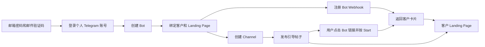

# Bot 自动化创建与 Telegram Card Bot

本项目提供两种卡片接入方式。`auto-register` 是 Node.js Docker API，负责个人 Telegram 账号登录、Bot 自动创建、客户落地页配置、Webhook、Channel 创建和引导帖子发布，用户、Telegram 会话、Bot 和 Channel 存入 MySQL，邮箱验证码与平台登录态存入 Redis。`card-bot` 是独立 Cloudflare Worker，使用已有 Bot Token 返回固定卡片，可单独部署。

- [Bot 自动化创建和客户转化流程](#1-bot-自动化创建和客户转化流程)
- [API 接口文档](#api-reference)
- [Docker 构建、更新和验证](#build-and-verify)
- [Telegram Card Bot](#2-telegram-card-bot)

## 项目目录

```text
auto-register/             Bot、客户落地页和 Channel API
  api/                     登录、资源创建、客户卡片、MySQL 存储
  AUTH.md                  邮箱鉴权、Redis TTL、用户归属与旧会话迁移
  CONVERSION.md            客户转化接口与恢复说明
  test/                    模拟 Telegram 流程测试
  scripts/                 命令行创建脚本和配置模板
  sql/init.sql             可选手工建库建表 SQL
  Dockerfile               Node.js API 镜像
  compose.yaml             API 部署与旧会话迁移卷
  .env.example             API、MySQL、Redis、SMTP、Telegram 配置
card-bot/                  Telegram 卡片服务
  src/index.js             Cloudflare Worker
  scripts/                 Webhook 注册脚本和配置模板
  wrangler.jsonc           Worker 部署配置
  .dev.vars.example        Worker 本地变量模板
```

两个目录各自包含 `package.json`，可独立安装和运行。仓库根目录的 npm 命令仅转发到对应服务；`npm run check` 同时检查两个服务。已有本地 `.env` 已迁入 `auto-register/.env`，不提交到 Git。

## 1. Bot 自动化创建和客户转化流程

用户先用邮箱、密码和一次性邮件验证码注册平台账号，再登录自己的 Telegram 个人账号并创建 Bot、频道和客户落地页配置。业务 API 使用每个用户独立的 Bearer 登录令牌，所有账号路径都检查归属；`customer_id` 仅用于业务关联。完整鉴权配置、注册和登录示例见 [AUTH.md](auto-register/AUTH.md)。

服务采用独立 API 分步执行，没有一次请求完成全部创建的接口。各步的调用顺序和输出如下：

| 步骤 | 操作 | 前置条件 | 返回或保存 |
| --- | --- | --- | --- |
| 部署 | Docker 启动，自动建库建表 | 可连接 MySQL、Redis，配置鉴权密钥和 SMTP | API 服务、MySQL 四张业务表 |
| 0 | 邮箱注册/登录并提交邮件验证码 | 邮箱、密码、邮件验证码 | access_token，默认 2 小时有效 |
| 1 | 发起 Telegram 登录 | App 凭据和个人手机号 | account_id、验证码接收方式 |
| 2 | 提交验证码及可能的两步验证密码 | 本次登录的 account_id | authorized、持久化会话 |
| 3 | 创建指定 Bot | 有效用户会话、唯一 Bot 用户名 | Bot Token、Bot URL |
| 4 | 配置客户落地页和卡片 | 本服务保存的 Bot | customer_id、卡片配置 |
| 5 | 注册 Webhook | 已保存卡片配置、公网 HTTPS API 地址 | 每个 Bot 的 Webhook URL |
| 6 | 创建私有 Channel，可选 | 有效用户会话、已配置落地页的 Bot | Channel ID、邀请链接 |
| 7 | 发布引导帖子，可选 | ready 状态的 Channel | Bot 链接、落地页链接、帖子结果 |

已有有效会话时从步骤 3 继续；已有 Bot 时从步骤 4 继续；只做 Bot 卡片时完成步骤 5 即可。Channel 创建不依赖 Webhook 注册，但 Bot 的卡片回复必须在 Webhook 配置完成后才能工作。



Channel 帖子同时提供落地页直接链接；加入频道不会自动启动 Bot 或私信成员。本项目使用客户已有的落地页，不生成页面，也不统计点击、注册或成交归因。两个卡片服务都支持私聊 `/start`，同一个 Bot 只能选择一个 Webhook 接收服务。

### 准备

- 已注册的个人 Telegram 账号，能够接收登录验证码。
- 在 [my.telegram.org](https://my.telegram.org) → API development tools 获取 App `api_id` 和 `api_hash`；它们与 Bot Token 不同。
- Docker、Docker Compose、可访问的现有 MySQL 和 Redis，以及 SMTP 发信服务。
- 首次需完成验证码及可能的两步验证密码校验，网页端登录不会自动授权本服务。

### Docker 部署

整套 Docker API 只需构建 `auto-register/` 一个目录。这个镜像包含平台鉴权、Telegram 登录、Bot 创建、落地页卡片回复、Webhook、Channel 创建和帖子发布，MySQL、Redis 使用环境变量指定的现有服务。

`card-bot/` 是可选的独立 Cloudflare Worker；使用 Docker API 回复卡片时无需构建或部署它。只有选择 Worker 作为某个 Bot 的卡片入口时，才按第二部分单独部署 `card-bot`。

以下 API 命令均在 `auto-register/` 目录执行：

```bash
cd auto-register
```

```bash
if [ ! -f .env ]; then cp .env.example .env; fi
chmod 600 .env
# 编辑 .env：设置随机 AUTH_HMAC_SECRET（至少 32 字符）、MySQL、Redis 和 SMTP 配置，可选填 App 凭据等默认值
# 生成随机密钥：openssl rand -hex 32
docker compose up -d --build
```

默认仅监听宿主机 `127.0.0.1:3100`。所有管理请求必须携带 `Authorization: Bearer <access_token>`。远程访问可通过 HTTPS 反向代理。健康检查为 `GET /health`。以下命令中的值均为占位符，使用自己的实际配置。

SMTP 可以暂时留空，服务仍会启动；`/auth/register/start` 和 `/auth/login/start` 在需要发信时返回 503，不能完成真实邮箱注册或登录。可以先验证 Docker、MySQL、Redis 和本地模拟邮件链路。`PUBLIC_BASE_URL` 也可留空，注册 Bot Webhook 时再配置。

| 环境变量 | 必填 | 默认值 | 用途和格式 |
| --- | --- | --- | --- |
| AUTH_HMAC_SECRET | 是 | 无 | 至少 32 字符的随机验证码 HMAC 密钥，不是登录令牌 |
| AUTH_CHALLENGE_TTL_SECONDS | 否 | `600` | 邮件验证码有效期（秒），60–3600 |
| AUTH_SESSION_TTL_SECONDS | 否 | `7200` | 平台登录态有效期（秒），60–86400 |
| REDIS_URL | 否 | 空 | Redis 连接 URI，优先于分项配置 |
| REDIS_HOST / REDIS_PORT / REDIS_DB | 是 / 否 / 否 | 无 / 6379 / 0 | Redis 地址、端口及数据库 |
| REDIS_USER / REDIS_PASSWORD | 否 | 空 | Redis ACL 用户名和密码 |
| REDIS_KEY_PREFIX | 否 | `telegram-bot:` | 本服务键前缀 |
| SMTP_HOST / SMTP_FROM | 发信必填 | 空 | SMTP 主机和发件人邮箱 |
| SMTP_PORT / SMTP_SECURE | 否 | 587 / false | 465 隐式 TLS 时设 secure=true |
| SMTP_REQUIRE_TLS | 否 | true | 要求 STARTTLS |
| SMTP_USER / SMTP_PASSWORD | 按邮件服务要求 | 空 | SMTP 鉴权凭据 |
| API_PORT | 否 | `3100` | Compose 的宿主机监听端口 |
| PUBLIC_BASE_URL | 注册 Webhook 时必填 | 无 | 指向 API 的公网 HTTPS 源地址，不含路径；用于 `/webhooks/:bot_id` |
| MYSQL_HOST | 是 | 无 | 数据库 IP/域名；宿主机已映射 MySQL 可用 `host.docker.internal` |
| MYSQL_PORT | 否 | `3306` | 1–65535 的整数 |
| MYSQL_DATABASE | 是 | 无 | 自动创建的库名，1–64 位字母、数字或下划线 |
| MYSQL_USER | 是 | 无 | 对目标库具有 CREATE、SELECT、INSERT、UPDATE 权限的用户 |
| MYSQL_PASSWORD | 是 | 无 | 数据库密码 |
| TG_API_ID | 条件必填 | 无 | 正整数；登录请求未传 `api_id` 时使用 |
| TG_API_HASH | 条件必填 | 无 | 32 位十六进制密钥；请求未传 `api_hash` 时使用 |
| TG_PHONE | 条件必填 | 无 | `+` 加 7–15 位数字，不含空格；请求未传 `phone` 时使用 |
| TG_BOT_NAME | 条件必填 | 无 | 显示名称，最多 64 个 JavaScript 字符；请求未传 `name` 时使用 |
| TG_BOT_USERNAME | 条件必填 | 无 | 5–32 位，字母开头、bot 结尾，仅含字母/数字/下划线；请求未传 `username` 时使用 |
| PORT | 否 | `3000` | Node.js 服务端口；Dockerfile 设置为 3000，Compose 不透传自定义值 |
| DATA_DIR | 否 | 本地 `./data`；容器 `/data` | 仅旧 JSON 会话迁移读取目录；新会话存 MySQL |

Dockerfile 使用 Node.js 22、非 root 用户运行，并内置 HTTP 健康检查。仅 API 代码和依赖进入镜像，真实 `.env` 和登录数据不进入镜像。使用现有 MySQL 时不需要部署新数据库容器。

可单独构建镜像并运行（同样使用环境变量和持久化卷）：

```bash
docker build -t telegram-card-bot-api:local .
docker run -d --name telegram-card-bot-api --restart unless-stopped \
  --env-file .env --add-host host.docker.internal:host-gateway \
  -p 127.0.0.1:3100:3000 -v telegram-bot-data:/data \
  telegram-card-bot-api:local
```

单独使用 `docker run` 时端口由 `-p` 参数指定；`API_PORT` 只供 Compose 插值。两种部署方式使用不同的卷名，选择一种并在后续部署中保留同一个卷。Compose 固定项目名为 `telegram-card-bot-github`，目录重组后继续使用原容器和 `telegram-card-bot-github_telegram-data` 卷；若改项目名，也需显式复用原卷才能迁移旧会话。

<a id="build-and-verify"></a>

### Docker 构建、更新和验证

以下命令从仓库根目录开始。API 使用 Node.js 22 Alpine 镜像，通过 `npm ci --omit=dev` 安装锁定版本的运行依赖；运行用户为 `node`。构建不需要真实 Telegram 凭据，也不会登录 Telegram、创建 Bot 或发邮件。容器启动时才读取环境变量，自动初始化 MySQL 四张业务表并连接 Redis。

```bash
cd auto-register

# 只校验配置，不输出展开后的环境变量值。
docker compose config --quiet

# 构建当前检出版本，再使用该镜像启动或更新服务。
docker compose build telegram-api
docker compose up -d --no-build telegram-api

# 检查运行状态、镜像和启动日志。
docker compose ps
docker compose images
docker compose logs --tail 50 telegram-api
curl -i http://127.0.0.1:3100/health

# 未登录的业务接口应返回 HTTP 401。
curl -i http://127.0.0.1:3100/v1/accounts
```

正常启动日志包含 `Telegram API service started`；`/health` 返回 HTTP 200 和 `{"ok":true}`。Docker 健康检查每 30 秒执行一次，刚启动时可能显示 `starting`，随后变为 `healthy`。健康检查仅验证 HTTP 服务，不实时探测 MySQL、Redis 或 Telegram 授权。

更新代码或修改 `.env` 后重新执行 build/up 两条命令即可。只有环境变量变化时可以只运行 `docker compose up -d telegram-api`；`docker compose restart` 不会加载新的容器环境变量。更新时继续使用原 MYSQL_DATABASE、Redis 连接/前缀、AUTH_HMAC_SECRET 和 Compose 项目名，保留用户、Telegram 会话及尚未过期的平台登录态。

如需重新拉取基础镜像并从头构建，可按需执行 `docker compose build --pull --no-cache telegram-api`。Compose 仅部署 API，不新建 MySQL、Redis 或 SMTP 容器。MySQL 需要支持 JSON 的 8.0 或更新版本，Redis 需要 6.0 或更新版本。旧 JSON 卷只用于迁移，新会话存储在 MySQL 的 tg_info 中。

源码检查和基础测试使用本地 Node.js 22，在仓库根目录执行：

```bash
npm --prefix auto-register ci
npm run check
npm test
```

真实 MySQL/Redis 与已启动 API 的集成验证在 `auto-register/` 目录执行，使用同一数据库、Redis DB/键前缀和鉴权密钥：

```bash
cd auto-register
# MySQL、Redis 均映射到宿主机端口时可使用以下地址。
# REDIS_URL 若已填写，仍优先于 REDIS_HOST；其他环境参数从 .env 读取。
INTEGRATION_TEST=1 MYSQL_HOST=127.0.0.1 REDIS_HOST=127.0.0.1 \
  TEST_API_URL=http://127.0.0.1:3100 \
  node --env-file=.env --test test/integration.test.js
```

如使用远程数据库或其他 API_PORT，将上述地址改为实际值。集成测试创建临时用户及业务记录，完成后清理；通过进程内 SMTP 接收器验证验证码邮件，不要求填写 SMTP，也不调用真实 Telegram 创建接口。该测试按默认 TTL 600/7200 秒验证有效期。

| 已验证项目 | 结果和范围 |
| --- | --- |
| Docker 镜像构建、容器启动、健康检查 | 已通过，本地 HTTP 200 |
| MySQL 自动初始化、四表读写 | 已通过，临时用户记录已清理 |
| Redis 验证码与登录态 | 已通过，默认 TTL 600/7200 秒、一次性使用、过期和退出 |
| 平台鉴权和用户隔离 | 已通过，未登录 401，其他用户访问账号资源 404 |
| SMTP 邮件验证码链路 | 本地 SMTP 接收器及 HTTP 验证通过，真实邮箱投递待配置 |
| 客户卡片、Channel 恢复和帖子重试 | 模拟 Telegram 测试通过 |
| 真实 Telegram 登录 | 此前已验证；旧 JSON 会话升级需先指定归属后迁移 |
| 真实 BotFather/Channel 创建、频道发布、公网 Webhook | 尚未实测 |

<a id="api-reference"></a>

### API 使用约定和接口明细

本地 Base URL 为 `http://127.0.0.1:3100`。API 用 JSON 接收参数并返回 JSON，POST / PUT 请求设置 `Content-Type: application/json`，请求体最大 16 KiB，所有成功请求当前均返回 HTTP 200。下面的步骤 0 给出完整平台鉴权示例，[AUTH.md](auto-register/AUTH.md) 补充限流和旧会话迁移规则。

平台注册/登录的 start、verify 接口无需已有令牌；`/auth/me`、`/auth/logout` 和所有 `/v1/*` 接口使用 `Authorization: Bearer <access_token>`。平台令牌默认 2 小时有效，访问不续期。每次新的 Telegram 登录生成一个独立 account_id，调用方保存它并用于验证码确认、创建和查询；account_id 本身不是鉴权凭据。资源路径会检查用户归属，访问他人的账号返回 404。

平台登录令牌、Telegram App api_hash 和 Bot Token 用途不同：access_token 用于调用本服务；api_id/api_hash 用于个人 Telegram 登录；Bot Token 用于 Telegram Bot API。App 配置不能跳过个人账号的验证码认证。

| 方法 | 路径 | 请求字段 | 返回内容 |
| --- | --- | --- | --- |
| POST | `/auth/register/start` | `email`、`password`；无需令牌 | 发注册邮件，返回 `challenge_id`、`status`、`expires_in` |
| POST | `/auth/register/verify` | `challenge_id`、`code`；无需令牌 | 创建用户，返回 `access_token`、`token_type`、`expires_in`、`user` |
| POST | `/auth/login/start` | `email`、`password`；无需令牌 | 校验密码后发登录邮件，返回 `challenge_id`、`status`、`expires_in` |
| POST | `/auth/login/verify` | `challenge_id`、`code`；无需令牌 | 返回新的平台登录令牌和用户信息 |
| GET | `/auth/me` | 无；本人 Bearer 凭据 | 当前用户 `id`、`email` |
| POST | `/auth/logout` | `{}`；本人 Bearer 凭据 | `{"ok":true}`，撤销当前平台令牌 |
| GET | `/v1/accounts` | 无；本人 Bearer 凭据 | 当前用户的 Telegram 账号列表 |
| GET | `/health` | 无；无需鉴权 | `{"ok":true}`；表示 HTTP 服务已启动，不实时探测 MySQL/Telegram |
| POST | `/v1/login/start` | `api_id`、`api_hash`、`phone`，可由环境变量提供 | `account_id`、`status`、`delivery` |
| POST | `/v1/accounts/:account_id/verify` | `code`；需要两步验证时提交 `password` | `account_id`、`status` |
| GET | `/v1/accounts/:account_id` | 无 | 已保存的账号标识和登录状态 |
| POST | `/v1/accounts/:account_id/bots` | `name`、`username`，可由环境变量提供 | `username`、`name`、`token`、`url` |
| GET | `/v1/accounts/:account_id/bots/:username` | 无 | MySQL 中已保存的 Bot 信息和 Token |
| PUT | `/v1/accounts/:account_id/bots/:username/landing` | `customer_id`、`landing_url`；可选卡片字段 | 保存并返回客户卡片配置 |
| GET | `/v1/accounts/:account_id/bots/:username/landing` | 无 | 读取客户卡片配置 |
| POST | `/v1/accounts/:account_id/bots/:username/webhook` | `{}` | 已注册的 Webhook URL |
| POST | `/v1/accounts/:account_id/channels` | `request_key`、`bot_username`、`title`；可选 `about` | Channel 信息和邀请链接 |
| GET | `/v1/accounts/:account_id/channels/:request_key` | 无 | Channel 的已保存状态 |
| POST | `/v1/accounts/:account_id/channels/:request_key/posts` | request_key、text | 帖子发送结果 |
| POST | `/webhooks/:bot_id` | Telegram Update；专属 Secret 请求头 | 接收 `/start` 并回复卡片，返回 `{"ok":true}` |

下面示例的 `YOUR_ACCESS_TOKEN` 是邮件验证码验证成功返回的令牌，`ACCOUNT_ID`、App 凭据和用户名也需要替换。

登录状态依次为 `code_required` → `password_required`（如启用两步验证）→ `authorized`。验证码和密码通过 verify 请求提交，API 不读取脚本专用的 `TG_PHONE_CODE`、`TG_PASSWORD` 环境变量。

`/health` 和 `/webhooks/:bot_id` 无需平台登录令牌；Webhook 必须携带 Telegram 的 `X-Telegram-Bot-Api-Secret-Token`，其余业务接口都需鉴权。

### 步骤 0：平台注册、登录和退出

首次注册提交邮箱及 12–128 字符的密码；邮箱会转为小写，密码中的空格会保留。SMTP 留空时本步骤的发送邮件请求返回 503，需配置邮件服务后再执行真实注册。

```bash
curl -X POST http://127.0.0.1:3100/auth/register/start \
  -H 'Content-Type: application/json' \
  -d '{"email":"you@example.com","password":"YOUR_LONG_PASSWORD"}'
```

响应示例中的 UUID 为占位值。邮件验证码为六位数字，默认 10 分钟有效，不通过 API 返回：

```json
{"challenge_id":"00000000-0000-4000-8000-000000000001","status":"email_code_required","expires_in":600}
```

收到邮件后提交上一步返回的 challenge_id 和验证码：

```bash
curl -X POST http://127.0.0.1:3100/auth/register/verify \
  -H 'Content-Type: application/json' \
  -d '{"challenge_id":"CHALLENGE_ID","code":"123456"}'
```

验证成功后创建 user_info 记录，返回平台登录令牌；响应中的用户 ID 与后续 Telegram account_id 是两个不同标识：

```json
{
  "access_token":"YOUR_ACCESS_TOKEN",
  "token_type":"Bearer",
  "expires_in":7200,
  "user":{"id":"00000000-0000-4000-8000-000000000002","email":"you@example.com"}
}
```

后续平台登录需要密码和新邮件验证码，调用以下两个接口，响应结构与注册流程相同；不能将注册 challenge 用于登录：

```bash
curl -X POST http://127.0.0.1:3100/auth/login/start \
  -H 'Content-Type: application/json' \
  -d '{"email":"you@example.com","password":"YOUR_LONG_PASSWORD"}'

curl -X POST http://127.0.0.1:3100/auth/login/verify \
  -H 'Content-Type: application/json' \
  -d '{"challenge_id":"LOGIN_CHALLENGE_ID","code":"123456"}'

curl http://127.0.0.1:3100/auth/me \
  -H 'Authorization: Bearer YOUR_ACCESS_TOKEN'

curl http://127.0.0.1:3100/v1/accounts \
  -H 'Authorization: Bearer YOUR_ACCESS_TOKEN'
```

`/auth/me` 返回 `{"id":"用户UUID","email":"you@example.com"}`。`/v1/accounts` 返回 `{"accounts":[]}` 或当前用户的 account_id、status、created_at 列表；查询不返回 App hash 和 Telegram session。

```bash
curl -X POST http://127.0.0.1:3100/auth/logout \
  -H 'Authorization: Bearer YOUR_ACCESS_TOKEN' \
  -H 'Content-Type: application/json' -d '{}'
```

退出返回 `{"ok":true}`，当前平台令牌立即失效，其他登录令牌仍按各自 TTL 有效。平台退出不撤销 Telegram session，也不删除 Bot 或 Channel；Telegram 退出通过客户端设备列表操作。

### 步骤 1：发起登录，发送验证码

```bash
curl http://127.0.0.1:3100/v1/login/start \
  -H 'Authorization: Bearer YOUR_ACCESS_TOKEN' \
  -H 'Content-Type: application/json' \
  -d '{"api_id":123456,"api_hash":"YOUR_APP_API_HASH","phone":"+8613800000000"}'
```

响应示例（account_id 每次不同）：

```json
{"account_id":"本次生成的UUID","status":"code_required","delivery":"telegram_app"}
```

服务在发送 Telegram 验证码后立即保存会话至 `tg_info`，关联当前平台用户，再返回 `account_id`。调用方也应保存这个值；验证码确认和后续创建使用同一个 account_id。向同一手机号重新发起登录会生成新标识，不会自动复用旧记录。

返回 `account_id`、`status: "code_required"`、`delivery`。`telegram_app` 表示通过 Telegram 客户端接收，`other` 表示其他渠道；本服务不保证短信发送。App 凭据和手机号已设置环境变量时可发送 `{}`。保存 `account_id`，后续调用均使用它，不需要重复发送验证码。

### 步骤 2：提交验证码，完成登录

```bash
curl http://127.0.0.1:3100/v1/accounts/ACCOUNT_ID/verify \
  -H 'Authorization: Bearer YOUR_ACCESS_TOKEN' \
  -H 'Content-Type: application/json' \
  -d '{"code":"12345"}'
```

成功响应示例：

```json
{"account_id":"返回的账号标识","status":"authorized"}
```

成功返回 `status: "authorized"`。如返回 `password_required`，向同一接口再次提交 `{"password":"你的两步验证密码"}`；也可首次提交 `code` 和 `password` 两个字段。提交的验证码和两步验证密码不保存到数据库；MTProto session 和验证码流程所需的 phone_code_hash 保存于 tg_info。登录流程在本服务中 10 分钟后过期，Telegram 验证码也可能提前失效；重新调用登录接口获取新的 `account_id`。当前不支持注册个人 Telegram 账号、Telegram 额外邮箱认证或验证码自动读取。

### 步骤 3：创建指定 Bot，回传 Token

```bash
curl http://127.0.0.1:3100/v1/accounts/ACCOUNT_ID/bots \
  -H 'Authorization: Bearer YOUR_ACCESS_TOKEN' \
  -H 'Content-Type: application/json' \
  -d '{"name":"Gatherstar Card Bot","username":"gatherstar_unique_card_bot"}'
```

响应示例：

```json
{"username":"gatherstar_unique_card_bot","name":"Gatherstar Card Bot","token":"123456:EXAMPLE_TOKEN","url":"https://t.me/gatherstar_unique_card_bot"}
```

`name`、`username` 可分别由 `TG_BOT_NAME`、`TG_BOT_USERNAME` 提供默认值。BotFather 对话依赖英文提示，用户名占用、账号限制或回复变化会返回错误；超时后先检查 BotFather 对话，避免重复创建。不要同时手动操作该账号的 BotFather。服务只对已成功保存的结果去重，无法保证远程创建与本地写入之间的事务一致性。

| 字段 | 必填 | 说明 |
| --- | --- | --- |
| name | 请求或环境变量提供 | Bot 显示名称，1–64 字符；默认读取 TG_BOT_NAME |
| username | 请求或环境变量提供 | 全局唯一，5–32 位，字母开头、bot 结尾，仅含字母、数字、下划线；默认读取 TG_BOT_USERNAME |

### 步骤 4：配置客户 Landing Page 和卡片

```bash
curl -X PUT http://127.0.0.1:3100/v1/accounts/ACCOUNT_ID/bots/customer_a_unique_bot/landing \
  -H 'Authorization: Bearer YOUR_ACCESS_TOKEN' -H 'Content-Type: application/json' \
  -d '{
    "customer_id":"customer_a",
    "landing_url":"https://customer-a.example.com/offer?source=telegram",
    "card_text":"欢迎查看客户 A 的活动",
    "card_image":"",
    "button_text":"查看活动"
  }'
```

| 字段 | 必填 | 限制或默认值 |
| --- | --- | --- |
| customer_id | 是 | 1–64 字符，绑定客户业务标识 |
| landing_url | 是 | 完整 HTTP(S) 地址，可带查询参数，不允许 URL 内嵌用户名密码 |
| card_text | 否 | 默认“欢迎访问平台”；有图片最多 1024，无图片最多 4096 字符 |
| card_image | 否 | 默认空；公网图片 URL 或 Telegram file_id，最多 2048 字符 |
| button_text | 否 | 默认“立即了解”，1–64 字符 |

PUT 保存完整配置，省略可选字段将恢复默认值。返回配置不含 Webhook 密钥。GET 同一路径可查询配置。不同 Bot 对应不同客户落地页，配置更新后后续 `/start` 使用新配置；不需要重新部署。Webhook 密钥在第一次配置时生成，后续更新保留。

### 步骤 5：注册 Bot Webhook

```bash
curl -X POST http://127.0.0.1:3100/v1/accounts/ACCOUNT_ID/bots/customer_a_unique_bot/webhook \
  -H 'Authorization: Bearer YOUR_ACCESS_TOKEN' -H 'Content-Type: application/json' -d '{}'
```

返回：

```json
{"username":"customer_a_unique_bot","webhook_url":"https://bots.example.com/webhooks/123456","status":"registered"}
```

用户私聊发送 `/start` 时，API 根据 Bot ID 从 MySQL 读取客户配置并发送图片或文字、网址按钮。这里由 Docker API 直接处理卡片，无需为每个客户部署 Cloudflare Worker。一个 Bot 只能设置一个 Webhook；注册到 Docker API 会替换该 Bot 之前的 Worker Webhook。独立 `card-bot` 仍可用于其他 Bot。

### 步骤 6：创建客户 Channel（可选）

```bash
curl http://127.0.0.1:3100/v1/accounts/ACCOUNT_ID/channels \
  -H 'Authorization: Bearer YOUR_ACCESS_TOKEN' -H 'Content-Type: application/json' \
  -d '{
    "request_key":"customer_a_channel_001",
    "bot_username":"customer_a_unique_bot",
    "title":"客户 A 活动频道",
    "about":"客户 A 的活动信息"
  }'
```

| 字段 | 必填 | 限制 |
| --- | --- | --- |
| request_key | 是 | 1–64 位字母、数字、下划线、短横线；同一账号下稳定且唯一 |
| bot_username | 是 | 当前账号已创建且已配置 landing 的 Bot 用户名 |
| title | 是 | 1–128 字符 |
| about | 否 | 最多 255 字符，默认空 |

创建的是私有广播频道，账号为创建者。响应包含 `request_key`、`channel_id`、`customer_id`、`bot_username`、`title`、`about`、`status: "ready"`、`invite_url`、`bot_url`，不返回 access_hash。当前不设置公开频道用户名，也不邀请用户或将 Bot 提升为管理员。发布通过登录用户账号完成。

GET `/v1/accounts/ACCOUNT_ID/channels/customer_a_channel_001` 查询已保存信息；GET 不会调用 Telegram。相同 request_key 和参数会返回已有频道，改变参数会返回 409。Channel 已创建但邀请链接生成失败时，使用同一 key 重试可继续生成链接。

Telegram 的 Channel 创建调用本身没有远程幂等键。如果发生网络错误，结果可能不确定，记录保留 `creating` 状态，服务返回 409 并禁止自动再次创建；先到 Telegram 检查，不应直接换 key 盲目重试。服务会先把已返回的创建结果保存到 tg_info.pending_channel，后续账号请求可据此补写 channel_info；如果 pending 写入也失败，需先核对 Telegram 中的实际结果。

### 步骤 7：发布转化引导帖子（可选）

```bash
curl http://127.0.0.1:3100/v1/accounts/ACCOUNT_ID/channels/customer_a_channel_001/posts \
  -H 'Authorization: Bearer YOUR_ACCESS_TOKEN' -H 'Content-Type: application/json' \
  -d '{"request_key":"offer_post_001","text":"本周活动已上线，点击下方链接了解详情。"}'
```

| 字段 | 必填 | 限制 |
| --- | --- | --- |
| request_key | 是 | 1–64 位字母、数字、下划线、短横线；同一频道内唯一 |
| text | 是 | 1–3000 字符，加入链接后总长度不超过 4096 |

频道发布普通文字，并追加两个可点击链接：Bot Start 链接、配置的 Landing Page。响应含 `status: "sent"`、`message_id`（如 Telegram 返回）、`bot_url`、`landing_url` 和文本。已成功发送的同 key 请求直接返回保存结果；改变正文或落地页需使用新 key。待发送记录保存 Telegram random_id，重试使用同一 random_id 来降低重复发送风险。不要无限重复提交。

### 查询登录状态或取回已保存 Token

```bash
curl http://127.0.0.1:3100/v1/accounts/ACCOUNT_ID \
  -H 'Authorization: Bearer YOUR_ACCESS_TOKEN'
curl http://127.0.0.1:3100/v1/accounts/ACCOUNT_ID/bots/gatherstar_unique_card_bot \
  -H 'Authorization: Bearer YOUR_ACCESS_TOKEN'
```

状态查询返回本地记录；创建时会检查 Telegram 会话是否仍有效。Token 查询仅支持本服务保存的 Bot，不会从 BotFather 导入已有 Bot，也不会轮换 Token。获得的 Token 可用于独立 Cloudflare 卡片服务；Docker 卡片模式会自动从数据库读取 Token，无需再配置给 Worker。

账号 GET 只返回本地状态，`authorized` 不代表本次请求实时验证了 Telegram。创建新 Bot、创建 Channel、发布帖子会检查实际授权；缓存结果或配置查询不验证用户会话。当前没有单独的实时会话校验 API。

### 常见错误和处理

失败返回 `{"error":"错误说明"}`，不会返回 App 密钥或用户会话。

| HTTP 状态 | 原因 | 处理 |
| --- | --- | --- |
| 400 | 参数缺失、格式错误或 JSON 错误 | 检查请求字段和配置表 |
| 401 | 平台令牌失效、未登录或实际 Telegram 会话失效 | 检查鉴权；会话失效时重新发起登录 |
| 404 | 接口、账号记录或已保存 Bot 不存在 | 检查路径、account_id 和用户名 |
| 409 | 并发操作、request_key 冲突或 Channel 创建结果不确定 | 等待、检查参数，或到 Telegram 核对远程资源 |
| 410 | 本服务登录流程超过 10 分钟 | 重新发起登录并使用新的 account_id |
| 413 | 请求体超过 16 KiB | 缩小请求体 |
| 422 | Telegram 拒绝认证、需要额外验证或 BotFather 创建失败 | 根据错误和 BotFather 对话处理；当前不支持 Telegram 额外邮箱认证或注册个人 Telegram 账号 |
| 429 | 平台邮件/密码限流或 Telegram FLOOD_WAIT | 等待 Telegram 指定时间，避免立即重复请求 |
| 403 | Webhook Secret 不匹配 | 检查注册的 Telegram Webhook 密钥 |
| 405 | Webhook 使用非 POST 方法 | Telegram 消息入口只接受 POST |
| 500 | 数据库、网络或其他内部错误 | 检查容器日志、MySQL 和网络连接 |
| 503 | SMTP 未配置或邮件发送失败 | 检查 SMTP 环境变量和邮件服务 |
| 502 | Telegram Bot API 请求或发送失败 | 检查 Token、图片、网络和 Webhook 配置 |
| 504 | BotFather 回复超时 | 先检查 Telegram 中是否已创建成功，再决定是否重试 |

同一 account_id 和用户名已有数据库记录时，创建接口直接返回已保存 Token；更改 name 不会更新已有 Bot。它不提供 Token 轮换、删除 Bot 或导入已有 Bot 功能。

### 数据持久化、初始化和维护

服务启动时自动创建 `MYSQL_DATABASE` 指定的数据库及四张业务表。库名仅允许 1–64 位字母、数字或下划线。初始化失败或 Redis 连接失败时不会开始接受请求。Compose 只启动 API，使用已有 MySQL 和 Redis。

| 表或数据位置 | 保存内容 |
| --- | --- |
| MySQL `user_info` | 用户 ID、唯一邮箱、随机盐的 scrypt 密码哈希 |
| MySQL `tg_info` | user_id、account_id、App 凭据、手机号、MTProto session、登录阶段及待补写结果 |
| MySQL `bot_info` | user_id、account_id、Bot ID、用户名、名称、Token、客户落地页、卡片及 Webhook 配置 |
| MySQL `channel_info` | user_id、account_id、Bot/客户关联、频道 ID、access_hash、邀请链接和 posts JSON 中的帖子记录 |
| Redis | 邮件验证码 challenge 默认 10 分钟；平台登录令牌默认 2 小时；限流计数和 Telegram 操作锁 |

新登录状态直接写 MySQL，不再生成 `<account_id>.json`。原命名卷保留，用于管理员迁移旧 JSON 会话；具体命令见 [旧会话迁移](auto-register/AUTH.md#旧-json-会话迁移)。旧表不会自动删除或向新用户开放。升级时需确认归属再迁移旧 Bot、客户和 Channel 记录。

数据库保存可复用的 Telegram session、App hash、Bot Token 和 Webhook Secret，应限制数据库访问并保护备份。远程创建结果会写入 tg_info 的 pending 字段，后续同账号请求先补写业务表；若首次 pending 写入本身失败，必须先检查 BotFather 或 Telegram 中的实际创建结果。服务不会回滚远程资源。

本地 MySQL 或 Redis 已映射宿主机端口时，Compose 可用 `host.docker.internal` 连接，模板已配置 host-gateway。容器中 `localhost` 指向 API 容器。MySQL 用户需具有目标库的 CREATE、SELECT、INSERT、UPDATE 权限。所有连接信息通过 `.env` 或容器环境变量传入，真实 `.env` 不进入镜像，也不提交 Git。

通常无需手动导入 SQL；[sql/init.sql](auto-register/sql/init.sql) 可预先建库建表，默认数据库名 `telegram_bot`。如果使用其他 MYSQL_DATABASE，请同步修改 SQL 的 CREATE DATABASE 和 USE。初始化使用 IF NOT EXISTS，不清空数据，也不自动改动已有同名表结构。

```bash
# 在 auto-register/ 目录；密码通过提示输入。
mysql -h 127.0.0.1 -P 3306 -u root -p < sql/init.sql

docker compose ps
docker compose logs --tail 50 telegram-api
curl http://127.0.0.1:3100/health
docker compose restart telegram-api
```

重启后仍使用原 account_id；平台令牌在 Redis 中未过期即可继续使用，MySQL 的 Telegram session 可以长期复用。平台退出接口 `/auth/logout` 仅撤销当前平台令牌。要终止 Telegram 会话，在 Telegram 客户端设置的设备列表中撤销；Bot 和 Token 不会因此删除。

非 Docker 运行需加载同样的环境变量，再执行 `npm run start:api`。默认 Node.js 端口为 3000，可设置 PORT。`docker compose down` 保留卷；`down -v` 删除旧会话卷，但不会删除外部 MySQL 或 Redis 数据。

### 检查与验证范围

```bash
npm run check
npm test
```

自动测试覆盖密码哈希、邮件验证码一次性使用和过期、登录态有效期、退出和资源归属，并模拟 Telegram 客户卡片、Channel 恢复与帖子重试。真实 MySQL/Redis 和已启动 API 的集成测试可在配置相同环境后运行：

```bash
INTEGRATION_TEST=1 node --env-file=.env --test test/integration.test.js
```

本地测试时 MYSQL_HOST、REDIS_HOST 必须能从宿主机访问；REDIS_URL 如配置则优先使用。该测试创建并清理临时记录，使用进程内的 SMTP 接收器捕获邮件，不向外部邮箱发信、不调用 Telegram。真实 SMTP 发信需配置后验证。此前真实 Telegram 验证码登录及会话授权已通过；真实 BotFather/Channel 创建、频道发布及公网 Webhook 尚未实测。

### 可选：通过 Node.js 脚本自动创建 Bot

除 Docker API 外，也可在本地终端运行独立创建脚本。需要 Node.js 20 或更新版本；脚本将会话和 Token 保存为本地文件，不使用 API 的数据卷或 MySQL。

`scripts/create-bot.js` 使用个人 Telegram 账号通过 MTProto 与官方 BotFather 对话，依次发送 `/newbot`、名称和用户名，提取返回的 Bot Token。首次无需已有 Bot Token，但需要在 [my.telegram.org](https://my.telegram.org) → API development tools 申请的 App `api_id`、`api_hash`。网页端登录会话不能直接作为本脚本的会话。

在 `auto-register/` 目录执行：

```bash
npm install
cp scripts/create-bot.env.example scripts/create-bot.env
chmod 600 scripts/create-bot.env
```

编辑 `scripts/create-bot.env`，填写以下环境变量。模板不包含真实凭据：

| 环境变量 | 必填 | 说明 |
| --- | --- | --- |
| TG_API_ID | 是 | App api_id，正整数 |
| TG_API_HASH | 是 | App api_hash，32 位十六进制密钥 |
| TG_PHONE | 是 | 个人账号手机号，包含国家区号，如 `+86...` |
| TG_BOT_NAME | 是 | 新机器人的显示名称 |
| TG_BOT_USERNAME | 是 | 唯一用户名，5–32 位，以字母开头、以 bot 结尾，仅含字母、数字、下划线 |
| TG_PHONE_CODE | 否 | 首次登录验证码，不提供时终端输入 |
| TG_PASSWORD | 否 | 两步验证密码，不提供时终端输入 |
| TG_SESSION_PATH | 否 | 用户会话路径，默认 `scripts/.telegram-user.session`，直接保存 StringSession 文本 |
| TG_TOKEN_FILE | 否 | Token 输出文件，默认 `scripts/.bot-token.env`，必须不存在 |

加载环境变量并运行：

```bash
set -a
source scripts/create-bot.env
set +a
npm run create:bot
```

脚本只从环境变量读取创建配置；也可由终端或密钥管理工具直接注入，无需配置文件。`source` 会执行 Bash 语法，只加载自己填写的可信文件。可通过 `TG_PHONE_CODE`、`TG_PASSWORD` 环境变量传入登录验证码和两步验证密码；未提供时在终端输入；验证码会过期，建议临时注入。用户会话有效时，后续运行可复用登录。

成功后 Token 写入 `TG_TOKEN_FILE`，格式为 `BOT_TOKEN=...`，文件仅当前用户可读写，不在终端显示 Token。脚本会拒绝覆盖已有输出文件。将该值填入下文 Cloudflare 的 `BOT_TOKEN` Secret 和 `scripts/env` 的 `BOT_TOKEN`；不会自动部署 Worker 或注册 Webhook。

不要同时手动操作 BotFather 或运行多个创建脚本。脚本依赖 BotFather 的英文提示，用户名占用、创建限制、回复变化或超时会停止流程；重新运行前检查 BotFather 对话，确认是否已创建成功，避免重复创建。脚本属于对话自动化，没有官方独立的 `createBot` HTTP 接口，尚未完成真实账号创建实测。

`scripts/create-bot.env`、默认 Token 输出和会话文件已被 Git 忽略。若自定义输出路径，请自行确认不会提交到 Git。会话文件可用于访问个人账号，应与 `api_hash`、Bot Token 一并保密。详见 [BotFather 流程](https://core.telegram.org/bots/features#creating-a-new-bot)、[用户授权](https://core.telegram.org/api/auth) 和 [Teleproto](https://docs.teleproto.dev/)。

## 2. Telegram Card Bot

Cloudflare Workers 使用已有 Bot Token，在私聊收到 `/start` 后发送固定图片、文案和网址按钮。无图片时发送文字和按钮。每个部署使用一组 Worker 环境变量，卡片服务无需 MySQL 或个人账号会话。适合已创建 Bot 的独立卡片接入。

如果已使用上方 Docker 的客户配置和 Webhook，可以由 Docker 直接发送卡片；Cloudflare Worker 是另一种部署选项。同一个 Bot 注册到 Worker 后会替换 Docker Webhook，反之亦然。

### 准备

以下卡片服务命令均在 `card-bot/` 目录执行：

```bash
cd card-bot
```

- 使用上方 API 创建 Bot 获取 Token，或在官方 @BotFather 通过 `/newbot` 手动创建。
- 注册 Cloudflare 账号，准备卡片图片直链和文案。
- Token 通常是 `数字ID:密钥`，Bot 用户名和普通账号 ID 不是 Token。
- 不要提交真实 Token 或 Webhook 密钥；`.dev.vars.example` 只是配置模板，不会自动配置线上变量。

### 使用流程

1. 准备 Bot Token、落地页网址，以及可选的图片和文案。
2. 将 `src/index.js` 部署到 Cloudflare Workers。
3. 设置 Worker 运行时变量和 Secrets，保存并部署。
4. 在本地配置 `scripts/env`，运行注册 Webhook 脚本。
5. 打开 `https://t.me/你的机器人用户名`，点击 Start 或发送 `/start`。

只响应私聊中的 `/start`（可带参数），忽略其他消息和群聊。配置了 `CARD_IMAGE` 时发送图片、文案和网址按钮；没有图片时发送文字和按钮。网址按钮只打开配置的网址，不在 API 服务中记录点击。

### 部署到 Cloudflare Workers

Cloudflare 控制台 → Workers & Pages → 创建应用 → 从 Git 仓库导入，选择本仓库。

- 部署命令：`npx wrangler deploy`
- 项目根目录：`card-bot`。
- 本项目无需构建；如果要求构建命令，可填写 `npm run check`。

也可以创建 Hello World Worker，在代码编辑器粘贴 `card-bot/src/index.js` 并部署。使用提供的 `workers.dev` 地址，无需自有域名。

### 配置运行时变量

Worker → Settings → Variables and Secrets，添加并保存部署：

| 名称 | 类型 | 必填 | 默认值/格式 | 用途 |
| --- | --- | --- | --- | --- |
| BOT_TOKEN | Secret | 是 | `数字ID:密钥` | 调用 Telegram Bot API；不是 App api_hash |
| WEBHOOK_SECRET | Secret | 是 | 1–256 位字母、数字、下划线或短横线，建议随机 32 位以上 | 验证 Telegram 请求，需与本地注册配置一致 |
| WEBHOOK_PATH | Text | 否 | `/webhook` | 接收 Webhook 的路径；修改后重新注册 |
| LANDING_URL | Text | 是 | 完整 `http://` 或 `https://` URL，可带查询参数 | 网址按钮目标 |
| CARD_IMAGE | Text | 否 | 空 | 公网图片直链或 Telegram file_id |
| CARD_TEXT | Text | 否 | `欢迎访问平台` | 有图最多 1024、无图最多 4096 个 JavaScript 字符，普通文本 |
| BUTTON_TEXT | Text | 否 | `立即进入平台` | 网址按钮文字 |

配置的是 Worker 运行时变量，不是 Git 构建环境变量。业务值不写入 wrangler 配置，方便在控制台修改。

### 本地开发

本地开发使用 `.dev.vars`，与 API 的 `.env` 独立：

```bash
npm ci
cp .dev.vars.example .dev.vars
# 编辑 .dev.vars，填写上表的 Bot Token、Webhook 密钥、落地页等
npm run dev
```

Wrangler 显示本地地址；Telegram 注册 Webhook 需要可从公网访问的 HTTPS 地址，不能直接使用 localhost。通过 Cloudflare 控制台配置的线上变量不会自动写入本地 `.dev.vars`，本地配置也不会自动同步线上。

### 注册 Webhook

注册脚本将公网 Worker URL 和校验密钥提交给 Telegram，并查询 Webhook 信息。它只配置消息接收入口，不会部署 Worker 或创建 Bot。复制模板：

```bash
cp scripts/env.example scripts/env
chmod 600 scripts/env
```

编辑 `scripts/env`，填写：

```ini
BOT_TOKEN=你的BotFather令牌
WEBHOOK_SECRET=与Cloudflare中完全一致的密钥
WORKER_URL=https://你的worker.你的子域.workers.dev
WEBHOOK_PATH=/webhook
```

| 配置 | 必填 | 说明 |
| --- | --- | --- |
| BOT_TOKEN | 是 | 与 Worker 的 BOT_TOKEN 完全一致 |
| WEBHOOK_SECRET | 是 | 与 Worker 的 WEBHOOK_SECRET 完全一致 |
| WORKER_URL | 是 | 公网 HTTPS 源地址，例如 `https://example.workers.dev`，不包含路径或查询参数 |
| WEBHOOK_PATH | 否 | 默认 `/webhook`；必须与 Worker 使用的路径一致 |

支持空行、整行 `#` 注释和包裹值的单引号/双引号；值按原文读取，不执行命令或展开变量。不要使用 `export` 或行尾注释。`scripts/env` 已被 Git 忽略，不提交密钥。建议执行 `chmod 600 scripts/env`。

在 Bash 终端执行：

```bash
bash scripts/register-webhook.sh
```

脚本自动读取其所在目录的 `env`，不再交互输入。从 `scripts` 目录也可执行 `bash register-webhook.sh`。确认 setWebhook 返回 `ok: true`，getWebhookInfo 的 URL 正确。本地 env 只用于注册 Webhook，不会同步 Cloudflare 变量。

### 测试和维护

| Worker HTTP 状态 | 含义 |
| --- | --- |
| 200 | 已处理，或消息不属于私聊 `/start` 而被忽略 |
| 400 | Webhook 请求不是有效 JSON |
| 403 | Telegram Secret Header 与配置不一致 |
| 404 | 请求路径不匹配 |
| 405 | Webhook 路径收到非 POST 请求 |
| 500 | 缺少密钥、落地页无效或文案超长 |
| 502 | Telegram 发送接口失败或网络请求异常 |

进入 Bot，点击 Start 或发送 `/start`，确认收到卡片，点击按钮检查完整落地页地址。

- 根路径返回 404、浏览器 GET 访问 Webhook 返回 405 是正常行为。
- 无回复：检查 getWebhookInfo 和 Worker 日志。
- 图片失败：检查直链是否能直接下载图片；先移除 CARD_IMAGE 验证文字发送。
- 修改图片、文案、按钮、落地页：保存并部署变量即可。
- 修改密钥、Token、路径或 Worker 地址：重新注册 Webhook。

普通网址按钮无法强制使用 TG 内置浏览器，取决于客户端和用户设置。基础版没有持久化去重，Telegram 重试时可能重复发送。不提供点击统计。

## 参考文档

- [Telegram Bot API](https://core.telegram.org/bots/api)
- [BotFather 创建流程](https://core.telegram.org/bots/features#creating-a-new-bot)
- [Telegram 用户授权](https://core.telegram.org/api/auth)
- [Cloudflare Workers](https://developers.cloudflare.com/workers/)
