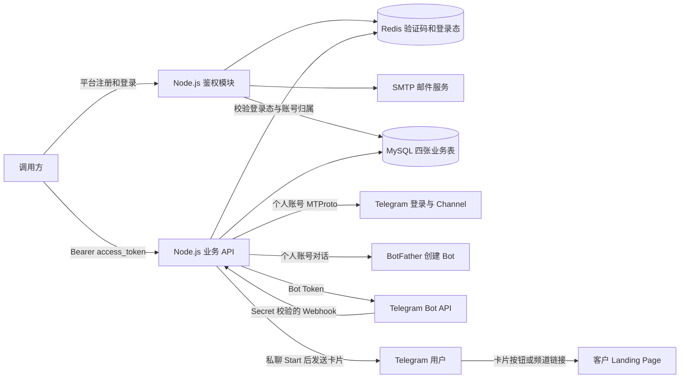

# Telegram Bot 自动化平台

主服务 `auto-register` 提供 Node.js Docker API：用户完成邮箱鉴权后登录个人 Telegram 账号，创建自己的 Bot、配置客户 Landing Page 卡片、注册 Webhook，并按需创建 Channel 和发布引导帖子。用户和业务数据持久化至 MySQL，邮件验证码与平台登录态由 Redis 管理。

**整套主服务只构建 `auto-register/` 一个目录。** 已有的 `card-bot/` 作为 Legacy Cloudflare Worker 保留，其卡片回复能力也已集成到主服务。新部署按本文的 Docker 流程操作；Legacy 使用说明放在文末。

- [设计与配置原则](#design)
- [架构、身份与数据模型](#architecture)
- [环境变量与配置需求](#configuration)
- [Docker 构建、部署和更新](#build-and-verify)
- [API 清单与完整调用示例](#api-reference)
- [错误处理、持久化和迁移](#operations)
- [测试与当前验证范围](#verification)
- [Legacy：card-bot](#legacy-card-bot)

<a id="design"></a>

## 1. 设计与配置原则

平台用户与 Telegram 个人账号分别认证。先用邮箱、密码和邮件验证码取得本服务的 access_token，再用 Telegram App api_id/api_hash、手机号和 Telegram 验证码建立 MTProto 会话。首次 Telegram 登录可能需要两步验证密码，App configuration 或网页端登录不能代替该认证步骤。

Telegram App 凭据从 [my.telegram.org](https://my.telegram.org) 的 API development tools 获取。验证码由 Telegram 决定发送渠道，可能发到已有 Telegram 客户端；当前服务不保证短信，也不自动读取验证码。

服务配置通过环境变量传入，用户自己的账号凭据及业务内容通过 API 请求传入。请求中的 Telegram App 凭据、手机号、Bot 名称和用户名优先于对应 TG_* 环境变量。多用户使用时，应在请求中传每个用户自己的配置；全局 TG_* 默认值适合单账号部署。

持久数据与短期认证状态分别管理。MySQL 保存用户、Telegram session、Bot Token、客户卡片和频道；Redis 保存邮件验证码、平台登录令牌、限流计数和操作锁。平台令牌默认 2 小时有效，访问不续期；Telegram session 可在平台令牌过期后继续保留。

业务流程通过多个接口分步执行。先完成登录、创建 Bot 和卡片配置，再按需注册 Webhook、创建频道和发布帖子。Bot 创建通过已登录的个人账号与 BotFather 对话完成；接口依赖其英文提示、用户名可用性及账号限制。

Landing Page 使用客户已有的完整 URL，本服务负责卡片按钮和频道引导链接。当前不会生成或托管落地页，不提供点击、注册或成交归因；频道成员需主动打开 Bot 并按 Start 才能收到卡片。

| 阶段 | 输入 | 输出或保存结果 |
| --- | --- | --- |
| 平台注册/登录 | 邮箱、密码、邮件验证码 | user_id、默认 2 小时的 access_token |
| Telegram 登录 | App 凭据、手机号、验证码，必要时两步验证密码 | account_id、持久化 MTProto session |
| 创建 Bot | account_id、name、username | Bot 信息、Token 和 t.me 链接 |
| 配置客户卡片 | Bot、customer_id、landing_url 和可选卡片字段 | bot_info 中的客户配置 |
| 注册 Webhook | 已配置的 Bot、公网 HTTPS API 地址 | Bot 的专属回调 URL |
| 创建 Channel（可选） | Bot、request_key、标题和简介 | 频道信息及邀请链接 |
| 发布帖子（可选） | Channel、request_key、正文 | 帖子结果、Bot Start 链接和落地页链接 |

已有 Telegram 会话时，在平台登录后复用原 account_id；已有 Bot 时可从配置卡片继续。频道流程不依赖 Webhook 已注册，但 Bot 自动回复需要有效 Webhook。

<a id="architecture"></a>

## 2. 架构、身份与数据模型



`auto-register/api/server.js` 提供 HTTP 入口和 Telegram 登录/创建流程；`auth.js` 与 `auth-runtime.js` 管理鉴权、Redis 和邮件；`conversion.js` 管理客户配置、Webhook、频道和帖子；`store.js` 与 `schema.js` 管理 MySQL 数据和启动初始化。

### 身份和凭据

| 标识或凭据 | 用途 | 有效期或归属 |
| --- | --- | --- |
| user_id | 平台用户，API 的 user.id 对应 user_info.id | 邮箱验证成功后创建 |
| access_token | 调用本服务的 Bearer 登录令牌 | 默认 2 小时，Redis 保存其摘要对应的登录态 |
| challenge_id + 邮件 code | 完成一次平台注册或登录验证 | 默认 10 分钟，成功后销毁，最多错误 5 次 |
| account_id | 本服务保存的一次 Telegram 登录及后续资源的标识 | UUID，关联 user_id，本身不能用于鉴权 |
| api_id / api_hash | Telegram App 凭据 | 用于 MTProto 个人账号认证，不是 Bot Token |
| Telegram session | 已认证的个人账号会话 | 存 MySQL，撤销方式为 Telegram 客户端设备列表 |
| Bot Token | 调用 Telegram Bot API | 存 MySQL bot_info，查询需平台鉴权及账号归属 |
| customer_id | Bot 对应客户的业务标识 | 不能代替平台身份，不是权限隔离依据 |
| request_key | 频道或帖子请求的稳定标识 | 频道在账号下唯一，帖子在频道内唯一 |

### 四张业务表

| 表 | 保存内容 | 关联关系 |
| --- | --- | --- |
| user_info | 用户 ID、唯一邮箱、随机盐的 scrypt 密码哈希、注册时间 | id 为平台用户主键 |
| tg_info | account_id、App 凭据、手机号、session、登录阶段、phone_code_hash、pending_bot/pending_channel | user_id 对应平台用户 |
| bot_info | Bot ID、用户名、名称、Token、customer_id、落地页、卡片和 Webhook 配置 | user_id 和 account_id 对应所属用户与 Telegram 登录 |
| channel_info | 频道 ID、access_hash、邀请链接、Bot/客户关联、创建状态及 posts JSON | user_id、account_id；posts 保存各帖子状态和 random_id |

这些关系由服务校验并建立查询索引，目前没有数据库外键级联删除。所有账号资源路径先检查用户归属，访问其他用户的账号返回 404。新 Telegram 登录直接写 tg_info，不再创建 JSON 会话文件；MySQL 中的可复用 session、App hash、Bot Token 和 Webhook Secret 需要保护数据库访问和备份。

### 项目目录

```text
auto-register/              当前主服务；唯一需要构建的 Docker 目录
  api/                      Node.js API、鉴权、Telegram、MySQL 存储
  AUTH.md                   邮件验证、Redis TTL、限流和旧会话迁移
  CONVERSION.md             客户卡片、Channel 和重试说明
  test/                     单元测试与可选 MySQL/Redis 集成测试
  scripts/assign-account.js 管理员导入旧 JSON 会话
  scripts/create-bot.js     独立本地创建工具，不走平台 API
  sql/init.sql              可选的手工建库建表 SQL
  Dockerfile                Node.js 22 Alpine API 镜像
  compose.yaml              API 部署；外接已有 MySQL 和 Redis
  .env.example              配置模板，真实 .env 不提交
card-bot/                   Legacy：独立 Cloudflare 卡片 Worker
  README.md                 Legacy 完整配置与部署说明
  src/index.js              私聊 Start 卡片回复
  scripts/                  Legacy Webhook 注册脚本
```

根目录 `npm run start:api`、`npm test`、`npm run create:bot` 转发到主服务；`npm run check` 检查两个目录。根目录 `npm run dev`、`npm run deploy` 仍是 Legacy Worker 命令，主服务使用下文 Docker 命令。

<a id="configuration"></a>

## 3. 环境变量与配置需求

### 按阶段配置

| 使用阶段 | 必要配置或条件 |
| --- | --- |
| 基础服务启动 | AUTH_HMAC_SECRET、MySQL 连接和库名、Redis 连接；Docker/Compose、MySQL 8.0+、Redis 6.0+ |
| 真实平台注册和登录 | 在基础配置上增加 SMTP_HOST、SMTP_FROM，按邮件服务要求配置端口、TLS 和密码 |
| Telegram 登录和创建 | 已注册的个人 Telegram 账号及 App 凭据；用户在请求中传入或配置 TG_* 默认值 |
| Bot 卡片自动回复 | 已保存客户卡片配置、PUBLIC_BASE_URL、公网 HTTPS 转发到 API，并调用注册 Webhook 接口 |
| Channel 创建和发布 | 有效 Telegram session、已保存并配置 landing 的 Bot，不要求 PUBLIC_BASE_URL |

SMTP 暂时留空仍可启动基础服务，发送验证码时返回 503，不能完成真实邮箱注册或登录。PUBLIC_BASE_URL 可留空，注册 Webhook 时再填写。MySQL、Redis 和 SMTP 都是外部服务，本项目的 Compose 不创建它们。

### 服务环境变量

| 环境变量 | 必填 | 默认值 | 用途和格式 |
| --- | --- | --- | --- |
| AUTH_HMAC_SECRET | 是 | 无 | 至少 32 字符的随机验证码 HMAC 密钥，不是登录令牌 |
| AUTH_CHALLENGE_TTL_SECONDS | 否 | `600` | 邮件验证码有效期（秒），60–3600 |
| AUTH_SESSION_TTL_SECONDS | 否 | `7200` | 平台登录态有效期（秒），60–86400 |
| REDIS_URL | 否 | 空 | Redis 连接 URI，优先于分项配置 |
| REDIS_HOST / REDIS_PORT / REDIS_DB | 是 / 否 / 否 | 无 / 6379 / 0 | Redis 地址、端口及数据库 |
| REDIS_USER / REDIS_PASSWORD | 否 | 空 | Redis ACL 用户名和密码 |
| REDIS_KEY_PREFIX | 否 | `telegram-bot:` | 本服务键前缀 |
| SMTP_HOST / SMTP_FROM | 发信必填 | 空 | SMTP 主机和发件人邮箱 |
| SMTP_PORT / SMTP_SECURE | 否 | 587 / false | 465 隐式 TLS 时设 secure=true |
| SMTP_REQUIRE_TLS | 否 | true | 要求 STARTTLS |
| SMTP_USER / SMTP_PASSWORD | 按邮件服务要求 | 空 | SMTP 鉴权凭据 |
| API_PORT | 否 | `3100` | Compose 的宿主机监听端口 |
| PUBLIC_BASE_URL | 注册 Webhook 时必填 | 无 | 指向 API 的公网 HTTPS 源地址，不含路径；用于 `/webhooks/:bot_id` |
| MYSQL_HOST | 是 | 无 | 数据库 IP/域名；宿主机已映射 MySQL 可用 `host.docker.internal` |
| MYSQL_PORT | 否 | `3306` | 1–65535 的整数 |
| MYSQL_DATABASE | 是 | 无 | 自动创建的库名，1–64 位字母、数字或下划线 |
| MYSQL_USER | 是 | 无 | 对目标库具有 CREATE、SELECT、INSERT、UPDATE 权限的用户 |
| MYSQL_PASSWORD | 是 | 无 | 数据库密码 |
| TG_API_ID | 条件必填 | 无 | 正整数；登录请求未传 `api_id` 时使用 |
| TG_API_HASH | 条件必填 | 无 | 32 位十六进制密钥；请求未传 `api_hash` 时使用 |
| TG_PHONE | 条件必填 | 无 | `+` 加 7–15 位数字，不含空格；请求未传 `phone` 时使用 |
| TG_BOT_NAME | 条件必填 | 无 | 显示名称，最多 64 个 JavaScript 字符；请求未传 `name` 时使用 |
| TG_BOT_USERNAME | 条件必填 | 无 | 5–32 位，字母开头、bot 结尾，仅含字母/数字/下划线；请求未传 `username` 时使用 |
| PORT | 否 | `3000` | Node.js 服务端口；Dockerfile 设置为 3000，Compose 不透传自定义值 |
| DATA_DIR | 否 | 本地 `./data`；容器 `/data` | 仅旧 JSON 会话迁移读取目录；新会话存 MySQL |

REDIS_URL 优先于 REDIS_HOST/PORT/DB/USER/PASSWORD。没有 URL 时至少配置 HOST；带有账号密码的 URL 使用连接 URI 所需的编码。Compose 默认 REDIS_HOST 为 host.docker.internal，MySQL Host 由 .env 必填。

在 API 容器中 localhost 指向 API 容器本身。宿主机已发布 MySQL/Redis 端口时，可用 host.docker.internal；Compose 已配置 Linux host-gateway。直接在宿主机运行 Node.js 时应使用本机可解析的数据库/Redis 地址。

AUTH_HMAC_SECRET 在各 API 实例间保持一致。Compose 的 API_PORT 只控制宿主机端口，容器内 PORT 固定为 3000；如修改宿主机端口，下面 curl 示例和 TEST_API_URL 也需调整。SMTP_SECURE、SMTP_REQUIRE_TLS 使用 true/false 字符串；587 通常使用 STARTTLS，465 使用隐式 TLS。

### 管理及测试专用变量

| 变量 | 使用位置 | 说明 |
| --- | --- | --- |
| MIGRATE_ACCOUNT_ID | assign:account 管理脚本 | 需要导入的旧 JSON 会话 UUID |
| MIGRATE_EMAIL | assign:account 管理脚本 | 已完成平台注册的归属邮箱 |
| DATA_DIR | assign:account 管理脚本 | 本地默认 ./data，Compose 固定 /data，只读取旧会话 |
| INTEGRATION_TEST | 集成测试 | 设为 1 才执行真实 MySQL/Redis 和 HTTP 集成验证 |
| TEST_API_URL | 集成测试 | 默认 http://127.0.0.1:3100；目标 API 需使用相同数据与鉴权配置 |

TG_PHONE_CODE、TG_PASSWORD、TG_SESSION_PATH 和 TG_TOKEN_FILE 仅供独立本地创建脚本使用；HTTP API 的验证码及两步验证密码通过 verify 请求提交。

<a id="build-and-verify"></a>
<a id="docker-部署"></a>

## 4. Docker 构建、部署和更新

### 首次部署

从仓库根目录开始，只构建 auto-register。镜像包含鉴权、Telegram 登录、Bot 创建、客户卡片/Webhook、Channel 和帖子功能，运行用户为 node。构建阶段通过 npm ci --omit=dev 安装锁定版本依赖，不登录 Telegram、不发邮件、不创建 Bot。

```bash
cd auto-register
if [ ! -f .env ]; then cp .env.example .env; fi
chmod 600 .env
# 生成随机密钥，将输出填入 .env 的 AUTH_HMAC_SECRET；已有密钥应保留。
openssl rand -hex 32
# 编辑 .env，填写 MySQL、Redis 等实际配置。SMTP 可以稍后填写。
docker compose config --quiet
docker compose up -d --build telegram-api
```

启动时先创建 MYSQL_DATABASE 指定的库及四张业务表，再连接 Redis，成功后才监听 HTTP；初始化或连接失败时启动失败。默认宿主机监听 127.0.0.1:3100，远程 API 访问通过 HTTPS 反向代理转发。PUBLIC_BASE_URL 是该 API 的公网 HTTPS 源地址，如 https://bots.example.com，不含路径、查询参数或认证信息，注册后回调路径为 /webhooks/:bot_id。

### 更新与健康检查

```bash
# 在 auto-register/ 中构建当前检出版本并使用该镜像启动。
docker compose build telegram-api
docker compose up -d --no-build telegram-api
docker compose ps
docker compose images
docker compose logs --tail 50 telegram-api
curl -i http://127.0.0.1:3100/health
# 未登录的业务请求应返回 HTTP 401。
curl -i http://127.0.0.1:3100/v1/accounts
```

正常日志包含 Telegram API service started，health 返回 HTTP 200 和 {"ok":true}。容器每 30 秒做 HTTP 健康检查，启动后可能先显示 starting，随后变为 healthy；该检查不实时探测 MySQL、Redis 或 Telegram 授权。

修改环境变量时执行 docker compose up -d telegram-api 重新创建容器；restart 不加载新容器环境变量。更新代码时先 build 再 up，保留原 MYSQL_DATABASE、Redis DB/键前缀、AUTH_HMAC_SECRET 和 Compose 项目名。需要刷新基础镜像时可按需使用 docker compose build --pull --no-cache telegram-api。

### 单独运行镜像

也可在 auto-register/ 目录使用 Dockerfile 构建并运行，选择一种部署方式并保留对应卷名：

```bash
docker build -t telegram-card-bot-api:local .
docker run -d --name telegram-card-bot-api --restart unless-stopped \
  --env-file .env --add-host host.docker.internal:host-gateway \
  -p 127.0.0.1:3100:3000 -v telegram-bot-data:/data \
  telegram-card-bot-api:local
```

Compose 固定项目名 telegram-card-bot-github，使用 telegram-card-bot-github_telegram-data 卷；docker run 示例使用另一个卷。/data 只用于旧会话迁移，新会话由外部 MySQL 持久化。

### 宿主机开发运行

本地使用 Node.js 22，可以在 auto-register/ 中直接运行 API。.env 不会由 npm 自动加载，以下命令显式加载文件；MySQL/Redis 地址需在宿主机可访问，端口由 PORT 控制，默认 3000：

```bash
cd auto-register
npm ci
node --env-file=.env api/server.js
```

<a id="api-reference"></a>
<a id="1-bot-自动化创建和客户转化流程"></a>

## 5. API 清单与完整调用示例

本地 Base URL 为 `http://127.0.0.1:3100`。API 用 JSON 接收参数并返回 JSON，POST / PUT 请求设置 `Content-Type: application/json`，请求体最大 16 KiB，所有成功请求当前均返回 HTTP 200。下面的步骤 0 给出完整平台鉴权示例，[AUTH.md](AUTH.md) 补充限流和旧会话迁移规则。

平台注册/登录的 start、verify 接口无需已有令牌；`/auth/me`、`/auth/logout` 和所有 `/v1/*` 接口使用 `Authorization: Bearer <access_token>`。平台令牌默认 2 小时有效，访问不续期。每次新的 Telegram 登录生成一个独立 account_id，调用方保存它并用于验证码确认、创建和查询；account_id 本身不是鉴权凭据。资源路径会检查用户归属，访问他人的账号返回 404。

平台登录令牌、Telegram App api_hash 和 Bot Token 用途不同：access_token 用于调用本服务；api_id/api_hash 用于个人 Telegram 登录；Bot Token 用于 Telegram Bot API。App 配置不能跳过个人账号的验证码认证。

| 方法 | 路径 | 请求字段 | 返回内容 |
| --- | --- | --- | --- |
| POST | `/auth/register/start` | `email`、`password`；无需令牌 | 发注册邮件，返回 `challenge_id`、`status`、`expires_in` |
| POST | `/auth/register/verify` | `challenge_id`、`code`；无需令牌 | 创建用户，返回 `access_token`、`token_type`、`expires_in`、`user` |
| POST | `/auth/login/start` | `email`、`password`；无需令牌 | 校验密码后发登录邮件，返回 `challenge_id`、`status`、`expires_in` |
| POST | `/auth/login/verify` | `challenge_id`、`code`；无需令牌 | 返回新的平台登录令牌和用户信息 |
| GET | `/auth/me` | 无；本人 Bearer 凭据 | 当前用户 `id`、`email` |
| POST | `/auth/logout` | `{}`；本人 Bearer 凭据 | `{"ok":true}`，撤销当前平台令牌 |
| GET | `/v1/accounts` | 无；本人 Bearer 凭据 | 当前用户的 Telegram 账号列表 |
| GET | `/health` | 无；无需鉴权 | `{"ok":true}`；表示 HTTP 服务已启动，不实时探测 MySQL/Telegram |
| POST | `/v1/login/start` | `api_id`、`api_hash`、`phone`，可由环境变量提供 | `account_id`、`status`、`delivery` |
| POST | `/v1/accounts/:account_id/verify` | `code`；需要两步验证时提交 `password` | `account_id`、`status` |
| GET | `/v1/accounts/:account_id` | 无 | 已保存的账号标识和登录状态 |
| POST | `/v1/accounts/:account_id/bots` | `name`、`username`，可由环境变量提供 | `username`、`name`、`token`、`url` |
| GET | `/v1/accounts/:account_id/bots/:username` | 无 | MySQL 中已保存的 Bot 信息和 Token |
| PUT | `/v1/accounts/:account_id/bots/:username/landing` | `customer_id`、`landing_url`；可选卡片字段 | 保存并返回客户卡片配置 |
| GET | `/v1/accounts/:account_id/bots/:username/landing` | 无 | 读取客户卡片配置 |
| POST | `/v1/accounts/:account_id/bots/:username/webhook` | `{}` | 已注册的 Webhook URL |
| POST | `/v1/accounts/:account_id/channels` | `request_key`、`bot_username`、`title`；可选 `about` | Channel 信息和邀请链接 |
| GET | `/v1/accounts/:account_id/channels/:request_key` | 无 | Channel 的已保存状态 |
| POST | `/v1/accounts/:account_id/channels/:request_key/posts` | request_key、text | 帖子发送结果 |
| POST | `/webhooks/:bot_id` | Telegram Update；专属 Secret 请求头 | 接收 `/start` 并回复卡片，返回 `{"ok":true}` |

下面示例的 `YOUR_ACCESS_TOKEN` 是邮件验证码验证成功返回的令牌，`ACCOUNT_ID`、App 凭据和用户名也需要替换。

登录状态依次为 `code_required` → `password_required`（如启用两步验证）→ `authorized`。验证码和密码通过 verify 请求提交，API 不读取脚本专用的 `TG_PHONE_CODE`、`TG_PASSWORD` 环境变量。

`/health` 和 `/webhooks/:bot_id` 无需平台登录令牌；Webhook 必须携带 Telegram 的 `X-Telegram-Bot-Api-Secret-Token`，其余业务接口都需鉴权。

### 步骤 0：平台注册、登录和退出

首次注册提交邮箱及 12–128 字符的密码；邮箱会转为小写，密码中的空格会保留。SMTP 留空时本步骤的发送邮件请求返回 503，需配置邮件服务后再执行真实注册。

```bash
curl -X POST http://127.0.0.1:3100/auth/register/start \
  -H 'Content-Type: application/json' \
  -d '{"email":"you@example.com","password":"YOUR_LONG_PASSWORD"}'
```

响应示例中的 UUID 为占位值。邮件验证码为六位数字，默认 10 分钟有效，不通过 API 返回：

```json
{"challenge_id":"00000000-0000-4000-8000-000000000001","status":"email_code_required","expires_in":600}
```

收到邮件后提交上一步返回的 challenge_id 和验证码：

```bash
curl -X POST http://127.0.0.1:3100/auth/register/verify \
  -H 'Content-Type: application/json' \
  -d '{"challenge_id":"CHALLENGE_ID","code":"123456"}'
```

验证成功后创建 user_info 记录，返回平台登录令牌；响应中的用户 ID 与后续 Telegram account_id 是两个不同标识：

```json
{
  "access_token":"YOUR_ACCESS_TOKEN",
  "token_type":"Bearer",
  "expires_in":7200,
  "user":{"id":"00000000-0000-4000-8000-000000000002","email":"you@example.com"}
}
```

后续平台登录需要密码和新邮件验证码，调用以下两个接口，响应结构与注册流程相同；不能将注册 challenge 用于登录：

```bash
curl -X POST http://127.0.0.1:3100/auth/login/start \
  -H 'Content-Type: application/json' \
  -d '{"email":"you@example.com","password":"YOUR_LONG_PASSWORD"}'

curl -X POST http://127.0.0.1:3100/auth/login/verify \
  -H 'Content-Type: application/json' \
  -d '{"challenge_id":"LOGIN_CHALLENGE_ID","code":"123456"}'

curl http://127.0.0.1:3100/auth/me \
  -H 'Authorization: Bearer YOUR_ACCESS_TOKEN'

curl http://127.0.0.1:3100/v1/accounts \
  -H 'Authorization: Bearer YOUR_ACCESS_TOKEN'
```

`/auth/me` 返回 `{"id":"用户UUID","email":"you@example.com"}`。`/v1/accounts` 返回 `{"accounts":[]}` 或当前用户的 account_id、status、created_at 列表；查询不返回 App hash 和 Telegram session。

```bash
curl -X POST http://127.0.0.1:3100/auth/logout \
  -H 'Authorization: Bearer YOUR_ACCESS_TOKEN' \
  -H 'Content-Type: application/json' -d '{}'
```

退出返回 `{"ok":true}`，当前平台令牌立即失效，其他登录令牌仍按各自 TTL 有效。平台退出不撤销 Telegram session，也不删除 Bot 或 Channel；Telegram 退出通过客户端设备列表操作。

### 步骤 1：发起登录，发送验证码

```bash
curl http://127.0.0.1:3100/v1/login/start \
  -H 'Authorization: Bearer YOUR_ACCESS_TOKEN' \
  -H 'Content-Type: application/json' \
  -d '{"api_id":123456,"api_hash":"YOUR_APP_API_HASH","phone":"+8613800000000"}'
```

响应示例（account_id 每次不同）：

```json
{"account_id":"本次生成的UUID","status":"code_required","delivery":"telegram_app"}
```

服务在发送 Telegram 验证码后立即保存会话至 `tg_info`，关联当前平台用户，再返回 `account_id`。调用方也应保存这个值；验证码确认和后续创建使用同一个 account_id。向同一手机号重新发起登录会生成新标识，不会自动复用旧记录。

返回 `account_id`、`status: "code_required"`、`delivery`。`telegram_app` 表示通过 Telegram 客户端接收，`other` 表示其他渠道；本服务不保证短信发送。App 凭据和手机号已设置环境变量时可发送 `{}`。保存 `account_id`，后续调用均使用它，不需要重复发送验证码。

### 步骤 2：提交验证码，完成登录

```bash
curl http://127.0.0.1:3100/v1/accounts/ACCOUNT_ID/verify \
  -H 'Authorization: Bearer YOUR_ACCESS_TOKEN' \
  -H 'Content-Type: application/json' \
  -d '{"code":"12345"}'
```

成功响应示例：

```json
{"account_id":"返回的账号标识","status":"authorized"}
```

成功返回 `status: "authorized"`。如返回 `password_required`，向同一接口再次提交 `{"password":"你的两步验证密码"}`；也可首次提交 `code` 和 `password` 两个字段。提交的验证码和两步验证密码不保存到数据库；MTProto session 和验证码流程所需的 phone_code_hash 保存于 tg_info。登录流程在本服务中 10 分钟后过期，Telegram 验证码也可能提前失效；重新调用登录接口获取新的 `account_id`。当前不支持注册个人 Telegram 账号、Telegram 额外邮箱认证或验证码自动读取。

### 步骤 3：创建指定 Bot，回传 Token

```bash
curl http://127.0.0.1:3100/v1/accounts/ACCOUNT_ID/bots \
  -H 'Authorization: Bearer YOUR_ACCESS_TOKEN' \
  -H 'Content-Type: application/json' \
  -d '{"name":"客户 A 助手","username":"customer_a_unique_bot"}'
```

响应示例：

```json
{"username":"customer_a_unique_bot","name":"客户 A 助手","token":"123456:EXAMPLE_TOKEN","url":"https://t.me/customer_a_unique_bot"}
```

`name`、`username` 可分别由 `TG_BOT_NAME`、`TG_BOT_USERNAME` 提供默认值。BotFather 对话依赖英文提示，用户名占用、账号限制或回复变化会返回错误；超时后先检查 BotFather 对话，避免重复创建。不要同时手动操作该账号的 BotFather。服务只对已成功保存的结果去重，无法保证远程创建与本地写入之间的事务一致性。

| 字段 | 必填 | 说明 |
| --- | --- | --- |
| name | 请求或环境变量提供 | Bot 显示名称，1–64 字符；默认读取 TG_BOT_NAME |
| username | 请求或环境变量提供 | 全局唯一，5–32 位，字母开头、bot 结尾，仅含字母、数字、下划线；默认读取 TG_BOT_USERNAME |

### 步骤 4：配置客户 Landing Page 和卡片

```bash
curl -X PUT http://127.0.0.1:3100/v1/accounts/ACCOUNT_ID/bots/customer_a_unique_bot/landing \
  -H 'Authorization: Bearer YOUR_ACCESS_TOKEN' -H 'Content-Type: application/json' \
  -d '{
    "customer_id":"customer_a",
    "landing_url":"https://customer-a.example.com/offer?source=telegram",
    "card_text":"欢迎查看客户 A 的活动",
    "card_image":"",
    "button_text":"查看活动"
  }'
```

| 字段 | 必填 | 限制或默认值 |
| --- | --- | --- |
| customer_id | 是 | 1–64 字符，绑定客户业务标识 |
| landing_url | 是 | 完整 HTTP(S) 地址，可带查询参数，不允许 URL 内嵌用户名密码 |
| card_text | 否 | 默认“欢迎访问平台”；有图片最多 1024，无图片最多 4096 字符 |
| card_image | 否 | 默认空；公网图片 URL 或 Telegram file_id，最多 2048 字符 |
| button_text | 否 | 默认“立即了解”，1–64 字符 |

PUT 保存完整配置，省略可选字段将恢复默认值。返回配置不含 Webhook 密钥。GET 同一路径可查询配置。不同 Bot 对应不同客户落地页，配置更新后后续 `/start` 使用新配置；不需要重新部署。Webhook 密钥在第一次配置时生成，后续更新保留。

### 步骤 5：注册 Bot Webhook

```bash
curl -X POST http://127.0.0.1:3100/v1/accounts/ACCOUNT_ID/bots/customer_a_unique_bot/webhook \
  -H 'Authorization: Bearer YOUR_ACCESS_TOKEN' -H 'Content-Type: application/json' -d '{}'
```

返回：

```json
{"username":"customer_a_unique_bot","webhook_url":"https://bots.example.com/webhooks/123456","status":"registered"}
```

用户私聊发送 `/start` 时，API 根据 Bot ID 从 MySQL 读取客户配置并发送图片或文字、网址按钮。这里由 Docker API 直接处理卡片，无需为每个客户部署 Cloudflare Worker。一个 Bot 只能设置一个 Webhook；注册到 Docker API 会替换该 Bot 之前的 Worker Webhook。独立 `card-bot` 仍可用于其他 Bot。

### 步骤 6：创建客户 Channel（可选）

```bash
curl http://127.0.0.1:3100/v1/accounts/ACCOUNT_ID/channels \
  -H 'Authorization: Bearer YOUR_ACCESS_TOKEN' -H 'Content-Type: application/json' \
  -d '{
    "request_key":"customer_a_channel_001",
    "bot_username":"customer_a_unique_bot",
    "title":"客户 A 活动频道",
    "about":"客户 A 的活动信息"
  }'
```

| 字段 | 必填 | 限制 |
| --- | --- | --- |
| request_key | 是 | 1–64 位字母、数字、下划线、短横线；同一账号下稳定且唯一 |
| bot_username | 是 | 当前账号已创建且已配置 landing 的 Bot 用户名 |
| title | 是 | 1–128 字符 |
| about | 否 | 最多 255 字符，默认空 |

创建的是私有广播频道，账号为创建者。响应包含 `request_key`、`channel_id`、`customer_id`、`bot_username`、`title`、`about`、`status: "ready"`、`invite_url`、`bot_url`，不返回 access_hash。当前不设置公开频道用户名，也不邀请用户或将 Bot 提升为管理员。发布通过登录用户账号完成。

GET `/v1/accounts/ACCOUNT_ID/channels/customer_a_channel_001` 查询已保存信息；GET 不会调用 Telegram。相同 request_key 和参数会返回已有频道，改变参数会返回 409。Channel 已创建但邀请链接生成失败时，使用同一 key 重试可继续生成链接。

Telegram 的 Channel 创建调用本身没有远程幂等键。如果发生网络错误，结果可能不确定，记录保留 `creating` 状态，服务返回 409 并禁止自动再次创建；先到 Telegram 检查，不应直接换 key 盲目重试。服务会先把已返回的创建结果保存到 tg_info.pending_channel，后续账号请求可据此补写 channel_info；如果 pending 写入也失败，需先核对 Telegram 中的实际结果。

### 步骤 7：发布转化引导帖子（可选）

```bash
curl http://127.0.0.1:3100/v1/accounts/ACCOUNT_ID/channels/customer_a_channel_001/posts \
  -H 'Authorization: Bearer YOUR_ACCESS_TOKEN' -H 'Content-Type: application/json' \
  -d '{"request_key":"offer_post_001","text":"本周活动已上线，点击下方链接了解详情。"}'
```

| 字段 | 必填 | 限制 |
| --- | --- | --- |
| request_key | 是 | 1–64 位字母、数字、下划线、短横线；同一频道内唯一 |
| text | 是 | 1–3000 字符，加入链接后总长度不超过 4096 |

频道发布普通文字，并追加两个可点击链接：Bot Start 链接、配置的 Landing Page。响应含 `status: "sent"`、`message_id`（如 Telegram 返回）、`bot_url`、`landing_url` 和文本。已成功发送的同 key 请求直接返回保存结果；改变正文或落地页需使用新 key。待发送记录保存 Telegram random_id，重试使用同一 random_id 来降低重复发送风险。不要无限重复提交。

### 查询登录状态或取回已保存 Token

```bash
curl http://127.0.0.1:3100/v1/accounts/ACCOUNT_ID \
  -H 'Authorization: Bearer YOUR_ACCESS_TOKEN'
curl http://127.0.0.1:3100/v1/accounts/ACCOUNT_ID/bots/customer_a_unique_bot \
  -H 'Authorization: Bearer YOUR_ACCESS_TOKEN'
```

状态查询返回本地记录；创建时会检查 Telegram 会话是否仍有效。Token 查询仅支持本服务保存的 Bot，不会从 BotFather 导入已有 Bot，也不会轮换 Token。获得的 Token 可用于独立 Cloudflare 卡片服务；Docker 卡片模式会自动从数据库读取 Token，无需再配置给 Worker。

账号 GET 只返回本地状态，`authorized` 不代表本次请求实时验证了 Telegram。创建新 Bot、创建 Channel、发布帖子会检查实际授权；缓存结果或配置查询不验证用户会话。当前没有单独的实时会话校验 API。

<a id="operations"></a>

## 6. 错误处理、持久化和迁移

### HTTP 错误与处理

失败返回 `{"error":"错误说明"}`，不会返回 App 密钥或用户会话。

| HTTP 状态 | 原因 | 处理 |
| --- | --- | --- |
| 400 | 参数缺失、格式错误或 JSON 错误 | 检查请求字段和配置表 |
| 401 | 平台令牌失效、未登录或实际 Telegram 会话失效 | 检查鉴权；会话失效时重新发起登录 |
| 404 | 接口、账号记录或已保存 Bot 不存在 | 检查路径、account_id 和用户名 |
| 409 | 并发操作、request_key 冲突或 Channel 创建结果不确定 | 等待、检查参数，或到 Telegram 核对远程资源 |
| 410 | 本服务登录流程超过 10 分钟 | 重新发起登录并使用新的 account_id |
| 413 | 请求体超过 16 KiB | 缩小请求体 |
| 422 | Telegram 拒绝认证、需要额外验证或 BotFather 创建失败 | 根据错误和 BotFather 对话处理；当前不支持 Telegram 额外邮箱认证或注册个人 Telegram 账号 |
| 429 | 平台邮件/密码限流或 Telegram FLOOD_WAIT | 等待 Telegram 指定时间，避免立即重复请求 |
| 403 | Webhook Secret 不匹配 | 检查注册的 Telegram Webhook 密钥 |
| 405 | Webhook 使用非 POST 方法 | Telegram 消息入口只接受 POST |
| 500 | 数据库、网络或其他内部错误 | 检查容器日志、MySQL 和网络连接 |
| 503 | SMTP 未配置或邮件发送失败 | 检查 SMTP 环境变量和邮件服务 |
| 502 | Telegram Bot API 请求或发送失败 | 检查 Token、图片、网络和 Webhook 配置 |
| 504 | BotFather 回复超时 | 先检查 Telegram 中是否已创建成功，再决定是否重试 |

同一 account_id 和用户名已有数据库记录时，创建接口直接返回已保存 Token；更改 name 不会更新已有 Bot。它不提供 Token 轮换、删除 Bot 或导入已有 Bot 功能。

邮件验证码最多错误 5 次，正确验证后即销毁。同一邮箱发信间隔为 60 秒，默认验证码有效期窗口内最多 5 次；鉴权 start 同一来源 IP 最多 20 次，verify 最多 60 次，邮箱密码检查最多 10 次。Redis 不可用时受保护接口不会放行。服务按 TCP 来源 IP 限流，不信任转发头；反向代理后的用户会共用来源 IP 限额，详见 [AUTH.md](AUTH.md)。

### 状态与重试

| 流程 | 保存或返回的状态 | 继续方式 |
| --- | --- | --- |
| 邮件验证 | email_code_required；验证后销毁 challenge | 同一 challenge/code 只可成功一次；过期后重新发起 start |
| Telegram 登录 | code_required → password_required（必要时）→ authorized | 使用同一个 account_id 提交 code/password，10 分钟流程过期后重新登录 |
| Channel 创建 | creating → created → ready | ready 返回保存结果；created 可用原 request_key 继续生成邀请链接；creating 需先核对远程结果 |
| 帖子发布 | sending → sent | 原 request_key 和参数重试；发送中复用保存的 random_id，已发送直接返回记录 |
| 平台登录态 | Redis 中存在且未过期才有效 | 默认 2 小时，访问不续期；退出或过期后重新进行平台登录 |

频道 request_key 与帖子 request_key 是两个不同范围的标识。重试时保留原参数；改变频道配置或帖子正文/落地页但复用原 key 会返回 409。不要在结果不确定时直接改 key 重复创建资源。

### 初始化、备份和退出

库表初始化使用 IF NOT EXISTS，不清空数据、不自动变更已有同名表结构。MySQL 用户需具有 CREATE、SELECT、INSERT、UPDATE 权限。可选的 [sql/init.sql](sql/init.sql) 默认使用 telegram_bot；手动导入其他库时先修改 CREATE DATABASE 和 USE，使其与 MYSQL_DATABASE 一致：

```bash
# 在 auto-register/ 中，密码通过提示输入。
mysql -h 127.0.0.1 -P 3306 -u root -p < sql/init.sql
```

MySQL 备份保存用户、Telegram session、Bot Token、卡片和频道。Redis 丢失登录态会要求重新进行平台登录，但 MySQL 中的 Telegram 会话仍保留。平台 /auth/logout 只撤销当前令牌；终止 Telegram 登录需在 Telegram 客户端设备列表撤销相应会话，不会删除 Bot、频道或 Token。

远程创建结果先写入 tg_info.pending_bot 或 pending_channel，再补写业务表；后续同账号请求会尝试恢复已保存结果。若最初 pending 写入也失败，应检查 BotFather/Telegram 实际资源后再决定重试。远程 Telegram 操作和数据库写入没有跨系统事务，服务不会自动删除创建结果或回滚已发布帖子。

Docker compose down 保留迁移卷，down -v 会删除该卷；外部 MySQL 和 Redis 不由此 Compose 管理。真实 .env、旧会话及本地 Token 文件均不应提交 Git。

### 旧 JSON 会话迁移

升级保留旧 JSON 卷及旧表，不自动将其开放给新用户。归属邮箱先完成平台注册，再由管理员执行以下命令。account_id 保持原值，归属绑定不可覆盖成其他用户：

```bash
# 在 auto-register/ 中执行；先替换为实际归属信息。
docker compose exec \
  -e MIGRATE_ACCOUNT_ID=OLD_ACCOUNT_ID \
  -e MIGRATE_EMAIL=you@example.com \
  telegram-api npm run assign:account
```

此脚本只导入旧 JSON 的 Telegram 会话至 tg_info，不删除原文件；旧 Bot、客户和频道表需管理员确认归属后另行迁移。没有 HTTP 认领接口，不能仅凭知道旧 account_id 取得它的访问权。完整规则见 [AUTH.md](AUTH.md#旧-json-会话迁移)。

### 可选：通过 Node.js 脚本自动创建 Bot

除 Docker API 外，也可在本地终端运行独立创建脚本。需要 Node.js 20 或更新版本；脚本将会话和 Token 保存为本地文件，不使用 API 的数据卷或 MySQL。

`scripts/create-bot.js` 使用个人 Telegram 账号通过 MTProto 与官方 BotFather 对话，依次发送 `/newbot`、名称和用户名，提取返回的 Bot Token。首次无需已有 Bot Token，但需要在 [my.telegram.org](https://my.telegram.org) → API development tools 申请的 App `api_id`、`api_hash`。网页端登录会话不能直接作为本脚本的会话。

在 `auto-register/` 目录执行：

```bash
npm install
cp scripts/create-bot.env.example scripts/create-bot.env
chmod 600 scripts/create-bot.env
```

编辑 `scripts/create-bot.env`，填写以下环境变量。模板不包含真实凭据：

| 环境变量 | 必填 | 说明 |
| --- | --- | --- |
| TG_API_ID | 是 | App api_id，正整数 |
| TG_API_HASH | 是 | App api_hash，32 位十六进制密钥 |
| TG_PHONE | 是 | 个人账号手机号，包含国家区号，如 `+86...` |
| TG_BOT_NAME | 是 | 新机器人的显示名称 |
| TG_BOT_USERNAME | 是 | 唯一用户名，5–32 位，以字母开头、以 bot 结尾，仅含字母、数字、下划线 |
| TG_PHONE_CODE | 否 | 首次登录验证码，不提供时终端输入 |
| TG_PASSWORD | 否 | 两步验证密码，不提供时终端输入 |
| TG_SESSION_PATH | 否 | 用户会话路径，默认 `scripts/.telegram-user.session`，直接保存 StringSession 文本 |
| TG_TOKEN_FILE | 否 | Token 输出文件，默认 `scripts/.bot-token.env`，必须不存在 |

加载环境变量并运行：

```bash
set -a
source scripts/create-bot.env
set +a
npm run create:bot
```

脚本只从环境变量读取创建配置；也可由终端或密钥管理工具直接注入，无需配置文件。`source` 会执行 Bash 语法，只加载自己填写的可信文件。可通过 `TG_PHONE_CODE`、`TG_PASSWORD` 环境变量传入登录验证码和两步验证密码；未提供时在终端输入；验证码会过期，建议临时注入。用户会话有效时，后续运行可复用登录。

成功后 Token 写入 `TG_TOKEN_FILE`，格式为 `BOT_TOKEN=...`，文件仅当前用户可读写，不在终端显示 Token。脚本会拒绝覆盖已有输出文件。需要 Legacy Worker 时，将该值填入其 `BOT_TOKEN` Secret 和 `scripts/env` 的 `BOT_TOKEN`；不会自动部署 Worker 或注册 Webhook。

不要同时手动操作 BotFather 或运行多个创建脚本。脚本依赖 BotFather 的英文提示，用户名占用、创建限制、回复变化或超时会停止流程；重新运行前检查 BotFather 对话，确认是否已创建成功，避免重复创建。脚本属于对话自动化，没有官方独立的 `createBot` HTTP 接口，尚未完成真实账号创建实测。

`scripts/create-bot.env`、默认 Token 输出和会话文件已被 Git 忽略。若自定义输出路径，请自行确认不会提交到 Git。会话文件可用于访问个人账号，应与 `api_hash`、Bot Token 一并保密。详见 [BotFather 流程](https://core.telegram.org/bots/features#creating-a-new-bot)、[用户授权](https://core.telegram.org/api/auth) 和 [Teleproto](https://docs.teleproto.dev/)。

<a id="verification"></a>

## 7. 测试与当前验证范围

### 源码检查及单元测试

使用本地 Node.js 22，在仓库根目录执行：

```bash
npm --prefix auto-register ci
npm run check
npm test
```

普通测试覆盖密码哈希、验证码一次性使用/错误次数/过期、平台登录态/退出、故障时拒绝鉴权、邮件冷却和手机号操作锁，并模拟客户卡片、Channel 恢复与帖子重试。真实集成测试默认跳过。

### 真实 MySQL/Redis 和 HTTP 集成验证

先启动 API，再在 auto-register/ 执行，使用与 API 一致的数据库、Redis DB/前缀、AUTH_HMAC_SECRET 和默认 TTL 600/7200 秒：

```bash
cd auto-register
# 示例假设 MySQL 和 Redis 发布到宿主机端口；远程连接时调整地址。
# REDIS_URL 如已配置，仍优先于 REDIS_HOST。
INTEGRATION_TEST=1 MYSQL_HOST=127.0.0.1 REDIS_HOST=127.0.0.1 \
  TEST_API_URL=http://127.0.0.1:3100 \
  node --env-file=.env --test test/integration.test.js
```

测试通过进程内 SMTP 接收器捕获验证码邮件，再用 HTTP 验证接口取得登录令牌，检查四表读写、Redis TTL、验证码重放、退出和跨用户访问。该测试会创建并清理临时业务记录，不需要真实 SMTP，不调用 Telegram 创建接口。

| 项目 | 已验证范围 |
| --- | --- |
| Docker 构建、容器启动、健康检查 | 已通过，HTTP health 200，未登录业务请求 401 |
| MySQL 初始化及四表读写 | 已通过，临时用户记录已清理 |
| Redis 验证码和平台登录态 | 默认 TTL 600/7200 秒、一次性验证、过期及退出通过 |
| 平台用户权限隔离 | 跨用户账号、Bot Token、客户卡片和频道访问返回 404 |
| 邮件验证码发送与验证 | 进程内 SMTP 及 HTTP 验证通过，真实邮箱投递待配置 |
| Telegram 个人账号登录 | 此前真实登录和会话授权已验证，旧 JSON 需按归属迁移 |
| 客户卡片、频道恢复和帖子重试 | 模拟 Telegram 测试通过 |
| 真实 BotFather/Channel 创建、帖子发布、公网 Webhook | 尚未实测 |

当前 API 不提供平台密码重置/刷新令牌、Telegram HTTP 退出或实时会话校验、Bot Token 轮换/删除/通用导入、公开频道用户名或邀请用户等接口；不会自动私信频道成员。account_id 状态查询只读保存记录，创建新资源时才检查实际 Telegram 授权。

<a id="legacy-card-bot"></a>
<a id="2-telegram-card-bot"></a>

## 8. Legacy：card-bot

card-bot 是原有的独立 Cloudflare Worker，使用已有 Bot Token，收到私聊 /start 后按 Worker 环境变量回复固定图片、文案和落地页按钮。这里的 Legacy 表示旧部署方式保留供已有部署使用，主服务的 Docker 构建不依赖此目录。

新服务已经通过 bot_info 中每个 Bot 的客户配置和专属 Webhook 完成同样的回复流程，并提供用户鉴权、Telegram 登录、Bot 与频道创建。继续使用 Legacy 时，它的 Secrets 和 .dev.vars 独立于主服务 .env，不自动共享 MySQL 中的用户或卡片配置。

同一个 Bot 只有一个 Webhook 接收入口。注册 Legacy Worker 会替换 Docker API 的该 Bot Webhook，注册 Docker API 也会替换 Worker；迁移时先保存该 Bot 的客户配置，再向所选入口注册 Webhook。

Legacy 的完整环境变量、Cloudflare 部署、本地开发和注册脚本说明见 [card-bot/README.md](../card-bot/README.md)。它只需要已有 Bot Token、Webhook Secret 和卡片配置，不负责主服务的账号注册或资源创建。

## 相关文档

- [auto-register 服务说明](README.md)
- [邮箱鉴权与旧会话迁移](AUTH.md)
- [客户卡片、Channel 与恢复说明](CONVERSION.md)
- [Legacy Worker 完整说明](../card-bot/README.md)
- [Telegram Bot API](https://core.telegram.org/bots/api)
- [Telegram 用户授权](https://core.telegram.org/api/auth)
